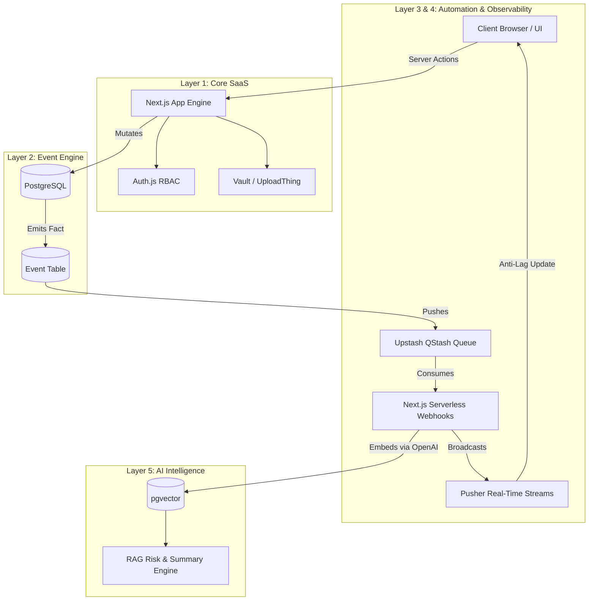
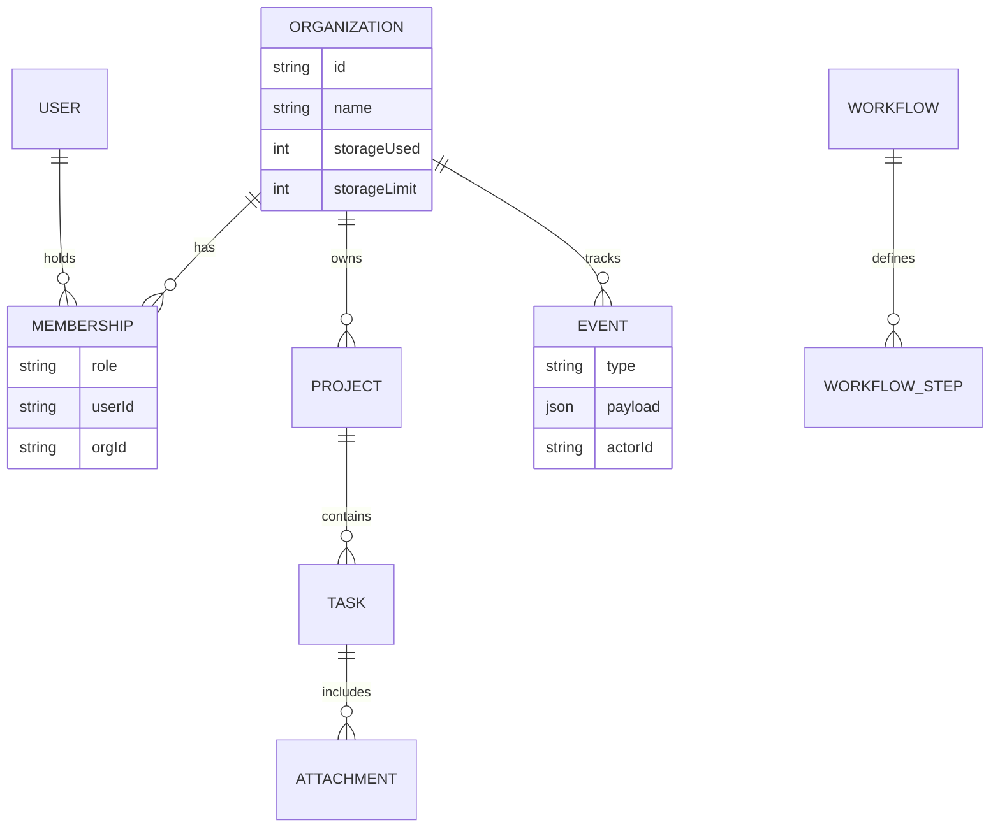

# ⚙️ Engineered Forge

### Multi-Tenant DAG Workflow Orchestration Engine

Built for concurrency • Isolated by design • Driven by immutable events

  
  
  
  
  
  

  
  
  
  
  

## 0. System Identity

Engineered Forge is not a task application. It is a **systems engineering demonstration**.

It is a multi-tenant SaaS platform that combines distributed project management, DAG-based workflow automation, real-time observability, secure file handling, and AI-driven intelligence under a strict event-driven architecture.

---

## 1. Core System Principles

* **Event-Driven by Design:** All state mutations emit events (`TASK_CREATED`, `FILE_UPLOADED`, `WORKFLOW_EXECUTED`). Nothing important happens silently. UI triggers actions $\rightarrow$ actions mutate DB $\rightarrow$ events are emitted $\rightarrow$ systems react.
* **Multi-Tenant Isolation:** Every entity is strictly scoped to an `orgId`. Global leakage is mathematically prevented at the DB query, middleware, server action, and vector retrieval layers.
* **Layered Architecture:** The system is structured into 7 distinct engineering layers, each depending strictly on the layers beneath it.

---

## 2. System Architecture

---

## 3. The 7 System Layers

### Layer 1: Core SaaS Foundation

* **Authentication & RBAC:** Powered by NextAuth v5 (Auth.js) and Prisma. Sessions are critically extended to attach `userId`, `activeOrgId`, and `role`. Roles (OWNER, ADMIN, MANAGER, MEMBER) are enforced at the middleware and action level.
* **Optimistic UI:** State updates utilize React's `useOptimistic` hook with temporary IDs and rollback mechanisms to eliminate perceived latency.
* **Vault Engine:** Secure attachment management utilizing UploadThing. Implements atomic storage quota reservations (preventing race conditions) and signed download URLs after strict DB ownership checks.

### Layer 2: Event Engine

* **Immutable Event Store:** The `Event` table (`id`, `type`, `payload`, `orgId`, `actorId`) acts as the single source of truth. Events are stored as facts, enabling asynchronous automation, audit trails, and future replay logic.

### Layer 3: Automation Engine

* **DAG Canvas:** An interactive, drag-and-drop Directed Acyclic Graph (DAG) built with React Flow to visually configure complex automation sequences.
* **Serverless Queues:** Events are pushed to an **Upstash QStash** queue and consumed by secured serverless webhooks, completely decoupling heavy processing from the API loop.
* **Idempotency & Resilience:** Workflow runs are guarded by composite idempotency keys (`eventId + workflowId`) to prevent duplicate executions, backed by exponential retry logic and dead-letter queues.

### Layer 4: Observability Engine

* **Real-Time Telemetry:** Backend execution logs and metric updates are streamed directly to the frontend via **Pusher WebSockets**.
* **State Optimization:** Functional React state updaters isolate DOM repaints, allowing the DAG UI to reflect live execution data without triggering re-render avalanches.

### Layer 5: AI Intelligence Layer

* **Embedding Pipeline:** Background jobs automatically extract text from tasks and attachments, generating OpenAI embeddings stored in a **pgvector** database.
* **RAG Engine:** Contextual retrieval generates executive project summaries and detects workflow bottlenecks based strictly on isolated, tenant-specific vector data.

### Layer 6: Security Hardening

* **Atomic Quotas & Soft Deletes:** Storage tracking increments atomically before cloud uploads, with nightly reconciliation jobs fixing drift. Destructive actions use a `deletedAt` pattern to prevent data loss.
* **Rate Limiting:** Enforced via Redis sliding windows per user and per organization.

### Layer 7: DevOps & Deployment

* **Infrastructure:** Deployed on Vercel utilizing a monorepo structure separating web UI, database packages, and shared config.
* **CI/CD Pipeline:** Strict GitHub Actions block deployments that fail ESLint, TypeScript compilation, or Prisma migrations.

---

## 4. Database Topography

---

## 5. Distributed Failure Mitigation

| Failure Mode | Architectural Mitigation |
| --- | --- |
| **Duplicate Events** | Idempotency keys checked before execution block. |
| **File Orphaning** | Nightly background cleanup and soft-delete reconciliation. |
| **Worker Crash** | Upstash QStash exponential backoff and dead-letter queues. |
| **Quota Race Conditions** | Atomic database reservations (`increment` operations). |
| **Cross-Tenant Attack** | Strict `orgId` composite indexing and middleware validation. |
| **UI Main-Thread Freeze** | WebSocket functional state updates to prevent deep DOM repaints. |

---

## 6. Engineering Outcomes

This architecture demonstrates production-grade capabilities in:

* Multi-tenant data isolation and RBAC security.
* Decoupled, event-driven state machines.
* Complex UI state orchestration (DAGs) synchronized with backend infrastructure.
* Vector search and contextual AI boundaries.
* Idempotent, highly available background processing.
