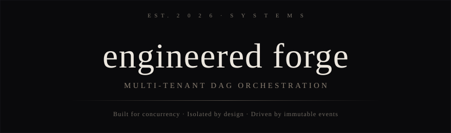
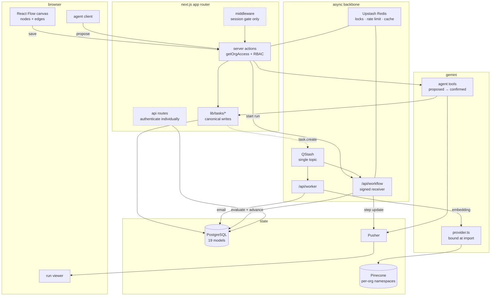

<p align="center">
  <picture>
    <source media="(prefers-color-scheme: dark)" srcset="./.github/assets/hero-dark.svg">
    <source media="(prefers-color-scheme: light)" srcset="./.github/assets/hero-light.svg">
    
  </picture>
</p>

<p align="center">
  
  
  
  
  
  
</p>

<p align="center">
  
  
  
  
</p>

<p align="center">
  
  
  
  
  
  
</p>

---

This is not a CRUD demo. It is a multi-tenant SaaS platform where the interesting
work lives in the parts that are usually hand-waved: a **durable DAG workflow
engine** that survives step failure and process death, an **AI agent runtime**
whose model proposals are enforced by the backend rather than trusted, and a
**tenant boundary** that holds on every write path including the ones a language
model triggers.

The thesis is narrow and deliberate:

> **An LLM proposes. The backend disposes.**
> Organization identity is never taken from model output, and no tool invocation
> bypasses the same authorization the UI uses.

Everything below is described as it is implemented — including the parts that
do not work yet. See [Status](#status--known-limitations).

---

## the three hard parts

<table>
<tr><td width="33%" valign="top">

**durable DAG execution**

A React Flow canvas compiles to a validated graph. The evaluator advances one
node at a time and re-enters itself through a signed queue message, so a step
that dies mid-flight is recovered by the next delivery rather than lost.

- compare-and-set context merge with an optimistic `contextVersion`
- 5s run lock with heartbeat, so two deliveries cannot interleave
- `MAX_RETRIES = 3`, then the step fails loudly and the run does not pretend
- a sweeper that cancels steps belonging to rolled-back runs
- per-step `ExecutionAuditLog` with level, payload, and latency

</td><td width="33%" valign="top">

**the agent is not trusted**

Bounded Gemini loops over three task tools. Write tools do not execute on model
authority — they are proposed, parked, and require human confirmation with an
expiry. The runtime then holds itself to invariants that are tested rather than
asserted.

- transactional outbox, so a commit and its publish cannot diverge
- Redis locks + heartbeats around session execution
- idempotency keys and backoff on the outbox
- a reaper that closes abandoned sessions with a recorded terminal reason
- a persisted `promptVersion`, so a prompt change cannot corrupt live sessions

</td><td width="33%" valign="top">

**tenancy that holds on write paths**

`getOrgAccess` is the single tenant boundary, used at every call site that
resolves a user-supplied identifier. It returns a *trusted* `{ organization,
membership, userId }` — the org is loaded from the slug and re-checked, never
read out of the request.

- `ADMIN` / `MANAGER` / `MEMBER`, enforced per action
- canonical write helpers that re-resolve project, task, and assignee against
  the trusted org id — and which both the agent tools and the workflow
  `task.create` action call, so model-generated writes inherit the same isolation
- per-organization Pinecone namespaces as defense in depth
- tenancy enforced *inside* the query for run views, not just before it

</td></tr>
</table>

---

## architecture

Two delivery surfaces sit behind the bus. Status codes are load-bearing: a `2xx`
from `/api/workflow` means the work is done **or durably scheduled**, and
nothing else.


```mermaid
flowchart TB
    subgraph client["browser"]
        canvas["React Flow canvas<br/>nodes + edges"]
        runs["run viewer"]
        agentui["agent client"]
    end

    subgraph app["next.js app router"]
        mw["middleware<br/>session gate only"]
        actions["server actions<br/>getOrgAccess + RBAC"]
        apiroutes["api routes<br/>authenticate individually"]
        write["lib/tasks/*<br/>canonical writes"]
    end

    subgraph bus["async backbone"]
        qstash["QStash<br/>single topic"]
        redis["Upstash Redis<br/>locks · rate limit · cache"]
        worker["/api/worker"]
        wfapi["/api/workflow<br/>signed receiver"]
    end

    subgraph data["state"]
        pg[("PostgreSQL<br/>19 models")]
        pine[("Pinecone<br/>per-org namespaces")]
        push["Pusher"]
    end

    subgraph ai["gemini"]
        provider["provider.ts<br/>bound at import"]
        tools["agent tools<br/>proposed → confirmed"]
    end

    canvas -->|save| actions
    actions --> write
    write --> pg
    write -.->|task.create| qstash
    qstash --> worker
    worker -->|embedding| provider
    worker -->|email| pg
    provider --> pine

    actions -->|start run| wfapi
    qstash --> wfapi
    wfapi -->|evaluate + advance| pg
    wfapi -->|step update| push
    push --> runs

    agentui -->|propose| actions
    actions --> tools
    tools --> write
    tools --> push

    mw --> actions
    apiroutes --> pg
    redis --- actions
    redis --- wfapi

    classDef trust stroke-width:1px,stroke-dasharray:3 3
    class mw,apiroutes trust
```

The dashed nodes are the ones worth reading twice: **`middleware` is a session
gate, not a tenant gate**, and it excludes `/api` entirely — so every API route
must authenticate itself. That is a deliberate boundary, but it means the
invariant lives in each route, not in one place.

---

## data model

19 models, 12 enums, PostgreSQL. Every tenant-scoped table hangs off
`Organization` directly or reaches it by relation.

| | model | role |
|---|---|---|
| **tenant** | `Organization` | root. unique `slug`, `storageUsed` / `storageLimit` quota, billing fields |
| | `Membership` | `@@unique([userId, orgId])`, carries `Role` |
| | `Invitation` | unique token, role, expiry, status |
| **work** | `Project` | `@@unique([name, orgId])` |
| | `Task` | status, priority, assignee → project → org |
| | `Comment`, `Attachment` | discussion and UploadThing `fileKey` |
| **workflow** | `Workflow` | `uiNodes`, `uiEdges`, compiled `definition`, `isActive` |
| | `WorkflowRun` | status, shared `context` + `contextVersion`, `lastAdvancedAt` |
| | `StepRun` | `@@unique([runId, stepId])`, attempts, compensation attempts |
| | `ExecutionAuditLog` | per-step trace: level, payload, latency |
| **agent** | `AgentSession` | `currentStep`, `terminalReason`, `promptVersion` |
| | `AgentToolExecution` | proposal + result, confirmation and expiry audit trail |
| | `AgentMessage` | transcript rows keyed by step |
| | `AgentOutboxEvent` | idempotency key, `messageId`, attempts, `availableAt` backoff |
| **infra** | `EventLog` | consumer dedup by `messageId` |
| | `AnalyticsEvent`, `RazorpayEvent` | analytics rows; webhook dedup keyed on event id |

The schema's inline comments are load-bearing — `contextVersion`,
`AgentOutboxEvent`, and `AgentToolExecutionStatus` each document the specific bug
they exist to prevent. Keep them.

---

## module map

| path | owns |
|---|---|
| `src/lib/workflow/` | engine: `execution/{evaluator,resolver,state,mutex,wrapper,trigger}`, `graph-ui/compiler`, `maintenance` |
| `src/lib/ai/agent/` | agent runtime, tools, registry, policy, outbox, session service |
| `src/lib/ai/` | provider binding, `semantic-cache`, prompts |
| `src/lib/vector/` | text extraction, semantic chunking, Pinecone client |
| `src/lib/events/` | event schemas, queue, router, worker factory |
| `src/lib/tasks/` | canonical task/project writes — the shared write path |
| `src/lib/locking/` | token-checked Redis lock primitive + heartbeat |
| `src/lib/prisma/` | driver-adapter client (`db.ts`), event-dispatching `extended.ts` |
| `src/lib/security/` | magic-byte upload validation |
| `src/lib/redis/`, `src/lib/pusher/`, `src/lib/emails/` | clients |
| `src/app/actions/` | server actions; the UI's write surface |
| `src/app/api/` | route handlers; each authenticates itself |
| `src/tests/` | 28 suites, node environment, no real database |

Tests run against an in-memory Prisma double, and a setup guard makes that
structural rather than conventional: `jest.setup-db-guard.ts` fails any suite that
tries to construct a real `PrismaClient`. Coverage is concentrated where the
concurrency is — agent durability, workflow context merge and retry, vector
chunking — because that is where the interesting bugs live.

---

## quickstart

Requires Node 20+ and a PostgreSQL database. Node is not pinned in the repo
(`.nvmrc` absent, no `engines` field).

```bash
git clone https://github.com/Mayur11code/Forge.git
cd Forge/forge

npm install
cp .env.example .env        # then fill it in
npm run dev
```

The app is served from **`Forge/forge`**, not the repository root — the repo
root holds the README, the assets, and the documentation.

### database

```bash
npx prisma migrate deploy   # 26 migrations
npm run build               # runs `prisma generate` first
```

Seeding is optional and creates a usable login:

```bash
npx prisma db seed          # ts-node prisma/seed.ts
```

Seeding only needs `DATABASE_URL`. The seed prints its credentials.

### environment

`forge/.env.example` is committed and documents every variable with the
`file:line` that reads it, so you can tell what a missing value actually breaks.
Nothing in it is a real secret.

Only two variables are needed to boot:

| variable | read by |
|---|---|
| `DATABASE_URL` | `src/lib/prisma/db.ts:5`, `prisma/seed.ts:6` |
| `AUTH_SECRET` | `src/lib/auth/auth.ts:18`, `auth.config.ts:5` |

Everything else is feature-scoped — the app starts without it and fails when you
use that feature. Two worth knowing about up front:

- **`GEMINI_API_KEY` is the only model credential.** Gemini is the sole provider
  (`src/lib/ai/provider.ts:7`). An `OPENAI_API_KEY` in an inherited `.env` is
  dead weight and can be deleted.
- **`QSTASH_URL` and `QSTASH_TOKEN` are not optional.** `src/lib/events/queue.ts:22`
  and `:26` throw if either is missing, so the event bus cannot initialise
  without them.

### tests

```bash
npm test              # 28 suites, 440 tests
npm run test:watch
```

There is no CI workflow, no pre-commit hook, and no Docker or `vercel.json` in
the repo. `npm test` and `npx tsc --noEmit` are the gate.

---

## status & known limitations

This is a work-in-progress systems portfolio piece, and the following are true
today. They are listed because a README that only shows the wins is not
documentation.

**Security and tenancy**

| issue | detail |
|---|---|
| **`I6` — cross-tenant workflow execution** | `triggerWorkflowRun` performs no auth, and `startWorkflow` loads the workflow by id with no `orgId` (`src/lib/workflow/execution/trigger.ts:7`). Any authenticated user can start any tenant's workflow and seed a `triggerPayload` into the run context. The open P0; gates phase 37.12. |
| **Google sign-in cannot persist** | `PrismaAdapter` is mounted, but the schema has no `Account` / `VerificationToken` model. Credentials sign-in works; OAuth does not. |
| Unauthenticated billing order creation | `src/app/api/razorpay/create-order/route.ts` has no auth check. |
| Unauthenticated workflow test route | `src/app/api/workflow/test/[workflowId]/test-run` has no auth and hard-codes a `projectId` and an org uuid. |
| Dead code with no auth | `api/uploadthing/deleteAttachment.ts` deletes any attachment by id. No callers, but it is live and reachable. |
| `/members` is mock data | No membership check, and it renders an `Owner`/`Editor`/`Viewer` vocabulary that does not exist in the `Role` enum. |

**Correctness and wiring**

| issue | detail |
|---|---|
| **Workflow triggers are manual only** | `startWorkflow` has exactly two callers: the run button and the test route. Nothing routes `TASK_CREATED` into it, so the event triggers the UI advertises are not connected. |
| **RAG index goes stale** | `TASK_UPDATED` and `TASK_DELETED` are dispatched but have no routing entry — only `TASK_CREATED` does. Edits and deletes never re-embed. |
| **Every task creation emits a failing job** | Routing emits `ANALYTICS_EVENT`, which has no worker case, so it returns `500` by design and burns its retry budget. |
| Attachments never reach the vector store | `createAttachment` never publishes `FILE_UPLOADED`; the file worker computes `extractedText` and discards it; the embedding worker always queries `task.findUnique`. |
| Live run streaming cannot authenticate | `api/pusher/auth/route.ts` authorizes agent channels only, and refuses everything else. The `private-workflow-*` channel has no authorizer. |
| Two dead-end routes | `/router` redirects to `/onboarding` and `/select-org`; neither exists. |
| Invitations are not emailed | The link must be copied by hand, and email delivery currently targets a hard-coded address. |
| 11 of 21 declared event types have no consumer | `PROCESS_FILE`, `AI_SUMMARY_REQUESTED`, `NOTIFY_PROJECT_OWNER`, and others are declared and routed but unhandled. |

**Verification debt**

- All evidence is Jest-level against an in-memory double. **No live database,
  queue, or end-to-end run has been exercised.** Phase 37.16 owes that.
- 4 pre-existing `no-explicit-any` lint errors on the workflow action signatures.
- `OPENAI_API_KEY` and `ioredis` are unused dependencies; `TaskBoxv1`,
  `analytics-worker`, and `ai-worker` are orphaned modules.
- Inconsistent URL casing (`/Tasks`).

---

## documentation

The architecture is documented separately from the code, and the docs are the
source of truth for intent.

**agent** — [entry point](forge/docs/architecture/agent/README.md) ·
[security boundaries](forge/docs/architecture/agent/security.md) ·
[runtime](forge/docs/architecture/agent/runtime.md) ·
[tools](forge/docs/architecture/agent/tools.md) ·
[task tools](forge/docs/architecture/agent/task-tools.md) ·
[decisions](forge/docs/architecture/agent/decisions.md) ·
[roadmap](forge/docs/architecture/agent/roadmap.md)

**workflows** — [tracker](forge/docs/architecture/workflows/assignments-37-tracker.md) ·
[issue register](forge/docs/architecture/workflows/assignments-37-issue-register.md) ·
[plan](forge/docs/architecture/workflows/assignments-37-plan.md) ·
[phase 0 audit](forge/docs/architecture/workflows/assignments-37-phase-0-audit.md)

**dev log** — [agent runtime hardening](forge/docs/dev-log/2026-09-29.md) ·
[audit closure pass](forge/docs/dev-log/2026-09-30.md) ·
[I1 / I2 closure and I6](forge/docs/dev-log/2026-09-30-assignment-37.md)

The trackers are kept current rather than rewritten at the end, so the
percentage complete in them is the honest one. Phase 37 is at 3 of 20.

---

<p align="center">
  <sub>
    Built with Next.js, Prisma, QStash, Upstash, Pinecone and Gemini ·
    <a href="./forge/prisma/schema.prisma">schema</a> ·
    <a href="./forge/src/lib/workflow">engine</a> ·
    <a href="./forge/src/lib/ai/agent">agent</a>
  </sub>
</p>