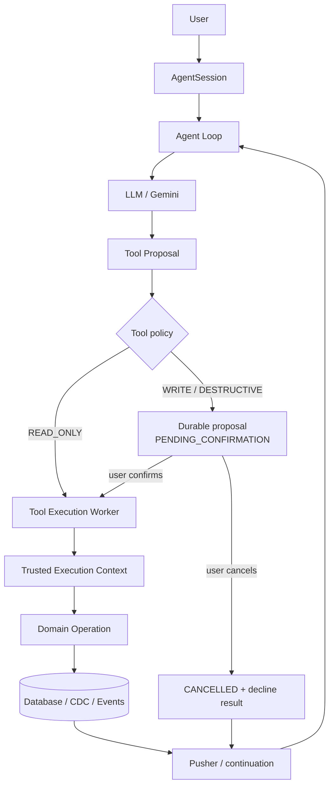
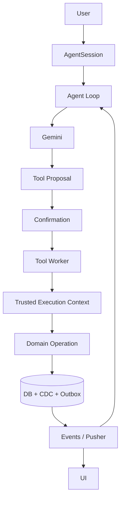

# Forge AI Agent — Architecture

> **Status of this document set.** Last updated by the Phase 2 production pass
> (2026-09-29). Every status below was verified against the repository, not
> assumed. Where the code and an earlier plan disagree, **the code wins** for
> implemented status, and the disagreement is recorded explicitly.
>
> This is the entry point. Read this file, [`roadmap.md`](./roadmap.md),
> [`decisions.md`](./decisions.md) and [`runtime.md`](./runtime.md) before
> making changes.

## Status legend

| Label | Meaning |
| --- | --- |
| `IMPLEMENTED` | Exists in code and is wired into the runtime. |
| `PARTIAL` | Exists but with a known correctness or durability gap. |
| `DECLARED ONLY` | The type, enum or column exists; nothing produces it. |
| `PLANNED` | Intentionally not built yet. Tracked in [`roadmap.md`](./roadmap.md). |
| `DEFERRED` | Deliberately pushed out of the current architecture. |
| `REMOVED` | Existed and was deleted. |

Two authorities, deliberately separated:

- **The repository is the source of truth for what is implemented.**
- **[`roadmap.md`](./roadmap.md) is the source of truth for what we intend to build.**

## The central principle

> The LLM decides **intent** and **arguments**.
> The backend owns **identity, authorization, organization boundaries,
> validation, confirmation, execution, persistence, and recovery**.

The model is treated as an untrusted, non-deterministic *proposal engine*. It
may say "create a task called X in project Platform with HIGH priority". It may
never say which organization to write into, which user is asking, or which
project id to use. Those are resolved from persisted backend state, inside the
backend, at execution time.

This is why no tool schema has an `orgId` field, why `ToolExecutionContext`
exists, why the canonical task operations re-validate their own input, and why
the confirmation endpoints take **no request body at all**.

## The pipeline



Read top to bottom, that is:

1. **AgentSession** — the durable record. Everything below is reconstructible
   from it, including after a client refresh.
2. **Agent Loop** — a stateless, repeatable step that claims work, calls the
   model once, and decides what happens next.
3. **LLM** — produces either a final answer or a tool call. One model turn
   produces **at most one** executable tool call.
4. **Tool policy** — trusted server metadata, resolved from the tool *name*.
   The model cannot select, relax, or spoof it.
5. **Confirmation** — a durable gate. A write proposal is persisted, shown to
   the user, and does not run until they approve it.
6. **Tool Execution Worker** — a *separate* process from the model loop. It
   never talks to the model provider, and it structurally cannot execute a
   proposal that is still awaiting approval.
7. **Trusted Execution Context** — `orgId` / `userId` / `executionId`, read from
   the persisted `AgentSession` row, never from the queue payload and never
   from model input.
8. **Domain Operation** — `createTaskInOrg`, `updateTaskInOrg`, `listTasksInOrg`
   and friends. The single enforcement point for tenant boundaries.
9. **Database / CDC / Events** — the write, plus the change-data-capture
   consequences.
10. **Pusher / continuation** — live UI updates, and the next loop event that
    resumes the conversation.

## Why event-driven and durable

The loop is deliberately **not** one long-running HTTP request.

A single turn can involve a multi-second model call, a Redis lock, one or more
tool executions, and domain writes. If that were a request/response cycle:

- An HTTP timeout in front of the worker would abort work that is already
  committed.
- A client disconnect would kill an in-flight tool write.
- Retrying the request would re-run side effects that already happened.
- Nothing could resume a half-finished conversation.

Instead, every stage is a **durable row plus an event**. The stage does its
work, commits state, publishes the next event, and returns. The next stage is
an independent delivery.

Concretely this buys:

| Property | How |
| --- | --- |
| Resume after crash | The session row and its `currentStep` are the only state that matter. |
| Exactly-once *step* claiming | `updateMany` with `currentStep: expectedStep` — a compare-and-swap, not a check-then-act. |
| Exactly-once *execution* | `markToolExecutionRunning` claims `PENDING -> RUNNING`. Cancelled and unapproved rows are not claimable by construction. |
| User approval is durable | The proposal is a row, not a pending HTTP request. A refresh loses nothing. |
| Duplicate-delivery safety | A `SET NX PX` lock with a TTL heartbeat, plus the `EventLog(messageId)` idempotency guard. |
| Orphan detection | A claimed execution refreshes its own row every 30 s, so "no heartbeat" means "nobody is working on this" rather than "this is slow". |
| Durable event intent | Every critical event is an `AgentOutboxEvent` row committed with the domain state, then drained by a lease-claimed dispatcher. Delivery is **at-least-once**, never exactly-once. |
| Recovery actually runs | `AGENT_MAINTENANCE_REQUESTED` on the signed `/api/worker` runs the approval sweep, the orphan reaper, the confirmed-execution redelivery sweep, the **stalled-session re-drive** and the outbox drain. A QStash schedule (`scd_6x2LU8qSUyNjxuveHoyM8tPo4ykj`) POSTs it every five minutes and real signed ticks have been observed executing. |
| Bounded model work | `MAX_AGENT_STEPS = 5`, enforced by a pure policy function. |
| No long-held connections | Workers are short-lived QStash deliveries. |

The system is still eventually consistent, and that is now a stated property
rather than an open defect: a committed domain state and the intent to deliver
its event are atomic, but the publish itself is not. Duplicates are made safe by
the consumers' compare-and-set and the deterministic `deduplicationId`; the
weaker guarantee is documented in
[`decisions.md`](./decisions.md#decision-17-transactional-outbox-at-least-once)
rather than papered over.

## Document index

| Document | Contents |
| --- | --- |
| [`README.md`](./README.md) | This file. Principles, pipeline, current vs target. |
| [`runtime.md`](./runtime.md) | End-to-end runtime flow: init, loop, confirmation, tool path, state machines, recovery. |
| [`security.md`](./security.md) | Trust boundaries, tool policy, confirmation, what the model may and may not control. |
| [`task-tools.md`](./task-tools.md) | The canonical task operations and the consolidation that produced them. |
| [`tools.md`](./tools.md) | Tool anatomy, the single registry, and the current tool surface. |
| [`prompt.md`](./prompt.md) | The system prompt, its sections, and prompt provenance. |
| [`roadmap.md`](./roadmap.md) | Phases 0–6, the current-state matrix, and deferred items. |
| [`decisions.md`](./decisions.md) | Architectural decisions and the reasoning behind them. |
| [`assignments-35-36-audit.md`](./assignments-35-36-audit.md) | Closure report for Assignments 35/36: what is proven, what is only implemented, what is not done. |
| [`../../dev-log/2026-09-29.md`](../../dev-log/2026-09-29.md) | Chronological record of every pass. |

## Current vs target architecture

### Current

**Status:** `IMPLEMENTED`
```mermaid
flowchart TD
    U[User] --> S[AgentSession]
    S --> L[Agent Loop]
    L --> M[Gemini]
    M -->|listTasks (READ_ONLY)| TW[Tool Worker]
    M -->|createTask / updateTask (WRITE)| PR[Durable proposal + expiresAt]
    PR -->|confirm| TW
    PR -->|cancel| CAN[CANCELLED]
    PR -->|expiry sweep| EXP[EXPIRED + APPROVAL_TIMEOUT]
    TW --> CTX[Trusted context]
    CTX --> DO[Canonical domain op]
    DO --> DB[(DB)]
    TX[transaction] --> DB
    TX --> OB[AgentOutboxEvent]
    OB --> DIS[Dispatcher]
    DIS --> L
    DIS --> TW
    DIS --> UI[Pusher / live updates]
```

Implemented and wired: session persistence, event-driven loop, step claiming,
lock heartbeat, execution liveness heartbeat, a single registry carrying tool +
executor + policy with the model-facing map derived from it, one read tool, two
write tools, durable user confirmation **with an expiry**, trusted context,
canonical task create/update/read operations, Pusher transport, session
recovery, prompt provenance, a **transactional outbox**, and a **scheduled
maintenance pass**. The UI is still the only missing piece of this diagram.

### Target

**Status:** `PARTIAL`


Still missing: the **UI** and **destructive** tools. The **outbox** and the
recovery **scheduler** are now implemented — see
[`runtime.md`](./runtime.md#transactional-outbox) and
[`roadmap.md`](./roadmap.md#phase-4--durability--crash-recovery).

### The difference in one sentence

The model proposes, the backend decides, a human approves, and the intent to act
on that approval is durable: a committed proposal and the event that would
execute it cannot be separated by a crash.

## What is *not* proven

This documentation must not be read as a claim that the system has been
exercised end to end. It has not.

- **QStash consumer topology is unverified.** `USE_MULTI_TOPICS = false` sends
  every event to topic `"events"`. Routing in source is correct, but whether a
  *deployed* QStash consumer points at `/api/worker` is an environment fact
  that cannot be read from the repository.
- **Five migrations have not been applied** to any live database: session
  `terminalReason`, tool-execution confirmation states, session `promptVersion`,
  approval expiry, and the outbox table. The only `DATABASE_URL` configured in
  this environment is a live Neon primary, so applying them is an operational
  decision, not a code change.
- **Pusher, NextAuth, Prisma, Redis and QStash are unit-tested or statically
  reviewed only.** No live integration test exists.
- **There is no client.** Nothing in the app calls `POST /api/agent/init`,
  `GET /api/agent/session/[sessionId]`, or the confirm/cancel endpoints, and
  nothing subscribes to a `private-agent-*` channel. The entire agent subsystem
  currently has no UI. The server-side contract is complete; the client is not
  written.
- **The maintenance schedule runs, but only through a temporary tunnel.** The
  handler is implemented, registered on `/api/worker`, and driven by schedule
  `scd_6x2LU8qSUyNjxuveHoyM8tPo4ykj` every five minutes; real signed ticks have
  been observed arriving and executing the five duties. What is missing is a
  *stable* origin: `APP_URL` is `http://localhost:3000` and delivery depends on a
  temporary `ngrok-free.dev` tunnel. `scripts/qstash-maintenance-schedule.mjs`
  refuses tunnel destinations unless `AGENT_MAINTENANCE_ALLOW_TUNNEL=yes` is set
  explicitly, because QStash accepts a dead tunnel without complaint and then
  fails every tick — which is worse than nothing, since it looks configured.
- **Destructive tools do not exist.** `DESTRUCTIVE` policy is implemented and
  tested but unused, because the domain has no safe deletion semantics. See
  [`decisions.md`](./decisions.md#decision-13-no-destructive-tools-despite-a-working-policy).
- **The loop worker still drops deliveries it refuses on lock contention.** It
  logs and returns `200`, so the broker treats them as delivered. Re-arm makes
  this self-healing within 3 attempts for *re-drive* traffic, but an ordinary
  tool→loop handoff that loses the race is still lost silently. Left as its own
  change.

## Testing status

`npx jest` — **20 suites, 304 tests, passing**. `npx tsc --noEmit` — clean.
Scoped ESLint over the changed agent code — clean. No test constructs a real
`PrismaClient`; `jest.setup-db-guard.ts` fails the run if one is instantiated.

| Suite | Covers |
| --- | --- |
| `agent-channel.test.ts` | Channel/body validation. |
| `agent/` `durability.test.ts` | Lock heartbeat, token-guarded renewal, reaper selection/CAS/staleness, execution liveness transitions, outbox-driven redelivery, **stalled-session detection under the lock, `PENDING_CONFIRMATION` exclusion, and bounded re-drive**. |
| `agent/` `execution-routes.test.ts` | Confirm/cancel auth, session binding, terminal-session refusal, state-before-liveness ordering, idempotency, race outcomes, transactional continuation. |
| `agent/` `approval-timeout.test.ts` | `EXPIRED` sweep, the null-`expiresAt` exemption, one-transaction expiry, late confirm, bounded batches. |
| `agent/` `outbox.test.ts` | Outbox row creation inside the caller's transaction, lease exclusivity, backoff, dedup-key collapse, dispatcher isolation, **`PUBLISHED` re-arm CAS and its attempt cap**. |
| `agent/` `maintenance.test.ts` | All five duties, per-duty failure isolation, bounded limits, partial-failure retry, payload contract, identifier-free logging. |
| `agent/` `worker-auth.test.ts` | Signature enforcement, the explicit opt-in, and per-delivery CloudEvent `id`/`time` derivation for schedule bodies. |
| `agent/` `queue-publish.test.ts` | Deterministic ids, dedup keys, delay-unit conversion, regional `baseUrl`. |
| `agent/` `provider-binding.test.ts` | `googleProvider` singleton, `gemini-2.5-flash`, `GEMINI_API_KEY` fail-closed. |
| `agent/` `worker-auth.test.ts` | Signature required by default; `ALLOW_UNSIGNED_LOCAL_WORKER === "true"` is the only bypass, and `"0"`/`"false"` do not enable it. |
| `agent/` `queue-publish.test.ts` | Delay conversion to seconds, deterministic ids, `deduplicationId`. |
| `agent/` `loop-policy.test.ts` | Step budget and one-call-per-turn policy. |
| `agent/` `pusher-auth.test.ts` | Private channel authorization. |
| `agent/` `session-read.test.ts` | Session ownership and the recovery response contract. |
| `agent/` `task-operations.test.ts` | Org scoping, assignee membership, ambiguous-title refusal, model-supplied `orgId` rejection. |
| `agent/` `tool-confirmation-flow.test.ts` | Proposal persistence, read-only dispatch, unknown-tool fail-closed, worker execution gating. |
| `agent/` `tool-confirmation.test.ts` | Policy derivation and proposal rendering. |
| `agent/` `validation-contract.test.ts` | A schema rejection names the field that failed, reports every issue without echoing any value, is shared by all three tools, survives the worker round trip under the exact `toolCallId`, and cannot be duplicated by a redelivery. |
| `agent/` `worker-routing.test.ts` | Event dispatch to the correct worker. |

**Still untested:** `createTaskInOrg` and `updateTaskInOrg` against a real
database, the Prisma migration statements, Pusher delivery, and anything
requiring a live Redis or QStash. The prisma double does **not** simulate
rollback, so the tests assert that work is enclosed in a transaction and that
the writes are correct — not that a mid-transaction failure would undo them. That
needs a real database.

One property to be aware of when reading the tests: the shared prisma double
honours each `where` clause, so the CAS assertions are real rather than
stubs — but `jest.clearAllMocks()` does not reset implementations, so a suite
that stubs `updateMany` must call `restorePrismaDouble()` before any test that
depends on the filtering behaviour. Two suites do.

See [`roadmap.md`](./roadmap.md#phase-6--testing) for the full testing plan.
