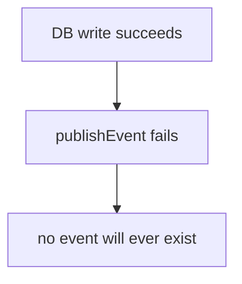

# Architecture Decision Log

> Compiled 2026-09-29 from the reasoning behind the current design. Each entry
> records the decision, the alternatives that were rejected, and — where
> relevant — the current status, so a later reader can tell a settled decision
> from an open question.

## Decision 1: Canonical task domain operation

**Status:** `IMPLEMENTED` — `forge/src/lib/tasks/create-task.ts`

**Decision.** All task creation goes through `createTaskInOrg(input, actor)`.
There is exactly one `prisma.task.create` in the codebase.

### Why

Task creation existed as three independent implementations, and the divergence
was not theoretical:

- The **workflow node action** called `raw db.task.create` with **no
  authentication and no org check**. Any `projectId` in a node's config was
  accepted, so that path could write a task into another organization's
  project. It also bypassed the CDC, so `TASK_CREATED` never fired and the
  task was invisible to embedding, analytics and email.
- The **UI server action** and the **triage route** each carried their own copy
  of the same rules, with their own rate limiting and their own error handling.
- The UI action called `rateLimit.limit()` **twice**, taking `success` from the
  first call and `remaining`/`reset` from the second, so a single user action
  consumed the rate-limit budget twice.

Multiple copies of business rules drift. Three had already drifted, and one had
drifted into a tenant-isolation hole.

### Why one function rather than a shared helper library

A shared helper called by three callers would still leave three call sites, each
able to omit a check. Making the canonical operation the *only* way to write a
task means there is exactly one place where authorization is enforced, and
therefore exactly one place to audit and test.

### Why it returns rather than throws

`CreateTaskResult` is a discriminated union. A workflow retry policy needs a
machine-readable code (`CREATE_FAILED` is retriable; `PROJECT_NOT_FOUND` is
not), and an LLM executor needs to turn a failure into something the model can
read. An exception carries neither without a convention layered on top.

### Why it is worker-safe

No `auth()`, no `notFound()`, no `revalidatePath()`, no `next/*` import. This is
the property that lets a React server action, a queue worker and an LLM executor
share one function. It also forced the UI concerns into the UI adapter, where
they belong.

Rejected: a shared validator plus per-caller writes (keeps three call sites);
a repository layer (adds indirection without reducing the count of writers).

See [`task-tools.md`](./task-tools.md).

## Decision 2: Trusted execution context

**Status:** `IMPLEMENTED` — `types.ts`, `tool-worker.ts`, `tools/registry.ts`

**Decision.** `ToolExecutor` is
`(input: Prisma.JsonValue, ctx: ToolExecutionContext) => Promise<...>`, and
`ctx.orgId` / `ctx.userId` are read from the **persisted `AgentSession` row**,
never from the queue payload and never from model input.

### Why

Before this, `ToolExecutor` was `(input: Prisma.JsonValue) => ...`. The tool
layer had no way to know which organization it was acting for. That left exactly
one option for any write-capable tool: **accept `orgId` as model input.** A tool
schema containing `orgId` is a tenant-isolation hole with a natural-language
interface — the model would not need to be attacked, only wrong.

The context closes the gap. Identity is resolved by the backend, from state the
backend owns, at the moment of execution. The model is never in that position.

### Why the QStash payload is treated as a pointer

`handleToolExecution` destructures only `{ executionId, expectedStep }`. It
resolves the session, the org, the user and the tool input from the database.
A replayed or forged message body therefore cannot redirect a write into another
organization, because the body is not where identity comes from.

### Why the two arguments have different types

`input: Prisma.JsonValue` and `ctx: ToolExecutionContext` is deliberate. The
type signature itself marks which value is untrusted. A tool author cannot
avoid noticing the distinction.

### Residual risk

The `ai` package returns tool input as a parsed object rather than a JSON
string. `ToolExecutionContext` is trusted and is not persisted, so this is not
an issue today — but a tool that accepted its own context as input would need a
different design.

See [`security.md`](./security.md).

## Decision 3: Project-name resolution

**Status:** `IMPLEMENTED` — `forge/src/lib/tasks/projects.ts`

**Decision.** The model supplies `projectName`; the backend resolves it to a
`projectId` inside the trusted org via `resolveProjectNameInOrg`, and returns
`FOUND` / `NOT_FOUND` / `AMBIGUOUS`.

### Why not a project id

Two reasons, and the second matters more than the first.

1. **Reliability.** `Project` is unique on `@@unique([name, orgId])`, and a
   human can say a project's name reliably. A CUID cannot be invented or
   recalled. Asking the model for an id invites confident fabrication.
2. **Safety.** An org-scoped resolver *cannot* return a cross-org project,
   because it only ever queries within `ctx.orgId`. A raw `projectId` must be
   re-checked at the write, because the model could supply any id in the system.
   Name resolution removes the guess; the ownership assertion remains as a
   second layer.

### Why return candidates instead of picking one

`AMBIGUOUS` returns the real candidates and instructs the model to ask the user
which is meant. The alternative — best-guess ranking — would silently create
tasks in the wrong project, which is a worse failure than an extra question.
`NOT_FOUND` returns up to 10 real project names for the same reason: the model
can self-correct and ask a good question instead of inventing an id.

Cross-org projects are never returned, not even as suggestions. Cross-org
existence is not leaked.

### Known cost

Disambiguation currently costs a failed tool call. Injecting the project's list
into the system prompt would remove the round trip; that is tracked in
[`prompt.md`](./prompt.md#known-prompt-gaps).

## Decision 4: One tool call per model turn

**Status:** `IMPLEMENTED` — `loop-policy.ts`, `loop-runner.ts`, system prompt

**Decision.** A single model turn may produce **at most one** executable tool
call. More than one fails the turn with `MULTIPLE_TOOL_CALLS`, and **nothing is
persisted**.

### Why

The persisted transcript is a sequence of assistant and tool messages. The
model provider requires that **every** tool call in an assistant message has a
matching tool result. A turn that persisted two tool calls and then executed
only one would leave the conversation permanently invalid, and the next
`generateText` call would fail.

That is a data-integrity problem, not a style preference.

The architecture is also not designed for parallel tool results: the tool
worker is a single-worker, id-addressed path that writes one tool-result message
per execution and then re-arms the loop. Supporting N parallel calls means N
executions racing on `currentStep`, and the single `expectedStep` CAS has no way
to express "three of these four are done".

The rule is enforced **in the runner, before persistence**, rather than only in
the prompt, because it is the one behavioural rule whose violation corrupts
stored state. The prompt states it too, for model cooperation.

### Why not a provider flag

`ai@6.0.208` exposes `toolChoice` only as
`'auto' | 'none' | 'required' | { type: 'tool', toolName }` and has **no**
`parallelToolCalls` option. The provider cannot be asked. Verified, not assumed.

### Why "fail" rather than "take the first"

Silently dropping the extra calls would execute an action the model did not
actually commit to, and would hide a real failure from the user. Failing with an
explicit reason surfaces it.

### Deferred, not forgotten

Parallel tool calls are `DEFERRED` in the roadmap. Adopting them means
reworking step claiming, the tool worker, and the confirmation flow together.
Doing it piecemeal would reintroduce exactly the transcript-integrity problem
this decision avoided.

## Decision 5: Confirmation as a separate authorization layer

**Status:** `IMPLEMENTED` in Phase 2 — durable proposal, confirm/cancel
endpoints, and a worker that structurally cannot run unapproved work. See
[Decision 11](#decision-11-derive-confirmation-from-policy-never-store-it).

**Decision.** A write-capable tool call must be a **proposal** that a human
approves before it executes. The model proposing an action and the system being
authorized to perform it are different events.

### Why

Today, the model calling `createTask` *is* the write. The system prompt says to
only write on an explicit user request — but that is the model reporting on its
own behaviour. There is no mechanism in which the model can be wrong about
whether the user asked, and no way for the user to intervene.

That is acceptable for a read tool. It is not acceptable for a write that a user
would be surprised to find they had made.

### Why a durable proposal rather than an in-memory gate

The session must survive a refresh, a reconnect and a worker restart between
"proposal made" and "user responded". A pending action therefore has to be
persisted state, not a live socket message. The `WAITING_CONFIRMATION` session
status is that state, and `AgentStatusEvent`'s variant already carries
`executionId`, `summary` and `expiresAt` for the UI.

### What still has to be decided

- **Where the proposal is stored.** Reusing `AgentToolExecution` in a
  "proposed" state is the least invasive option; a separate table is cleaner if
  proposals need their own lifecycle.
- **Expiry.** The event carries `expiresAt` but there is no column and no
  sweeper. A proposal that is never answered is a stuck session.
- **Stale work.** A session cancelled between dispatch and delivery must not
  run its queued tool. The tool worker does not currently check session status.
  This becomes a real bug the moment cancellation exists.

### Sequencing

Confirmation lands **before** any further write tool. Adding update and delete
tools first would multiply the blast radius of a model mistake. Read tools are
the exception — they need no gate, which makes them the natural first Phase 2
work.

## Decision 6: Event-driven continuation

**Status:** `IMPLEMENTED`

**Decision.** The agent loop is a chain of durable rows and events, not one
long-running request. Each stage commits state, publishes the next event, and
returns.

### Why

A single turn can involve a multi-second model call, a Redis lock, one or more
tool executions, and database writes. As one request:

- an HTTP timeout in front of the worker would abort work already committed;
- a client disconnect would kill an in-flight tool write;
- retrying the request would re-run side effects that already happened;
- nothing could resume a half-finished conversation.

Splitting into events makes the database the only thing that has to be
correct. `AgentSession.currentStep` plus the `AgentMessage` rows are sufficient
to reconstruct or resume any point in the conversation.

### Why this also gives duplicate-delivery safety

At-least-once delivery is the default for any queue, and the same mechanism
that provides durability also provides the place to put idempotency:
`EventLog(messageId)`, the session `currentStep` CAS, and the
`PENDING → RUNNING` CAS on tool execution. A duplicate event cannot advance a
step twice or run a tool twice.

### The cost, and what closed it

The system is eventually consistent, and there was a window where the database
was correct but a consumer had not been told:



This was a real gap and the entire subject of
[Phase 4](./roadmap.md#phase-4--durability--crash-recovery). **Assignment 36
closed it** with a transactional outbox — see
[Decision 17](#decision-17-transactional-outbox-at-least-once) — but not the
Pusher half, which remains transport only by design
([Decision 8](#decision-8-pusher-is-transport-only)). The UI is still
eventually consistent with its own live-update path; the *agent's* internal event
stream is no longer lossy.

The alternative considered was a synchronous long-lived request with streaming,
rejected because it couples model latency to HTTP connection lifetime and gives
up resumability.

## Decision 7: Redis lock plus database CAS

**Status:** `IMPLEMENTED` (`PARTIAL` for the lease)

**Decision.** Two independent mechanisms: a Redis `SET NX PX` lock for mutual
exclusion during work, and a database `updateMany` CAS for correctness.

### Why both

They are not redundant. The lock prevents two workers from doing the *same work*
concurrently and burning a model call each. The CAS is the **correctness**
guarantee: it is atomic, transactional, and survives the expiry of any lock.

The CAS is what makes a lost race safe. If a worker crashes mid-turn, the 30 s
TTL expires, and a second worker takes the lock — the CAS still rejects it if
the step was already claimed. The lock is an optimisation; the CAS is the
guarantee.

Locking alone would be wrong: a TTL-expiring lock does not undo a
double-claim. CAS alone would be safe but would waste a model call on every
duplicate delivery.

### Known gap — now closed

The TTL used to be flat 30 s and never renewed, so a slow `generateText` call
could outlive its own mutex while still executing. The CAS limited the damage —
a second worker could not claim the same step — but the model call was wasted.
Assignment 36 added the token-guarded
[lease renewal](./roadmap.md#lock-lease--heartbeat).

## Decision 8: Pusher is transport only

**Status:** `IMPLEMENTED`

**Decision.** `AgentSession` in Postgres is the source of truth. Pusher carries
live updates and nothing more. `GET /api/agent/session/:id` is the recovery
path.

### Why

A socket connection is not durable. Tying state to one means the UI's view of
the world is only as reliable as the socket. Tying it to the database means the
UI can always rehydrate, and the socket is an optimisation for latency.

This is also why every terminal Pusher publish is gated on
`updateMany().count === 1` — the event is a *notification that a transition
happened*, never the transition itself.

### Consequence to accept

A missed event leaves the UI stale until it re-reads. The session GET exists for
exactly this, and has no client yet.

## Decision 9: Keep the tool surface deliberately small

**Status:** `IMPLEMENTED` (three tools)

**Decision.** The agent can read, create and update tasks. It cannot delete, and
there is no free-text search.

### Why

1. **Add a capability only once the layer that makes it safe exists.** The
   original rule was "one capability proves the pipeline". Phase 2 applied it
   again in the other direction: the policy and confirmation layers were built
   **first**, and only then did two more tools become safe to add. The order is
   the argument.
2. **Read before write.** `updateTask` cannot honestly be called "mark the login
   bug done" without a way to find that task, so `listTasks` is what makes the
   update tool usable rather than lucky.
3. **Every tool description is sent on every turn**, competing with the
   behavioural rules for the model's attention. Three is a budget, not a
   target.
4. **The groundwork was already in place.** `listProjectsInOrg` and
   `searchProjectsInOrg` were written org-scoped and worker-safe specifically so
   the read tools would be additions rather than rewrites.

## Decision 10: No parallel tool execution in the current architecture

**Status:** `DEFERRED`

**Decision.** Parallel tool calls are out of scope for the current design.

This is the direct consequence of [Decision 4](#decision-4-one-tool-call-per-model-turn)
and is listed again in the [deferred table](./roadmap.md#deliberately-deferred)
so it is not mistaken for an oversight. It requires reworking step claiming, the
tool worker, and confirmation together.

## Decision 11: Derive confirmation from policy, never store it

**Status:** `IMPLEMENTED`

**Decision.** `AgentToolPolicy` carries one field, `access`. Whether a tool
needs approval is computed from it. It is not a stored boolean.

```ts
export function requiresConfirmation(policy: AgentToolPolicy): boolean {
  return policy.access !== "READ_ONLY";
}
```

### Why not `{ access, requiresConfirmation }`

Because the two fields can disagree, and nothing would complain. A tool
declared `DESTRUCTIVE` with `requiresConfirmation: false` would execute a
destructive action with no approval, and the type system would be satisfied the
whole time. That is the worst shape a security control can have: a failure mode
that is silent *and* looks like it was configured.

Deriving it makes the dangerous state unrepresentable, and leaves policy with no
second source that anything could relax. Policy is also resolved from the tool
**name** on the server, so there is no input field through which a model could
influence it.

### Consequence

Adding a tool means writing exactly one policy. There is no second place to
update and no way to get the two out of sync. `tool-confirmation.test.ts` covers
the derivation.

## Decision 12: One registry, and the model-facing map is derived from it

**Status:** `IMPLEMENTED`

**Decision.** Tool, executor, policy and proposal renderer are registered as one
entry. `agentTools` — the map handed to the model — is computed from that
registry, not written out beside it.

### Why the projection must be derived, not maintained

The intermediate version had a single registry *and* a hand-written
`agentTools` object listing each name again. That reintroduced precisely the
duplication the registry existed to remove: a tool registered but forgotten in
the projection would compile, pass review, and simply never reach the model.
Nothing about a hand-maintained list fails loudly.

The projection is now `Object.fromEntries(...)` over the registry entries, with
a mapped type preserving the literal keys, so the exported object is still
`ToolSet`-compatible and still has key-level types.

### What this buys

An executor with no policy, a policy with no executor, and a tool the model
cannot see are all the same class of mistake, and all are now registration-time
errors rather than runtime surprises.

## Decision 13: No destructive tools, despite a working policy

**Status:** `IMPLEMENTED` (`DESTRUCTIVE` policy exists; no tool uses it)

**Decision.** Do not ship `deleteTask`. `DESTRUCTIVE` is implemented, tested and
unused.

### Why

There is no safe deletion to call. A repository-wide search finds zero
`prisma.task.delete`, no `deletedAt` column, no domain operation and no server
action. Deleting a task also cascades to its `Comment` and `Attachment` rows.

Shipping a tool here would mean choosing soft vs. hard deletion, deciding
whether comments survive, deciding what the UI shows afterwards, and putting an
irreversible operation behind a single confirmation dialog. Every one of those is
a product decision this repository has never made. A wrong irreversible delete
cannot be fixed later by adding a confirmation dialog — the data is already
gone.

### Why not just soft-delete

Because "soft" is only a safety property if the rest of the system agrees with
it: queries would need to filter it everywhere, uniqueness constraints would
need to account for it, and `taskCount` would need to exclude it. Adopting that
half-way is worse than not starting.

The blocker is domain semantics, not the agent layer. When the domain has a
deletion operation, the tool is a small addition — the gate is already built.

## Decision 14: Execution liveness is a heartbeat, not a duration

**Status:** `IMPLEMENTED` (scheduler still missing)

**Decision.** A claimed execution refreshes its own row every 30 s, and the
recovery sweep treats "no heartbeat for 10 minutes" as orphaned.

### Why not a plain age threshold

Nothing else writes a `RUNNING` row while the executor runs, so `updatedAt` is
pinned at the moment of the claim. With a bare age check, a legitimately slow
execution and a worker that died holding it are **indistinguishable**. The sweep
would cancel live work: the side effect would still have happened, and the
session would be failed underneath a successful write. That is worse than the
hang the sweep was written to prevent.

The heartbeat makes staleness mean "nobody is working on this".

### Why not reuse the Redis lock

The lock heartbeat already exists, but it is process-local state the sweep
cannot observe, and it is renewed without touching the row. The row is shared
state both the worker and the sweep can see. The two heartbeats answer different
questions: the lock keeps a second worker *out*, the row tells the sweep whether
anyone is still *in*.

### Why the staleness predicate is in the CAS too

The sweep reads candidates and then writes each one. That gap is exactly when a
periodic sweep is most likely to fire. Without repeating `updatedAt < cutoff` in
the `where` clause, a heartbeat landing between the two calls would be
overwritten and healthy work cancelled — the same race, moved rather than
removed. The row count is also what `swept` reports, so the number reflects
cancellations that happened rather than rows that were read.

## Decision 15: Decide confirmation state before session liveness

**Status:** `IMPLEMENTED`

**Decision.** `decideConfirmation` maps `(action, execution status, session
status)` to `TRANSITION` / `IDEMPOTENT` / `CONFLICT`, and session liveness is
consulted **only** for an execution still in `PENDING_CONFIRMATION`.

### Why the order matters

An execution that has already left the gate cannot be changed by a dead session.
Checking liveness first means a client that double-clicked confirm after the
session completed is told it has a problem it does not have — a `409` it can do
nothing about, in place of the real answer. The ordering is not cosmetic; it is
the difference between reporting truth and hiding it.

Only an undecided proposal is genuinely gated by liveness: a terminal session
must not gain new side effects.

### Why a pure function

Because the property worth protecting — state is decided before liveness — is
otherwise only observable by standing up two sessions, a queue and a database.
Extracted as a pure function it is five assertions, one of which loops over all
three session statuses to pin the idempotency guarantee.

## Decision 16: Record prompt provenance honestly, at session level

**Status:** `IMPLEMENTED` (partial — no per-message hash)

**Decision.** `AgentSession.promptVersion` records the contract a session was
**created** under, defaulted to the legacy value so legacy rows backfill
truthfully. `runAgentLoop` logs when a session's recorded version differs from
the current one. The system prompt is still rebuilt each turn.

### Why the default is the legacy version

The column is `NOT NULL`, so existing rows backfill from the default. Defaulting
to the *current* version would stamp `"v2"` onto sessions that predate the new
`TOOL_CONTRACT` — asserting provenance for history that never had it, and
invisibly, because the result looks right. `createAgentSession` writes the
current version explicitly, so the default is only ever reached by rows that
existed before the migration.

### Why not pretend it is per-turn

The builder is called fresh from current source on every turn, so a session
created before a bump runs the new contract on its next turn. Claiming the row
describes every turn would be a false guarantee, and a false provenance field is
worse than none: it would be trusted exactly when it is wrong.

So the claim is scoped to what is true, and the mismatch is made **visible in
the logs** rather than inferred later. A per-message `promptHash` — over the
rendered prompt *and* the tool descriptions, since those carry behavioural rules
— is the real fix and is still open.

### Why a hash was not added now

Because it has to be right the first time, and "hash of what exactly" is a
design question, not a field: the template, the rendered prompt, the tool
descriptions, or all of them. Shipping a version field that says precisely what
it means, plus a log line for divergence, is more useful than a hash computed
over the wrong artifact.

## Decision 17: Transactional outbox, at-least-once

**Status:** `IMPLEMENTED` (Assignment 36)

**Decision.** Every critical agent event is written as an `AgentOutboxEvent` row
in the same transaction as the domain state, and a separate dispatcher publishes
`PENDING` rows to QStash.

### Why not just publish, and retry on failure

Because "retry on failure" cannot cover the case that matters. The dangerous gap
is a crash *between* the committed domain write and the publish: nothing failed,
so nothing is retried, and the event is gone permanently. The rows the recovery
sweeps inspect all read state saying the work was already done, so no sweep
could ever find it. A committed session at `RUNNING` with its opening message
and no event looks live to every read path and is claimed by nothing.

### Why not `EventLog`

`EventLog` is the wrong table, not just the wrong shape. It is written by the
*consumer* after delivery, keyed on a broker-assigned `Upstash-Message-Id` that
does not exist at publish time, and it carries no retry scheduling. It is a
consumer dedup ledger. A producer outbox has to be written *before* publish and
must know when the next attempt is due.

### At-least-once, and stated as such

A crash after `publishJSON` returns but before the row is marked `PUBLISHED`
causes a redelivery. Exactly-once delivery is not achievable with an
at-least-once broker and is **not claimed anywhere**. The guarantee is delivered
at-least-once and consumed effectively-once, via the tool worker's `PENDING`
claim CAS, the loop handler's step CAS, and a deterministic `deduplicationId`.
Documenting the weaker guarantee honestly is the point; an "exactly-once" label
on this design would be false and would hide which guard to trust.

### Claiming is a lease, not a status check

A dispatcher that selects `status = PENDING` and does not change `status` cannot
exclude a concurrent dispatcher: both read `PENDING`, both publish, and the
duplicate is manufactured *inside the application*. `attempts` does not fix this
either — an optimistic version check only excludes writers that raced before the
read, and a later batch reads the already-incremented value and matches again.

So the claim pushes `availableAt` forward to a lease deadline and requires the
row to still be due against one `now` captured per batch. That is a real CAS on
the same field the predicate tests. The cost is a stranded row when a dispatcher
dies mid-publish, which the lease expires after 30 s — the right trade, because
a duplicate is made safe by the consumers and a lost event never is.

## Decision 18: `EXPIRED` is a distinct terminal state, not `CANCELLED`

**Status:** `IMPLEMENTED` (Assignment 36)

**Decision.** An unanswered proposal becomes `EXPIRED` with an
`APPROVAL_TIMEOUT` tool-result. It does not become `CANCELLED`.

### Why the distinction matters

`CANCELLED` is a decision. The model is told the user declined and the system
prompt says a decline is final. Reusing it for a timeout would tell the model
the user refused something they were never asked — a false account of a human's
intent, produced by a machine's impatience, fed straight into the next turn. The
`APPROVAL_TIMEOUT` result says what actually happened.

The timeout tool-result also instructs the model not to retry **and not to
achieve the same outcome by another route**. That second clause is the one that
matters: a capable model told merely to "handle the timeout" reliably finds a
different tool, and the approval gate is bypassed without ever being violated on
its own terms.

### Why expiry is transactional with the transcript

The CAS commits `EXPIRED`, a terminal state that `findDueApprovalCandidates` will
never select again. A crash before the transcript and re-arm commit therefore
strands the session permanently — the proposal is closed and the query that
would have recovered it no longer matches it. One transaction removes the state
entirely: either all of it commits, or the proposal stays
`PENDING_CONFIRMATION` and the next tick retries.

### Why `NULL` `expiresAt` is never expired

`NULL <= now` is `NULL` in SQL, not true, so pre-migration rows are left alone.
Closing a proposal against a deadline the user was never shown is the same class
of mistake as recording a prompt version the session never ran under.

### Why 15 minutes

A number the system picks rather than one the user chose, so it is a judgement
call. 15 minutes is long enough to read a write proposal and decide, and short
enough that an abandoned session does not hold resources overnight. It is
configurable via `AGENT_APPROVAL_TIMEOUT_MS` because the right value is
product-specific and the schema should not encode that opinion.

## Decision 19: An environment name is not a security boundary

**Status:** `IMPLEMENTED` (Assignment 36)

**Decision.** Queue signature verification is skipped only when
`ALLOW_UNSIGNED_LOCAL_WORKER === "true"`, and maintenance requires a secret. No
code path branches on `NODE_ENV` to decide whether to authenticate.

### Why the old check was wrong

`NODE_ENV === "development"` was being used to skip QStash signature
verification. The failure is not that it is loose in development — it is that
deployed, preview, and tunnelled processes can all report that value, and the
handlers behind it perform real writes with real tool inputs. Any deployment
misconfiguration, proxy, or local tunnel turned a security control off by
accident, silently and with no signal that it had happened.

`if (process.env.ALLOW_UNSIGNED_LOCAL_WORKER)` would not be an improvement: the
string `"0"` and the string `"false"` are both truthy, so the two values an
operator is most likely to type to disable it would enable it. The check is an
exact comparison, and a worker running unsigned logs a warning naming the
variable.

### Why maintenance is a queue event, not a cron route

The maintenance pass runs real writes — expiring proposals, failing sessions,
draining the outbox — so it needs a boundary in front of it. It was originally a
Vercel cron route behind `AGENT_MAINTENANCE_SECRET`, and both halves of that were
rejected:

**A static secret is the wrong boundary.** Comparing a bearer value against a
copy of itself protects against an unauthenticated caller and nothing else: it
cannot distinguish a genuine invocation from a forged one, and the comparison is
permanently valid until the secret is rotated. QStash signs every delivery with
the account's signing key, so the recipient verifies a *real* attestation from
the *real* sender. Maintenance now runs through the same `verifySignatureAppRouter`
path as every other event and has no secret of its own. There is nothing to leave
unset and therefore no fail-open configuration to get wrong.

**A Vercel cron is the wrong trigger.** Its frequency is plan-dependent — once a
day on Hobby — so a five-minute recovery sweep would have been silently rejected
at build time on a free tier. It also has no per-delivery identity, so a retry is
indistinguishable from a first attempt.

What replaced it is a QStash schedule POSTing an `AGENT_MAINTENANCE_REQUESTED`
CloudEvent to `/api/worker`. The recovery system now has one authentication scheme,
one scheduler, and one place to look when something stops firing. A partial
failure throws *after* all duties settle: the broker records the tick as failed and
retries it, while a broken reaper still cannot cost the approval sweep.

The one thing this does not fix is a missing destination. A schedule pointed at
`localhost` or a dev tunnel is accepted by QStash and fails on every single tick —
worse than no schedule, because it looks configured. `scripts/qstash-maintenance-schedule.mjs`
refuses to create one without an explicit opt-in.

> **Update.** The schedule now exists (`scd_6x2LU8qSUyNjxuveHoyM8tPo4ykj`) and
> real signed ticks have been observed. The tunnel destination was admitted behind
> a required, explicit `AGENT_MAINTENANCE_ALLOW_TUNNEL=yes` rather than by
> relaxing the check, so the "looks configured but fails every tick" failure mode
> is still refused by default. A stable public origin is still owed; the schedule
> currently depends on a temporary tunnel.


## Decision 20: The outbox deliberately has no foreign keys

**Status:** `IMPLEMENTED` (Assignment 36)

**Decision.** `AgentOutboxEvent.sessionId` and `.executionId` are plain strings.

An outbox row is a durable statement that work is *owed*. If it cascaded away
with its session it would be deleted at exactly the moment the system was behind
and the event was most valuable — the same cascade that cleans up domain rows
would erase the record that cleanup was required. Referential integrity here
would trade a correctable backlog for an unrecoverable gap.

The cost is that the table can hold ids that no longer resolve, and
`redeliverStalledConfirmedExecutions` re-records intent rather than checking
existence. That is the correct side to err on: a stale row is inert, a missing
one is a hang.

## Decision 21: A stale session is proven dead by its lock, not its timestamp

**Status:** `IMPLEMENTED`, `SOURCE VERIFIED`, live-proven on one of two sessions

**Decision.** `redriveStalledSessions` treats `AgentSession.updatedAt` as an
indexed *pre-filter* only. The session lock is the authoritative liveness signal:
a candidate is re-read under `withAgentSessionLock`, and is only re-driven if it
is still `RUNNING`, still stale, and still has no in-flight execution.

`updatedAt` is written when a step is **claimed**, and nothing refreshes it during
a turn. A worker mid-Gemini-call therefore has a session row that looks hours old
while a live execution heartbeat is running underneath it. Treating the timestamp
as proof of death lets two sweeps collide with healthy in-flight work — precisely
the failure the lock exists to prevent. The pre-filter is allowed to make us look;
the lock is allowed to decide.

**The in-flight set is `PENDING | RUNNING | PENDING_CONFIRMATION`.** The third
status is not optional. A session parked on human approval is still `RUNNING` at
the session level, so the "obvious" predicate — no `PENDING`/`RUNNING` execution —
would drag the model back into a turn nobody approved. Covered by a
mutation-checked test.

**Re-driving reuses the existing outbox, but needs one bounded exception.** The
duty records `AGENT_LOOP_REQUESTED:<sessionId>#redrive#<currentStep>` and lets the
normal dispatcher publish it: no new event type, no new worker, no direct publish.

The exception is `rearmOutboxEvent`, which CAS-transitions a single row
`PUBLISHED → PENDING`. It is required because of a race that was **observed live,
not predicted**: the sweep publishes the re-drive while still holding that same
session's lock; the loop worker treats contention as a successful delivery (logs,
returns `200`); QStash marks it delivered and never retries. Because the row is
then `PUBLISHED` and `recordAgentEvent` will never resurrect a published row, the
session was *permanently* stranded while the sweep re-selected it every tick
doing nothing. The CAS on `status: PUBLISHED` means it cannot double-queue a
`PENDING` row or race a dispatcher mid-publish.

**Recovery is bounded, and giving up is terminal.** After
`AGENT_STALLED_SESSION_MAX_REDRIVES` (3) the session becomes `FAILED` with
`terminalReason: "ERROR"` and a `FAILED` status event, mirroring the execution
reaper's terminate-don't-spin behaviour. An unbounded reaper is a reaper that
hides a permanently broken session behind a `RUNNING` row forever.

**Known gap, deliberately not closed here.** The worker-side lock-contention drop
in `agent-loop/al.ts` still acknowledges deliveries it refuses. Re-arm bounds it
to 3 attempts for re-drive traffic only; an ordinary tool→loop handoff that loses
the race is still dropped silently. Changing consumer semantics is a different
decision from adding a reaper and should be reviewed on its own.
