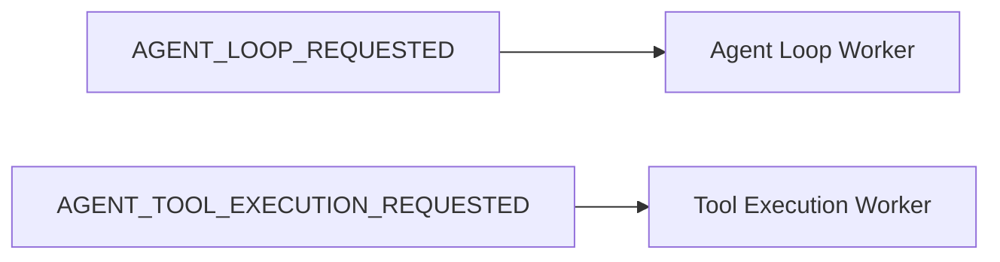
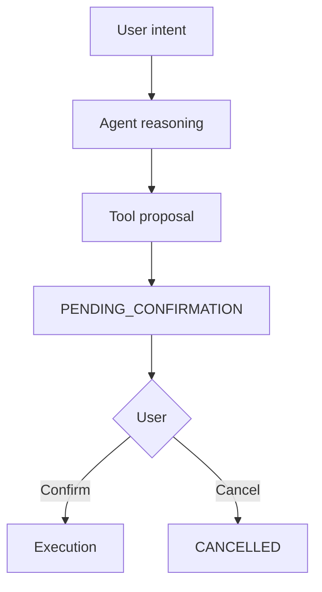
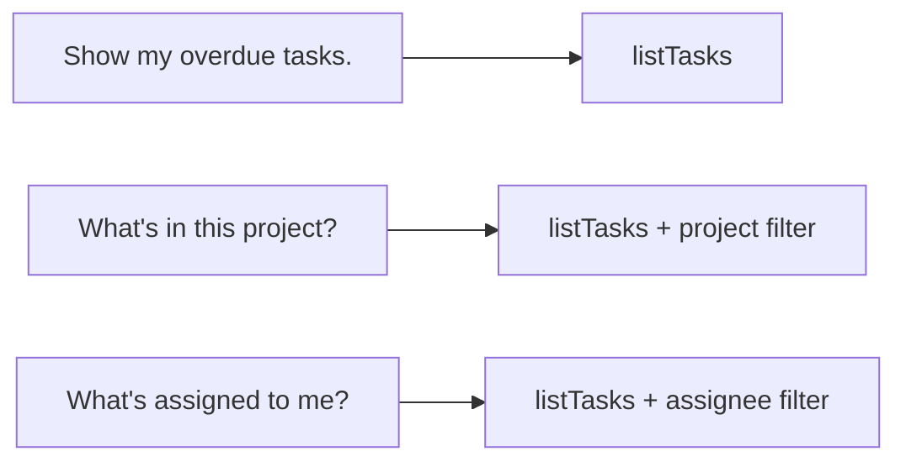
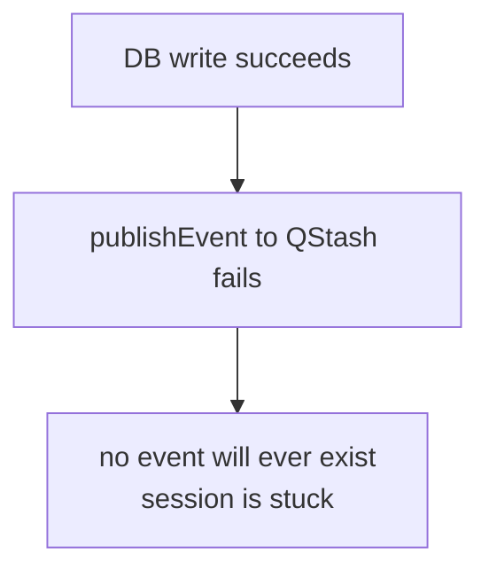
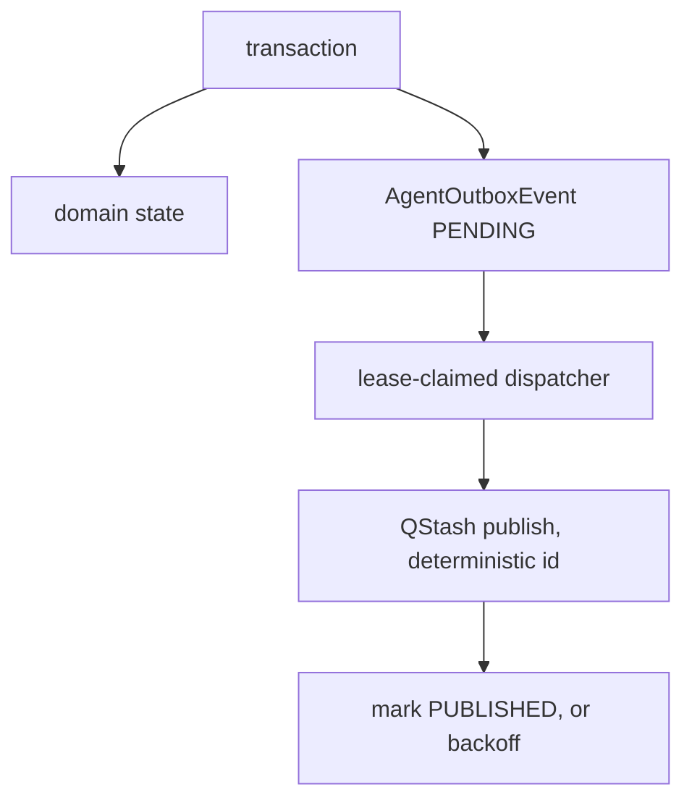
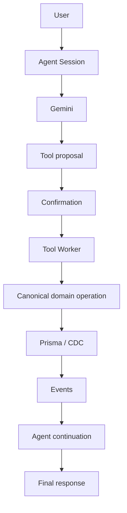

# Agent Roadmap

> Verified against the repository on 2026-09-29. Every status in this document
> was checked against the code, not assumed from a plan.
>
> **The repository is the source of truth for implemented status. This document
> is the source of truth for intent.** Where the two disagree, the code wins and
> the disagreement is called out.

## Status labels

| Label | Meaning |
| --- | --- |
| `IMPLEMENTED` | Exists in code and is wired into the runtime. |
| `PARTIAL` | Exists, with a known correctness or durability gap. |
| `DECLARED ONLY` | Type, enum or column exists; nothing produces it. |
| `PLANNED` | Intentionally not built yet. |
| `DEFERRED` | Deliberately pushed out of the current architecture. |
| `REMOVED` | Existed and was deleted. |

## Current-state matrix

Statuses below were **verified**, not copied from an earlier plan. Three rows in
the original planning matrix have moved from `PLANNED / VERIFY` to
`IMPLEMENTED` as a result of the Phase 1 hardening pass: `Session GET`,
`Secure Pusher auth`, and the max-step / single-tool-call / routing work.

| Capability | Status | Notes |
| --- | --- | --- |
| `AgentSession` | `IMPLEMENTED` | Durable persistence layer; 4 indexes incl. `terminalReason` |
| `AgentMessage` | `IMPLEMENTED` | Raw AI SDK `ModelMessage` JSON, ordered by `createdAt` only |
| `AgentToolExecution` | `IMPLEMENTED` | `toolCallId` unique; proposal/dispatch/terminal states incl. `PENDING_CONFIRMATION`, `CANCELLED` and `EXPIRED` |
| Event-driven loop | `IMPLEMENTED` | QStash re-arms the loop; no long-running request |
| Redis lock | `IMPLEMENTED` | `SET NX PX` + token-guarded Lua renewal at `ttl / 3` |
| CAS step claim | `IMPLEMENTED` | `updateMany` on `currentStep: expectedStep` |
| Event routing | `IMPLEMENTED` | Single dispatcher; unknown → 400, known-unhandled → 500 |
| Max-step guard | `IMPLEMENTED` | `currentStep > maxSteps`; exactly 5 model calls |
| One tool call per turn | `IMPLEMENTED` | Enforced in `loop-runner`, not just the prompt |
| Terminal reasons | `IMPLEMENTED` | `terminalReason` column + `AgentTerminalReason`; **migration not applied** |
| Tool registry | `IMPLEMENTED` | One entry per tool binding tool + executor + policy; `agentTools` derived |
| Tool policy | `IMPLEMENTED` | `READ_ONLY` / `WRITE` / `DESTRUCTIVE`; confirmation derived, not stored |
| Trusted tool context | `IMPLEMENTED` | `orgId`/`userId` from the persisted `AgentSession` |
| Confirmation gate | `IMPLEMENTED` | Durable `PENDING_CONFIRMATION` proposal + confirm/cancel endpoints; **migration not applied** |
| Canonical task creation | `IMPLEMENTED` | `createTaskInOrg()` — the single enforcement point |
| Canonical task update | `IMPLEMENTED` | `updateTaskInOrg()` — the second single enforcement point |
| Canonical task reads | `IMPLEMENTED` | `listTasksInOrg` / `getTaskInOrg` / `resolveTaskInOrg`, all project→org scoped |
| Project name resolution | `IMPLEMENTED` | `resolveProjectNameInOrg` — org-scoped, `FOUND/NOT_FOUND/AMBIGUOUS` |
| Pusher transport | `IMPLEMENTED` | Live update only; DB remains the source of truth |
| Secure Pusher auth | `IMPLEMENTED` | `401` / `400` / `403`; ownership checked; foreign ≡ unknown |
| Session GET | `IMPLEMENTED` | `GET /api/agent/session/[sessionId]`, owner-scoped, includes open proposals |
| Lock heartbeat | `IMPLEMENTED` | Token-guarded renewal at `ttl / 3` |
| Execution liveness heartbeat | `IMPLEMENTED` | Claimed rows refreshed every 30 s; staleness re-checked inside the reaper CAS |
| Orphan recovery | `IMPLEMENTED` / `SCHEDULED` | `reapOrphanedToolExecutions` + `redeliverStalledConfirmedExecutions` via `AGENT_MAINTENANCE_REQUESTED`, driven by QStash schedule `scd_6x2LU8qSUyNjxuveHoyM8tPo4ykj`; real signed ticks observed. Destination is a temporary tunnel — a stable origin is still owed |
| Stalled-session recovery | `IMPLEMENTED` / `SCHEDULED` (live proof partial) | `redriveStalledSessions` + bounded `rearmOutboxEvent`; 5th maintenance duty. Lock is the liveness signal, `updatedAt` only a pre-filter. See [Decision 21](./decisions.md#decision-21-a-stale-session-is-proven-dead-by-its-lock-not-its-timestamp) |
| Prompt versioning | `PARTIAL` | `AGENT_PROMPT_VERSION` + `AgentSession.promptVersion` (session-level only; no per-message hash) |
| Unit tests (agent) | `IMPLEMENTED` | 20 suites, 304 tests |
| `searchKnowledge` | `REMOVED` | Replaced by `createTask` |
| Dedicated tool-execution route | `REMOVED` | Folded into `/api/worker` — one consumer per event |
| Agent UI | `PLANNED` | **No client exists.** Nothing calls `/api/agent/init` or the session GET |
| Task read tools | `IMPLEMENTED` | `listTasks` is `READ_ONLY`; `getTaskInOrg` remains internal |
| Task update tools | `IMPLEMENTED` | `updateTask` is `WRITE`, confirmed |
| Task status transitions | `PARTIAL` | `IN_PROGRESS` / `DONE` now writable via `updateTask`, with no domain transition rules |
| Task deletion | `DEFERRED` | No safe domain semantics; `DESTRUCTIVE` policy is ready but unused |
| Project list in prompt | `PLANNED` | Disambiguation costs a round trip |
| Transactional outbox | `IMPLEMENTED` | `AgentOutboxEvent` written in the caller's transaction; lease-claimed dispatcher, backoff, deterministic ids |
| Approval timeout | `IMPLEMENTED` | `EXPIRED` after `expiresAt` (15 min default); expiry + transcript + re-arm are one transaction |
| Maintenance auth | `IMPLEMENTED` | None needed — inherits the worker's QStash per-delivery signature verification |
| Queue signature bypass | `IMPLEMENTED` | `ALLOW_UNSIGNED_LOCAL_WORKER === "true"`; no `NODE_ENV` gate |
| Tool result pairing | `PLANNED` | Guaranteed structurally today, not by validation |
| Message ordering | `PLANNED` | `createdAt` alone; no deterministic secondary key |
| Persisted message validation | `PLANNED` | `message-mapper.ts` casts JSON without validating |
| Duplicate-execution tests | `IMPLEMENTED` | Cancelled/unconfirmed rows are not claimable; covered in `durability.test.ts` and `tool-confirmation-flow.test.ts` |
| End-to-end test | `PLANNED` | None exists |
| Parallel tool calls | `DEFERRED` | Deliberately out of the current architecture |

---

## Phase 0 — Existing Agent Foundation

**Status:** `IMPLEMENTED`
The foundation was already in place before any of the work in this document.

| Component | Where | Status |
| --- | --- | --- |
| `AgentSession` / `AgentMessage` / `AgentToolExecution` | `prisma/schema.prisma` | `IMPLEMENTED` |
| Durable event-driven loop | `agent-loop/al.ts` + `loop-runner.ts` | `IMPLEMENTED` |
| Redis locking | `locks.ts` | `IMPLEMENTED`, hardened in Phase 4 |
| CAS step claiming | `session-service.ts` | `IMPLEMENTED` |
| QStash continuation | `events/queue.ts` | `IMPLEMENTED` |
| Pusher events | `status.ts` + `pusher/auth/route.ts` | `IMPLEMENTED`, secured in Phase 1 |
| Persisted tool execution state | `tool-execution-service.ts` | `IMPLEMENTED` |

Phase 0 established the shape. It did not establish correctness — that was
Phase 1.

## Phase 1 — Agent Runtime Hardening

**Status:** `IMPLEMENTED`
Two passes on 2026-09-29. See
[`../../dev-log/2026-09-29.md`](../../dev-log/2026-09-29.md).

### Routing

**Status:** `IMPLEMENTED`


Both events dispatch through `/api/worker`. Before this pass,
`AGENT_TOOL_EXECUTION_REQUESTED` had **no case in the dispatcher at all** and
relied entirely on an unverifiable external QStash consumer pointed at a
dedicated route. The dedicated route has since been deleted so there is exactly
one source-level consumer per event.

The dispatcher also stopped acknowledging work it did not do: previously every
unrecognised event returned `200`, telling QStash the job was done. Now a known
event with no handler returns `500` and an unknown type returns `400`.

> **Operational action required:** repoint any deployed QStash consumer from
> `/api/worker/agent-tool-execution` to `/api/worker`.

### Max-step correctness

**Status:** `IMPLEMENTED`
- `AgentSession.terminalReason` (`String?`, indexed) added, with a
  machine-readable `AgentTerminalReason` union.
- The gate is now `currentStep > maxSteps`, evaluated after the CAS claim, so
  `MAX_AGENT_STEPS = 5` produces **exactly five** model calls. The previous
  comparison was off by one.
- `LoopResult` is exhaustive with an `assertNever` default, so a new variant is
  a compile error until handled.
- Every terminal Pusher publish is gated on `updateMany().count === 1`, so a
  duplicate delivery cannot emit a second contradictory terminal event.

### Single tool call per model turn

**Status:** `IMPLEMENTED`
> One model turn produces **at most one** executable tool call.

The installed `ai@6.0.208` exposes `toolChoice` only as
`'auto' | 'none' | 'required' | { toolName }` and has **no** `parallelToolCalls`
flag, so the provider cannot be asked to disable parallel calls. Enforcement is
therefore in `loop-runner.ts`, after `generateText` resolves and **before
anything is persisted** — so a mismatched turn leaves no partial transcript.

Parallel tool execution is `DEFERRED` by design, not by omission. See
[`decisions.md`](./decisions.md#decision-4-one-tool-call-per-model-turn).

### Pusher security

**Status:** `IMPLEMENTED`
Authenticated user **plus** session ownership before authorizing a private
agent channel. The org id is no longer read from the request body. The old
`&`/`=` split parser that truncated values containing `=` was replaced with
`URLSearchParams`.

### Session recovery API

**Status:** `IMPLEMENTED`
`GET /api/agent/session/[sessionId]` returns status, step, final response,
error, terminal reason, timestamps, messages and tool executions. Foreign and
unknown sessions are both `404` so the endpoint cannot enumerate session ids.

### Tests

**Status:** `IMPLEMENTED`
52 tests across 5 suites:

| Suite | Covers |
| --- | --- |
| `loop-policy.test.ts` | Max-step boundary, stale/duplicate deliveries, one-tool-per-turn |
| `worker-routing.test.ts` | Event→handler bindings, dispatch, 500/400 distinction |
| `pusher-auth.test.ts` | 401/400/403/200, ownership, foreign ≡ unknown |
| `session-read.test.ts` | 401/400/404/200, terminal-state shapes |
| `agent-channel.test.ts` | Body parsing, channel shape, lookalike-prefix rejection |

Terminal-state coverage lives in `loop-policy` and `session-read`.

## Phase 2 — Product Capability Layer

**Status:** `IMPLEMENTED`
Completed 2026-09-29. See
[`../../dev-log/2026-09-29.md`](../../dev-log/2026-09-29.md) and
[`tools.md`](./tools.md).

### Confirmation / approval



> **LLM intent is not equivalent to authorization to perform a write.**

Before this phase, the model calling `createTask` *was* the write. The prompt
said to only do it on explicit request, and nothing checked.

What shipped:

- `AgentToolExecutionStatus.PENDING_CONFIRMATION` and `CANCELLED`, plus
  `confirmedAt` / `cancelledAt` (**migration not applied**).
- `AgentToolPolicy` with `READ_ONLY` / `WRITE` / `DESTRUCTIVE`. Confirmation is
  **derived** from the policy, so a tool cannot declare itself safe.
- One registry binding tool + executor + policy. `agentTools` is derived from
  it, so the model-facing map cannot drift.
- The loop persists a proposal and stops publishing. The worker's claim is a CAS
  from `PENDING` only, so an unapproved or cancelled row is structurally
  unexecutable.
- `POST .../executions/[executionId]/confirm` and `.../cancel`, **no request
  body**, owner-scoped and bound to the session by `sessionId`.
- A server-rendered proposal on `GET /api/agent/session/[sessionId]`, so a
  refresh does not lose a pending approval.
- `TOOL_PROPOSED` / `TOOL_CONFIRMED` / `TOOL_CANCELLED` / `TOOL_COMPLETED`
  status events. The `WAITING_CONFIRMATION` **wire** variant was removed —
  nothing ever published it, and the execution row identifies the specific
  action pending rather than only the fact that something is.

What was deliberately **not** built:

- **No approval timeout.** `expiresAt` exists only on the removed event variant;
  there is no column and no sweeper. A proposal persists until the user acts.
  Phase 4.
- **No `WAITING_CONFIRMATION` session status.** Cancelling one proposal is not
  cancelling the conversation, so a declined write leaves the agent free to
  continue. `cancelAgentSession` therefore still has zero callers.
- **No destructive tool**, despite the policy being implemented and tested.

### Task read tools

**Status:** `IMPLEMENTED`


`READ_ONLY`, so it dispatches immediately with no confirmation — which is what
makes a read tool cheap to trust. It runs against `listTasksInOrg`, which
filters through `project: { orgId }` because `Task` has no `orgId` column of its
own, and clamps `take` server-side.

### Task update tools

**Status:** `IMPLEMENTED (status, priority, assignee)`
`updateTask` reaches `updateTaskInOrg` — the same shape as `createTaskInOrg`, and
likewise the **only** `prisma.task.update` in `src`. Partial updates: omitted
fields are untouched, `assigneeId: null` unassigns, a payload that changes
nothing returns `NO_CHANGES` rather than a false success.

Two things were left out on purpose:

- **Title is not updatable via the agent tool**, even though the domain schema
  accepts it. The model identifies a task by exact title, so rewriting the title
  would invalidate the handle the model is holding for the rest of the
  conversation.
- **Project moves are not supported** by the tool.

### Task lifecycle / status operations

**Status:** `PARTIAL`
`IN_PROGRESS` and `DONE` are now writable through `updateTask`, but with **no
domain transition rules**: any status can be set from any other. The phase's
original preference — a `transitionTaskStatus` operation encoding the legal
transitions — is still the better design and remains open.

### Task deletion

**Status:** `PLANNED`
Destructive. Naturally interacts with the confirmation system, and should land
after it, not with it. It also raises a question the current schema does not
answer: `TASK_DELETED` exists in `EventTypes` and the extended Prisma client
already dispatches it, so the CDC path is ready.

## Phase 3 — Agent UI / Session Experience

**Status:** `PLANNED — no client exists today`
> **There is currently no client at all.** Nothing in the app calls
> `POST /api/agent/init` or `GET /api/agent/session/[sessionId]`, and nothing
> subscribes to a `private-agent-*` channel or binds `AGENT_STATUS_CHANGE`. The
> existing `RealtimeListener` and `useWorkflowLiveStream` hooks handle the
> workflow and org channels respectively, and are a reasonable starting pattern.

Planned surface: conversation, tool proposal, confirmation, tool execution
state, tool result, final response — driven by Pusher, with
`GET /api/agent/session/:id` as the recovery path.

Must handle: browser refresh, reconnect, delayed execution, and worker
continuation. `GET /api/agent/session/:id` exists precisely so the client can
rehydrate from the database rather than trusting a possibly-missed socket
event.

> Two client-side requirements fall out of the current design: branch on
> `status` and `terminalReason`, **never** on the presence of `finalResponse`
> (it is `null` for both an empty answer and a failure); and expect that a tool
> may be running with no event published, because the tool worker only publishes
> on failure.

## Phase 4 — Durability / Crash Recovery

**Status:** `IMPLEMENTED` (Assignment 36) except sessions whose step froze with no
execution in flight

### Event recovery

**Status:** `IMPLEMENTED, NOW SCHEDULED`

A worker crash mid-loop leaves a session in `RUNNING` with a frozen
`currentStep`. A crash inside the tool worker after the `PENDING → RUNNING` CAS
leaves the execution row orphaned, and a QStash redelivery cannot recover it
because `markToolExecutionRunning` returns `count === 0` and the worker exits
silently.

`forge/src/lib/ai/agent/reaper.ts` contains all four sweeps, and
`AGENT_EXECUTION_HEARTBEAT_INTERVAL_MS` gives the first one something real to
measure:

| Function | Selects | Acts |
| --- | --- | --- |
| `expireStaleApprovals` | `PENDING_CONFIRMATION`, `expiresAt <= now`, session live | CAS → `EXPIRED` + `APPROVAL_TIMEOUT` result + re-arm intent, one transaction |
| `reapOrphanedToolExecutions` | `RUNNING`, no heartbeat for 10 min, session `RUNNING` | CAS → `CANCELLED`; session → `FAILED` + `terminalReason`; publish `FAILED` |
| `redeliverStalledConfirmedExecutions` | `PENDING`, stale, session `RUNNING` | re-record the dispatch intent |
| `redriveStalledSessions` | `RUNNING`, `updatedAt` older than 10 min, **no** `PENDING`/`RUNNING`/`PENDING_CONFIRMATION` execution, **re-confirmed under the session lock** | re-record or bounded-re-arm the `AGENT_LOOP_REQUESTED` intent; after 3 attempts → `FAILED` + `terminalReason` |

Liveness is a **heartbeat**, not a duration. Nothing else touches a `RUNNING`
row, so without a heartbeat a slow-but-healthy execution and a dead worker are
indistinguishable — and cancelling a slow execution kills a side effect that was
about to succeed. The staleness predicate is repeated inside the CAS for the
same reason: the read-then-write gap is exactly when the sweep fires.

`redriveStalledSessions` has no heartbeat to read, because there is no execution
row at all. It substitutes the **session lock** for a heartbeat: `updatedAt` is
only a pre-filter, and the session is re-read under the lock before anything is
published. See [Decision 21](./decisions.md#decision-21-a-stale-session-is-proven-dead-by-its-lock-not-its-timestamp).

**The scheduler gap is now closed, with a caveat.** `AGENT_MAINTENANCE_REQUESTED`
runs all of them plus the outbox drain, bounded by the payload's `limit`, through
the signed `/api/worker` dispatcher. A failure in one duty does not stop the
others, and the pass throws afterwards so QStash retries the tick. Schedule
`scd_6x2LU8qSUyNjxuveHoyM8tPo4ykj` exists and real signed ticks have executed the
sweep.

The caveat is durability of the destination, not existence of the schedule: the
worker is reachable only through a temporary `ngrok-free.dev` tunnel and
`APP_URL` is still `localhost`, so a stable public origin is still owed. A
schedule that exists but cannot be reached looks identical to one that works, from
every document and every dashboard.

Sweeping sessions whose *step* froze with no tool execution in flight is no
longer open — that is `redriveStalledSessions`. Its live re-arm path is not yet
proven; see the audit's *What is NOT verified*.

### Outbox

**Status:** `IMPLEMENTED` (Assignment 36)

The failure window that motivated this:



Every domain transition published inline after its own `updateMany`, with no
transactional coupling. A crash in that gap left the database correct and the
event permanently gone, with no recovery path — because the recovery paths that
did exist all read state that said the work was already done.

The implemented model:



The domain write and the outbox row commit together; the dispatcher drains
separately. Delivery is **at-least-once and only at-least-once** — exactly-once
is not claimed. Duplicates are made safe by the consumers' own CAS (tool worker
claims only `PENDING`, loop handler only advances a step it holds) plus the
deterministic `deduplicationId`. Failed publishes stay `PENDING` with an
incremented attempt count and a backoff along
`AGENT_OUTBOX_BACKOFF_MS`; they are never dropped.

Claiming is a **lease on `availableAt`**, not a `status = PENDING` read. The
claim mutates the very field the predicate tests, so an overlapping maintenance
tick reads a row that is no longer due and matches nothing. A status-only check
would let both ticks "win" and publish the same event twice from inside the app.

Pusher remains transport-only. The outbox makes the *event* stream replayable;
the UI's own live-update gap is a separate concern and is not closed by this.

### Lock lease / heartbeat

**Status:** `IMPLEMENTED`

`withToolExecutionLock` / `withAgentSessionLock` arm a renewal timer at
`ttl / 3` and extend with a Lua script that re-checks the token before
`PEXPIRE`ing. A blind `PEXPIRE` would extend a lock a *different* worker had
since re-acquired, locking that worker out of its own lock.

Still open, and deliberately not attempted: fencing tokens, or moving the lease
into the database so the check and the renewal are one atomic operation.

### Stale tool execution

**Status:** `IMPLEMENTED`

The tool worker loads the session with the execution and refuses to run when it
is not `RUNNING`, closing the row out as `CANCELLED` and writing a
`SESSION_NOT_RUNNING` tool result so the transcript is not left holding an
unanswered call. The abandon CAS includes `RUNNING`, because at that point the
worker owns the claim and no other path would ever transition the row.

### Approval timeout

**Status:** `IMPLEMENTED` (Assignment 36)

`AgentToolExecution.expiresAt` is stamped at proposal time from
`getAgentApprovalTimeoutMs()` (15 min default, `AGENT_APPROVAL_TIMEOUT_MS`
overridable), indexed with `status` so the sweep stays bounded. A `NULL`
`expiresAt` — a pre-migration row — is never expired, since `NULL <= x` is not
true.

`expireStaleApprovals` calls `expireToolExecutionAndContinue`, which commits the
`EXPIRED` CAS, the `APPROVAL_TIMEOUT` tool-result, and the re-arm intent in one
transaction. That atomicity is load-bearing: with the old three-step shape a
crash after the CAS left a **terminal** execution that no sweep would ever
select again, stranding the session permanently.

A terminal session is still closed but not continued — there is no turn left to
continue. The model is told the action did not happen, must not be retried, and
must not be reached by another route, which is the part that stops it from
finding a workaround around the gate.

## Phase 5 — Reliability / Correctness Hardening

**Status:** `PLANNED`
### Tool result pairing

Every persisted tool call must have a corresponding result or failure
representation. Today this holds *structurally* — the loop runner refuses to
persist an assistant message containing a tool call unless exactly one call was
produced, and the tool worker always writes a tool-result message on both the
success and failure paths. But nothing validates it, and the invariant is one
refactor away from breaking.

### Message ordering

`getMessages` and `getToolExecutionsForSession` order by `createdAt` alone.
Millisecond timestamps are not a total order, and `AgentMessage` has no
`updatedAt` and no secondary key. A deterministic secondary ordering — a
per-session monotonic sequence — should replace the timestamp dependency.

### Persisted message validation

`message-mapper.ts` is a `map` with an unchecked cast from `Prisma.JsonValue`
to `ModelMessage`. A malformed or legacy row becomes a malformed model input.
Reconstruction should be validated rather than asserted.

### Duplicate execution protection

At-least-once delivery must not create duplicate side effects. The guards —
`EventLog(messageId)`, the session CAS, the `PENDING → RUNNING` CAS — exist and
are correct in principle.

**Status:** `PARTIAL` — the execution CAS is now tested; the `EventLog` hole is
not.

`durability.test.ts` and `tool-confirmation-flow.test.ts` cover the claim CAS
against the real `where` clause, including that a `CANCELLED` and a
`PENDING_CONFIRMATION` row are not claimable. Still open: when the `EventLog`
`FAILED → PENDING` re-arm CAS loses, execution is skipped and the worker still
returns `200`. That is the same class of bug Phase 1 removed from the dispatcher.

Note also that the QStash `deduplicationId` was a hash of the whole CloudEvent
including `time` and a `Date.now()`-derived id, so it was unique per publish and
could never collapse a genuine re-publish. The outbox dispatcher now overrides it
with a deterministic value derived from the outbox row, which is the first case
where it does anything. The consumers' CAS remains the primary guard.

## Phase 6 — Testing

**Status:** `PARTIAL` — 20 suites, 304 tests. `npx tsc --noEmit` clean. No
coverage thresholds are configured. `npx jest` was not run against a live
database, and a `jest.setup-db-guard.ts` guard now fails any test that
constructs a real `PrismaClient`.

Two assertions were mutation-checked rather than trusted: removing the `PENDING_CONFIRMATION`
exclusion from `redriveStalledSessions` fails its test, as does removing the
outbox claim lease. A test that has never been seen to fail is not evidence.

### Unit tests — `PLANNED` (highest value)

Nothing currently tests the single tenant-enforcement point:

- `createTaskInOrg` — cross-org `projectId`, non-member assignee, invalid input,
  `CREATE_FAILED` mapping.
- `resolveProjectNameInOrg` — `FOUND` / `NOT_FOUND` / `AMBIGUOUS`, and that a
  project in another org is never returned.
- `executeCreateTask` — suggestion propagation, and that no Prisma import leaks
  into the tool layer.
- Lock behaviour — acquire, contention returns `null`, Lua CAS release.
- CAS behaviour — one winner, stale `expectedStep` rejected, rewind rejected.

### Agent loop tests

**Status:** `PARTIAL`
`loop-policy.test.ts` covers the step budget and the one-call rule as pure
functions; `tool-confirmation-flow.test.ts` covers proposal persistence,
read-only dispatch, unknown-tool fail-closed, and worker execution gating. Not
covered: the `generateText` → persist → re-arm integration.

### Security tests

**Status:** `PARTIAL`
Covered: wrong user, wrong session, cross-session execution binding,
unauthorized Pusher subscription, cross-org task reads, assignee membership,
ambiguous-title refusal, model-supplied `orgId` rejection, and the full
confirm/cancel authorization ladder (`execution-routes.test.ts`).

**Not covered: the domain operations against a real database.** Every task test
asserts the `where` clause the code *builds*, using a prisma double. That is
strong evidence for the predicates but not for the SQL Prisma emits from them,
and no test runs `createTaskInOrg` / `updateTaskInOrg` against Postgres.

### Worker durability tests

**Status:** `PARTIAL`
Covered: lock heartbeat and token-guarded renewal, lock contention, reaper
selection, reaper CAS including the staleness predicate, execution liveness
transitions, and the claim CAS refusing `CANCELLED` / `PENDING_CONFIRMATION`.

Not covered: real crash, real publish failure, real Redis/QStash.

### End-to-end test

**Status:** `PLANNED`


The confirmation steps now exist, so the flow is writable. It still needs a
database, a queue, and a model stub.

## Prompt versioning

**Status:** `PARTIAL — session-level only`
```ts
export const AGENT_PROMPT_VERSION = "v3";
// prisma/schema.prisma
promptVersion String @default("v1")
```

`AgentSession.promptVersion` records the contract the session was **created**
under; `runAgentLoop` warns when it differs from the current one.

**Not built:** a per-message `promptHash` of the rendered prompt. Without it, a
transcript spanning a deploy cannot say which contract each turn saw. The hash
should cover the tool descriptions too, since those carry behavioural rules —
see [`prompt.md`](./prompt.md#prompt-provenance).

## Deliberately deferred

| Item | Why deferred |
| --- | --- |
| **Parallel tool calls** | The architecture is not designed for parallel tool results, and the one-call rule is what keeps the transcript consistent. Revisit only with a real need. |
| **Model streaming** | The loop uses `generateText`. Streaming would require reconciling a partial stream with a persisted tool-call invariant. |
| **Dynamic tool loading / routing** | Every registered tool is offered on every turn. Selection is orthogonal to the `ToolExecutionContext` boundary and can be added without changing it. |
| **Multi-provider model abstraction** | One provider. The `agentModel` indirection already exists if needed. |
| **Streaming status via Pusher** | `AgentStatusEvent` has no partial-token variant, and partial output cannot be persisted safely under the current message model. |
| **Per-organization prompts** | The prompt takes only `organizationName`. Per-org customization is a product decision, not a technical prerequisite. |
| **Destructive tools** | The policy exists; the domain semantics do not. See [`decisions.md`](./decisions.md#decision-13-no-destructive-tools-despite-a-working-policy). |
| **A public `getTask` tool** | `listTasks` covers the read need, and `getTaskInOrg` exists for internal callers. Add it when a real case needs a single-task fetch. |

## Known dead code

Found during the 2026-09-29 audit. Harmless, but it obscures the real shape of
the system and should be cleaned up.

| Symbol | Location | Note |
| --- | --- | --- |
| `cancelAgentSession` | `session-service.ts` | 0 callers. Phase 2 did **not** make it live: a declined proposal leaves the session `RUNNING` on purpose, so cancelling one action is not cancelling the conversation. Delete it or give it a real caller. |
| `getAgentSessionForOwner` | `session-service.ts` | 0 callers; superseded by `getAgentSessionForUser`. |
| `getAppUrl` | `constants.ts` | 0 callers; `APP_URL` unused by agent code. |
| `terminalReasonForToolCallDecision` | `loop-policy.ts` | 0 callers; `loop-runner` inlines the mapping. |
| `StoredAgentMessage` | `types.ts` | 0 references. |
| `AgentLoopEventPayload` | `types.ts` | 0 references; `worker-types.ts` derives from `EventPayloadMap`. |
| `AgentToolExecutionEventPayload` | `types.ts` | 0 references. |
| `AgentMessageRole` (Prisma enum) | `schema.prisma` | Imported at `message-service.ts:3`, never used; no column consumes it. |
| `AgentLoopWorkerEvent` | `worker-types.ts` | `al.ts` declares a **duplicate local** type instead of importing it. |
| `searchProjectsInOrg` | `projects.ts` | One internal caller; now also used by `resolveProjectNameInOrg`. |
| `agent-tool-execution-requested` | `queue.ts` `topicMap` | Dead, because `USE_MULTI_TOPICS` is `false`. |
| `taskSummaryOutputSchema` | `tools/shared-output.ts` | Used only to infer the `TaskOutput` TypeScript type. It is **not** an output validator — executor results are typed, not parsed. Naming it `...Schema` implies enforcement that does not exist. |
| `hasLostOwnership` | `locks.ts` | Exposed on the lock result; nothing calls it. A worker's callback cannot be cancelled, so the flag could only ever be logged. |
| `AgentSessionStatus.WAITING_CONFIRMATION` | `schema.prisma` | The enum value remains, nothing sets it. The durable wait lives on the execution row instead — a *specific* pending action beats a session-level "something is pending". |
