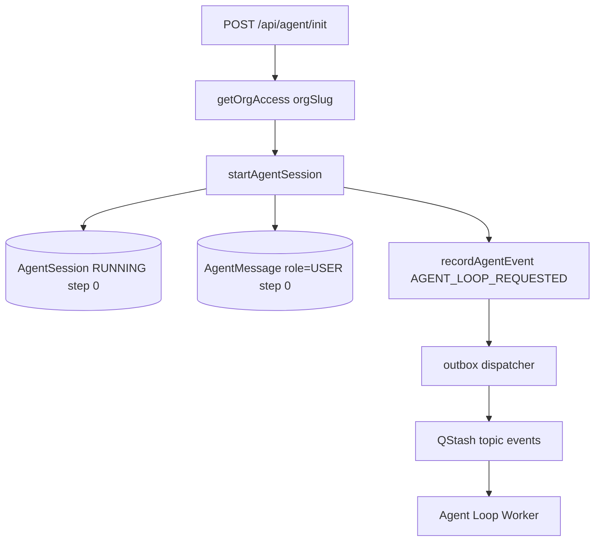
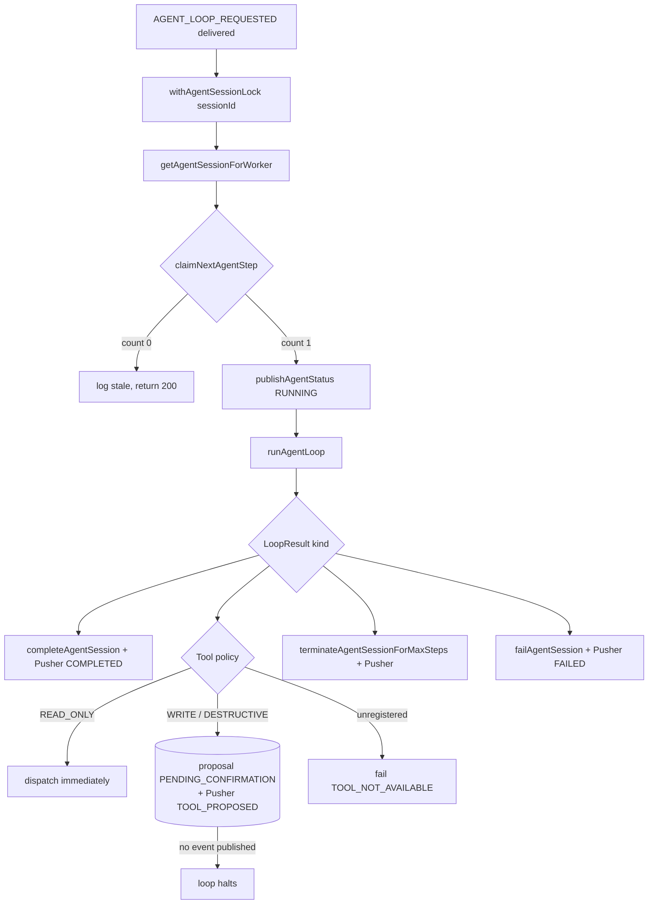
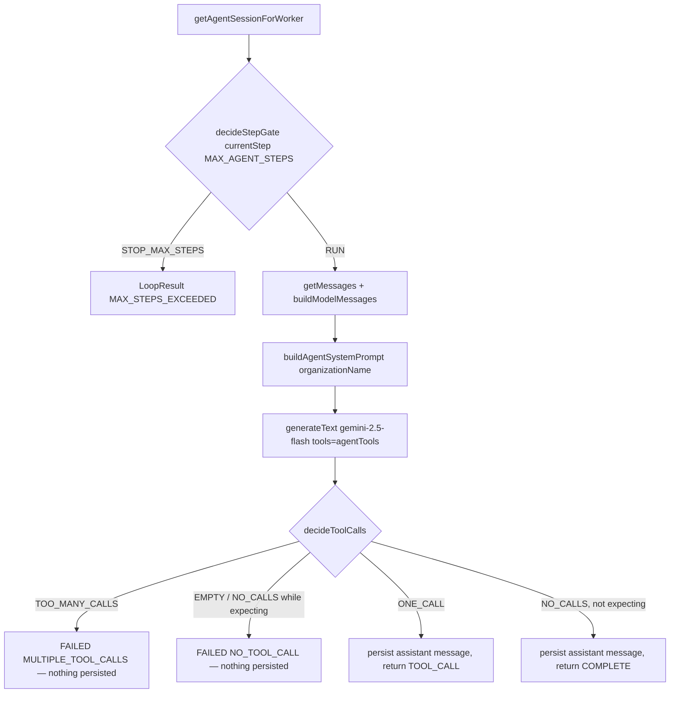
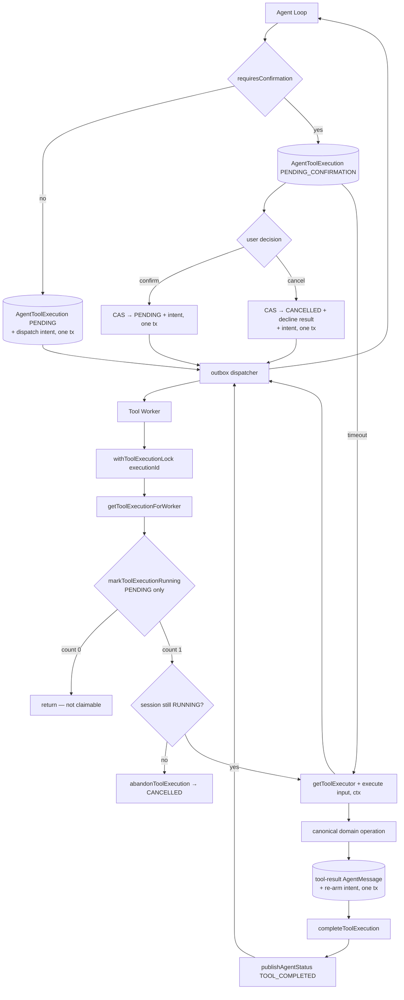
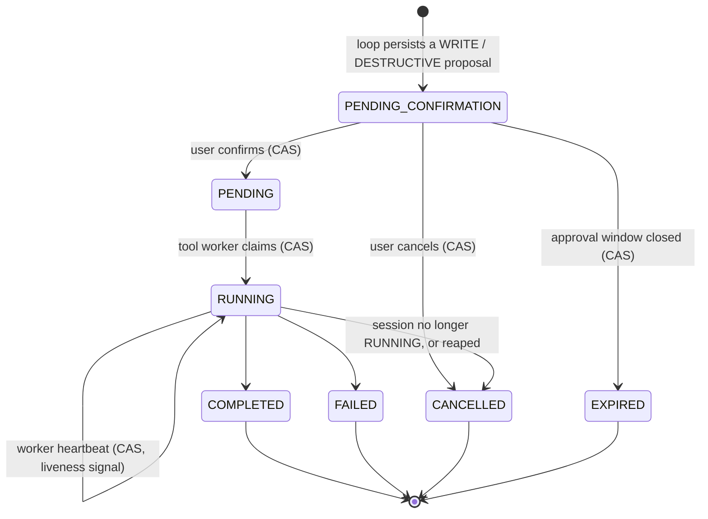
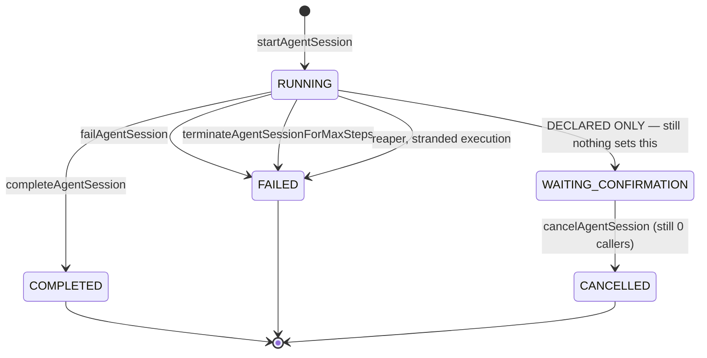
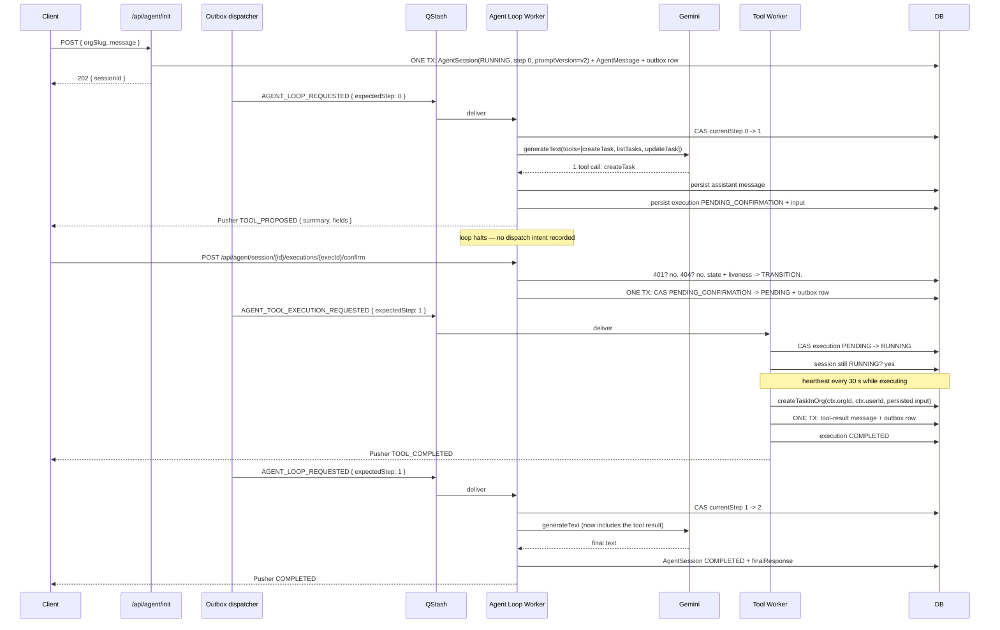

# Agent Runtime Architecture

> Verified against the repository on 2026-09-29. Status labels follow
> [`README.md`](./README.md#status-legend).

This document describes the runtime **as it is today**, stage by stage, with
the exact files and function names that implement each step.

## Stage 1 — Agent initialization



`forge/src/app/api/agent/init/route.ts` — `POST` only.

**Input** is a strict Zod object: `{ orgSlug: string (1+), message: string trimmed 1–5000 }`.
Invalid input is `400`.

**Authorization** is `getOrgAccess(orgSlug)`
(`forge/src/features/organizations/getOrgAccess.ts`), which requires a NextAuth
session, resolves the `Organization` by slug, and requires a `membership` row for
the current user. Unauthenticated or non-member is `403`.

> The `orgSlug` on the request body is an *input*, not an authorization. The
> trusted organization id is `orgAccess.organization.id`, returned by the
> membership check. This distinction is load-bearing — see
> [`security.md`](./security.md).

**Then** `startAgentSession({ orgId, userId, initialMessage })`
(`forge/src/lib/ai/agent/orchestrator.ts`) does exactly three things, **in one
transaction**:

1. creates one `AgentSession` row, `status: RUNNING`, `currentStep: 0`,
   `promptVersion` stamped from the compiled-in constant;
2. `createMessage` → one `AgentMessage` row, `role: "user"`, `step: 0`;
3. `recordAgentEvent` → one `AgentOutboxEvent` row for
   `AGENT_LOOP_REQUESTED`, keyed `AGENT_LOOP_REQUESTED:<sessionId>`.

> **Changed in Assignment 36.** These were three independent steps ending in a
> direct `publishEvent`. The worst case was a session committed at `RUNNING` with
> its opening message and no event: it looked live to every read path, nothing
> would claim it, and no recovery sweep covers a session that never started,
> because staleness is judged from a heartbeat this row never produced. The
> user's first message simply vanished. See
> [Transactional outbox](#transactional-outbox).

The route returns **`202`** with `{ sessionId, status }`. It does **not** block
on the model, and it publishes **no Pusher event** — the loop worker owns the
first `RUNNING` status.

## Stage 2 — The agent loop

`forge/src/app/api/worker/agent-loop/al.ts` — `handleAgentLoop`.



### Order of operations

1. **Acquire the session lock** — `withAgentSessionLock(sessionId, cb)`
   (`forge/src/lib/ai/agent/locks.ts`). Returns `null` on contention, which the
   worker logs as "already being processed" and returns `200`. Contention never
   blocks or throws.
2. **Load the session** — `getAgentSessionForWorker(sessionId)`. Missing →
   log, return.
3. **Claim the step** — `claimNextAgentStep(sessionId, expectedStep)`. This is
   the compare-and-swap described under [Concurrency](#concurrency). A lost race
   logs "stale loop event" and returns `200`.
4. **Publish `RUNNING`** — before the model call, so the UI shows activity.
5. **Run one model turn** — `runAgentLoop(session.id)`.
6. **Dispatch on the result** — exhaustive `switch` with an `assertNever`
   default, so adding a `LoopResult` variant becomes a compile error until every
   branch handles it.

### Terminal branches publish only after a successful DB transition

Every terminal branch is:

```ts
const { count } = await completeAgentSession(id, response);
if (count === 1) await publishAgentStatus(id, { type: "COMPLETED", content: response });
```

`completeAgentSession`, `failAgentSession` and
`terminateAgentSessionForMaxSteps` are all `updateMany` calls whose `where`
clause constrains the current status. A duplicate delivery therefore updates
**zero** rows, and the Pusher event is **not** re-emitted. This is what
prevents the database and the UI from disagreeing about the outcome.

The same guard exists in `tool-worker.ts` for its failure path.

### The `TOOL_CALL` branch

Three outcomes, decided entirely by trusted server-side policy.

```ts
const policy = getToolPolicy(result.toolName);
if (!policy) → failAgentSession(session.id, message, "TOOL_NOT_AVAILABLE");

const needsConfirmation = requiresToolConfirmation(result.toolName);

const execution = await createToolExecution({
  sessionId: session.id,
  toolCallId: result.toolCallId,
  toolName: result.toolName,
  input: result.input,          // persisted verbatim
  requiresConfirmation: needsConfirmation,
  // Required when the tool is dispatchable without approval. Recorded by
  // createToolExecution INSIDE its own transaction, so the row and the intent
  // to execute it commit together.
  dispatchEvent: needsConfirmation
    ? undefined
    : { orgId: session.orgId, expectedStep: expectedStep + 1 },
});

if (needsConfirmation) {
  const proposal = describeToolProposal(result.toolName, execution.input);
  await publishAgentStatus(session.id, { type: "TOOL_PROPOSED", ... });
  break;                        // ← no event recorded. The loop halts.
}
```

Four things are load-bearing here:

1. **Policy comes from the tool name, server-side.** `getToolPolicy` reads the
   registry. An unregistered name fails the session closed with
   `TOOL_NOT_AVAILABLE` rather than defaulting to "safe" or throwing deep in
   the worker.
2. **The proposal is persisted before anything else happens.** `input` on that
   row is the single copy of the arguments. The confirm path replays it; it
   never receives, reconstructs, or merges arguments of its own.
3. **A write halts the loop.** No dispatch intent is recorded, so no worker
   runs, and the next model call only happens after a confirm or a cancel
   re-drives the loop.
4. **`expectedStep + 1` only applies to the immediate dispatch.** The confirm
   endpoint records with `session.currentStep`, which is already the
   post-claim value — the same number. Both paths converge.

The assistant message has already been persisted by the loop runner. The tool
result message is written later, by the tool worker (or the cancel endpoint),
before the loop is re-armed.

## Stage 3 — The model turn

`forge/src/lib/ai/agent/loop-runner.ts` — `runAgentLoop(sessionId)`.



Uses **`generateText`**, not `streamText`. (An earlier dev-log line said
`streamText`; that was wrong and has been annotated in
[`../../dev-log/2026-09-29.md`](../../dev-log/2026-09-29.md). `streamText` is
used by the unrelated RAG chat at `src/app/api/chat/route.ts`.)

**The validation order matters.** The turn is classified *before anything is
persisted*. If the model returns two tool calls, the run fails with
`MULTIPLE_TOOL_CALLS` and **no** assistant message is written. This is what
prevents a transcript containing an assistant turn with two tool calls and no
matching results, which the provider would reject on the next call.

### `LoopResult`
```ts
type LoopResult =
  | { kind: "COMPLETE"; response: string }
  | { kind: "TOOL_CALL"; toolName: string; toolCallId: string; input: JsonValue }
  | { kind: "MAX_STEPS_EXCEEDED"; maxSteps: number; currentStep: number }
  | { kind: "FAILED"; reason: AgentTerminalReason; message: string };
```

### Max steps
`MAX_AGENT_STEPS = 5` (`forge/src/lib/ai/agent/constants.ts`).

The gate is `currentStep > maxSteps`, evaluated **after** the CAS claim, so
`currentStep` is 1-based. With the limit at 5 the model is called **exactly
five times**; the sixth loop event terminates the session with
`FAILED` + `MAX_STEPS_EXCEEDED` + `finalResponse: null`, and makes **no** model
call.

> One asymmetry worth knowing: a tool requested on the fifth turn still
> executes, and its result is still persisted. Termination happens on the
> following loop event. The guarantee that matters — *no model call after the
> limit* — holds.

The gate and the tool-call classifier are pure functions in
`forge/src/lib/ai/agent/loop-policy.ts` with no I/O, so they are directly
testable without mocking Prisma, Gemini or Redis.

## Stage 4 — The tool path



`forge/src/lib/ai/agent/tool-worker.ts` — `handleToolExecution`.

The worker is **event-queue-driven and id-addressed**. It destructures only
`{ executionId, expectedStep }`; `sessionId` in the payload is not used. The
worker loads the execution and resolves everything else from the database, which
means a payload cannot lie about the org, the user, or the tool input.

Sequence:

1. `withToolExecutionLock(executionId, …)` — `SET NX PX`, 30 s, **with a TTL
   heartbeat**.
2. `getToolExecutionForWorker(executionId)` — includes the owning `session`, and
   through it `organization` and `user`.
3. `markToolExecutionRunning(executionId)` — CAS `PENDING → RUNNING`.
4. **Session liveness check** — if `execution.session.status !== "RUNNING"`, the
   execution is abandoned (`abandonToolExecution` → `CANCELLED`), a
   `SESSION_NOT_RUNNING` tool-result is written, and the worker returns. A
   terminal session must not gain new side effects, and the row must not be
   left in flight.
5. `getToolExecutor(execution.toolName)`.
6. `executor(execution.input, { orgId, userId, executionId })`.
7. `createMessage(..., { role: "tool", … })` **and**
   `recordAgentEvent("AGENT_LOOP_REQUESTED")` in **one transaction** — the
   transcript must not contain a tool result whose continuation was never
   recorded. Previously these were separate, and a crash between them left a
   dangling tool call with nothing to close it.
8. `completeToolExecution(executionId)` — **CAS from `RUNNING`**, so a losing
   duplicate delivery cannot stamp `COMPLETED` over a row another worker
   advanced.
9. `publishAgentStatus(TOOL_COMPLETED)`.

> The `AGENT_LOOP_REQUESTED` intent is recorded in step 7, before the
> `completeToolExecution` CAS in step 8. This ordering is deliberate: the CAS can
> legitimately lose to another worker, and the continuation is idempotent by step
> CAS at the consumer. Recording it first means a lost CAS never costs the
> transcript its answer.

On failure: `failToolExecution` (which stores the **stack**), then
`failAgentSession(..., "ERROR")`, and a `FAILED` Pusher event **only if** the
session update affected a row.

### Why step 3 is the whole security story

`markToolExecutionRunning` claims **`PENDING` only**:

```ts
updateMany({ where: { id, status: PENDING }, data: { status: RUNNING } })
```

A `PENDING_CONFIRMATION` row and a `CANCELLED` row are therefore *not claimable
at all* — not by a guard clause someone might forget to write, but by the shape
of the CAS itself. A late or duplicated QStash delivery for a proposal the user
declined exits at step 3 having performed no side effect. This is a structural
guarantee rather than a convention, and it is covered by tests that assert the
worker writes no message and dispatches no event.

### Why the tool worker is separate from the model loop

Four reasons, in order of importance:

1. **Different trust levels.** The loop talks to an external model provider and
   writes assistant messages. The worker writes to the database and performs
   side effects. Splitting them means the code path that performs writes is
   never the code path that parses untrusted model output.
2. **Different failure modes.** A model call that times out, is rate-limited or
   returns nonsense must not be able to leave a half-executed tool. Separating
   them means the tool either ran and committed, or did not run at all.
3. **Different concurrency controls.** The loop holds a *session* lock; the
   worker holds a *tool execution* lock. Two different resources, two different
   keys (`agent_session_lock:<id>` and `agent_tool_execution_lock:<id>`).
4. **Different latency profiles.** Tool execution may be slow. Blocking a model
   turn on it would waste the model call and hold the session lock far longer.

The loop and the worker communicate only through persisted rows and events.

## Stage 5 — User confirmation

A write proposal is a **durable row**, not a pending HTTP request. That is the
whole point: it survives a refresh, a reconnect, and a deploy.

### The state machine



`PENDING_CONFIRMATION`, `CANCELLED` and `EXPIRED` are the approval-gate states,
with the `confirmedAt` / `cancelledAt` / `expiredAt` / `expiresAt` audit
columns. `CANCELLED` and `EXPIRED` are **terminal**: no transition leaves them,
and nothing dispatches them.

`EXPIRED` is **new in Assignment 36** and is deliberately distinct from
`CANCELLED`. Nobody declined — the window simply closed, so the model is told
`APPROVAL_TIMEOUT` and reports "the approval window closed" rather than claiming
the user refused something they were never asked about. Before this, a proposal
awaiting a human was parked exactly where the system put it, and **no amount of
`RUNNING`-expiry sweeping would ever release it**: a user who never answered
would hold their session indefinitely. See
[Approval expiry](#approval-expiry-new-in-assignment-36).

The `RUNNING → CANCELLED` edge is the one worth reading twice. The worker takes
it only after claiming the row *itself* and finding the session terminal, and
the compare-and-set includes `RUNNING`. Leaving `RUNNING` out of that
`where` clause is not a missing nicety: this worker owns the claim, the queue
event is already acknowledged, and no reaper sweeps this state — the row would
sit `RUNNING` forever with a cancelled session behind it.

### The endpoints

Both live under `src/app/api/agent/session/[sessionId]/executions/[executionId]/`
and both are `POST` with **no request body**. A confirm needs no arguments and a
cancel needs none either; accepting any would only create a channel for
smuggling substitute arguments past review.

Each of the three user-visible outcomes (confirm, cancel, expire) is **one
transaction** covering the state transition, the transcript, and the delivery
intent. See [Transactional outbox](#transactional-outbox) for why that is not
merely tidier.

| | Confirm | Cancel | Expire |
| --- | --- | --- | --- |
| Route | `.../confirm/route.ts` | `.../cancel/route.ts` | reaper only, no route |
| Trigger | user clicks approve | user clicks decline | deadline passes |
| Transition | `PENDING_CONFIRMATION → PENDING` | `→ CANCELLED` | `→ EXPIRED` |
| Records | `AGENT_TOOL_EXECUTION_REQUESTED` | `CANCELLED` tool-result + `AGENT_LOOP_REQUESTED` | `APPROVAL_TIMEOUT` tool-result + `AGENT_LOOP_REQUESTED` |
| Pusher | `TOOL_CONFIRMED` | `TOOL_CANCELLED` | `TOOL_EXPIRED` |
| Re-running it | `200` + `idempotent: true`, **no re-dispatch** | `200` + `idempotent: true`, no second message | `200` + `idempotent: true`; a late confirm cannot talk the system out of it |

A confirm against an `EXPIRED` proposal returns `200` + `idempotent: true`, not
`409`. The outcome is settled, and reporting it truthfully beats reporting an
error that implies the user did something wrong by being late.

### The authorization ladder

`loadConfirmationTarget` in
`forge/src/lib/ai/agent/services/confirmation-service.ts` centralises it so both
routes enforce it identically:

1. **Authentication** (route): `auth()` → `401`.
2. **Ownership**: `getAgentSessionForUser({ sessionId, userId })` → `404`.
3. **Binding**: `getToolExecutionInSession({ executionId, sessionId })` → `404`.
4. **State**: `decideConfirmation` maps `(action, execution status)` to
   `TRANSITION` / `IDEMPOTENT` / `CONFLICT`.
5. **Liveness**: consulted only for a still-undecided proposal —
   `session.status !== RUNNING` → `409 SESSION_NOT_RUNNING`.
6. **Transition**: a compare-and-set, so concurrent requests resolve to one
   outcome.

Step 3 deserves emphasis. The session id is attacker-controlled, so ownership of
*that* session proves nothing about the *execution* id in the same path. The
execution lookup is constrained by `sessionId`, so a user who owns session A
cannot act on an execution belonging to session B. Unknown session and foreign
execution both return `404` with an identical body, so the endpoint cannot be
used to probe for valid ids across tenants.

**Steps 4 and 5 are ordered deliberately.** An execution that has already left
the gate cannot be changed by a dead session, so its real state is reported
rather than masked behind a `SESSION_NOT_RUNNING` the user can do nothing
about. Checking liveness first would mean a client that double-clicked confirm
after the session completed was told it had a problem it did not have.
`decideConfirmation` is a pure function precisely so this ordering is testable
without a database.

### Races resolve to one outcome

| Race | Winner | Loser sees |
| --- | --- | --- |
| confirm vs confirm | one `PENDING` | `409`, no second dispatch |
| confirm vs cancel | whichever CAS hit `PENDING_CONFIRMATION` first | `409 ALREADY_CANCELLED` / `409 ALREADY_DISPATCHED` |
| cancel vs a live worker | the worker (row is `RUNNING`) | `409 NOT_CANCELLABLE` |
| cancel after completion | nobody — `COMPLETED` is immutable | `409 NOT_CANCELLABLE` |

A cancel can never overwrite a committed write, and a confirm can never
resurrect a cancelled proposal.

### Why a cancel still re-drives the loop

A declined tool call has to be *answered* in the transcript. If the cancel
endpoint marked the row and stopped, the next model call would carry an
assistant turn with a tool call and no matching result, which providers reject.

So the cancel writes a real tool-result:

```ts
{ ok: false, code: "CANCELLED",
  error: "The user declined this action. Do not retry it and do not attempt
          to achieve the same result by another means." }
```

The loop treats it like any other result, and the system prompt tells the model
a decline is final.

### Approval expiry (new in Assignment 36)

`PENDING_CONFIRMATION` **does** have a deadline. `AgentToolExecution.expiresAt`
is stamped at proposal time from `getAgentApprovalTimeoutMs()`, which defaults
to 15 minutes and is overridable with `AGENT_APPROVAL_TIMEOUT_MS`. A row with a
**null** `expiresAt` is never expired — rows written before this column existed
stay `PENDING_CONFIRMATION` rather than being closed against a deadline nobody
agreed to. SQL agrees with that reading: `NULL <= x` is `NULL`, not true.

`expireStaleApprovals` in `forge/src/lib/ai/agent/reaper.ts` sweeps proposals
whose window has closed and calls `expireToolExecutionAndContinue`, which is
**one transaction**: the `PENDING_CONFIRMATION → EXPIRED` CAS, an
`APPROVAL_TIMEOUT` tool-result, and the `AGENT_LOOP_REQUESTED` intent.

That atomicity is the point, not tidiness. These were three separate steps, and
once the CAS committed the execution was terminal — so `findDueApprovalCandidates`
would never return it again. A crash before the publish stranded the session
*permanently*: the proposal closed, the transcript still held an unanswered tool
call, and the only query that would have found the work was the one that had just
marked it done. Atomicity removes that state: either all three commit, or the
proposal stays `PENDING_CONFIRMATION` and the next tick retries it.

A **terminal session is still closed but not continued** — there is no turn left
to continue, and a terminal session has no step to claim. The same applies when
the session row has vanished (e.g. an org cascade): the execution is closed so it
cannot hang forever, and nothing is published.

The model is told explicitly that the action did **not** happen, must not be
retried, and must not be attempted by another route. That last clause matters
more than it looks: a capable model asked to "handle the timeout" will otherwise
often find a different way to achieve the same outcome, which defeats the entire
approval gate.

`AgentSessionStatus` is still never set to `WAITING_CONFIRMATION` — the loop
simply stops publishing, and the *execution* row is what carries the waiting
state. The `WAITING_CONFIRMATION` enum value and the `cancelAgentSession` helper
remain `DECLARED ONLY`.

## Concurrency

### Redis locking
`forge/src/lib/ai/agent/locks.ts`.

| Lock | Key | TTL | Contention |
| --- | --- | --- | --- |
| Session | `agent_session_lock:<sessionId>` | `AGENT_SESSION_LOCK_TTL_MS` = 30 000 | returns `null`, caller logs and exits |
| Tool execution | `agent_tool_execution_lock:<executionId>` | `AGENT_TOOL_EXECUTION_LOCK_TTL_MS` = 30 000 | returns `null` |

Acquire is a single atomic `SET key <token> NX PX <ttl>` where `token` is
`crypto.randomUUID()`. Release is a Lua compare-and-delete so a worker can
never delete a lock that has since been taken by someone else.

**Renewal (Phase 2).** A flat TTL is a bet that work finishes inside it. A
`generateText` call plus a Prisma round trip can exceed 30 s under load, at
which point the lock silently lapses, a second worker starts, and both write.
`withLock` now arms a heartbeat at `ttl / 3` that extends the lease with a
token-guarded Lua script:

```lua
if redis.call("GET", KEYS[1]) == ARGV[1] then
  return redis.call("PEXPIRE", KEYS[1], ARGV[2])
end
return 0
```

The token check is the point. A blind `PEXPIRE` would happily extend a lock that
had already expired and been re-acquired by *another* worker, locking that
worker out of its own lock. If renewal finds the token gone, the helper logs
`Lost ownership … while work was in flight` — loud, because the exclusivity
guarantee is genuinely gone and silently continuing would hide a race.

The timer is `unref`'d so a held lock can never keep the process alive.

`withLock` returns `null` on contention but `undefined` when the callback
returns early, which is how `al.ts` and `tool-worker.ts` distinguish "someone
else has the lock" from "we did nothing because the event was stale". Both now
log contention; the tool worker previously discarded the return value entirely.

### CAS step claiming
`claimNextAgentStep(sessionId, expectedStep)` in `session-service.ts`:

```ts
const result = await prisma.agentSession.updateMany({
  where: { id: sessionId, status: RUNNING, currentStep: expectedStep },
  data:  { currentStep: { increment: 1 } },
});
return result.count === 1;
```

Exact equality, not `>=` or `<=`. Consequences:

- Two concurrent deliveries of the same step: exactly one gets `count === 1`.
- A duplicate or out-of-order event with a stale `expectedStep`: `count === 0`,
  logged, `200` returned. It cannot advance the counter.
- A rewound `expectedStep` (e.g. `0` after the session is at step 4) is
  **permanently** rejected, because the counter only ever increments.

A second, independent CAS exists for tool executions:
`markToolExecutionRunning` does `updateMany({ where: { id, status: PENDING },
data: { status: RUNNING } })` and the worker exits if `count !== 1`. This is
what stops a duplicate QStash delivery from running a tool twice.

## Event routing

`forge/src/app/api/worker/route.ts` is the **single** dispatcher and the
**only** source-level consumer of both agent events.

| Event | Handler | File |
| --- | --- | --- |
| `AGENT_LOOP_REQUESTED` | `handleAgentLoop` | `src/app/api/worker/agent-loop/al.ts` |
| `AGENT_TOOL_EXECUTION_REQUESTED` | `handleToolExecution` | `src/lib/ai/agent/tool-worker.ts` |

The default branch refuses to acknowledge work it did not do:

| Condition | Status | Reasoning |
| --- | --- | --- |
| Missing `type` | `400` | Malformed payload. |
| Known `EventTypes` value, no handler | `500` | Misrouting. Must retry, must not be a silent drop. |
| Unknown `type` | `400` | Retrying can never help; would burn the retry budget forever. |

> **Removed.** `src/app/api/worker/agent-tool-execution/route.ts` was deleted in
> the Phase 1 hardening pass. Two source-level consumers for one event is not a
> routing strategy, and the dedicated path could only ever receive traffic from
> an external QStash consumer that cannot be verified from the repository.
> **Operational action required:** if a deployed QStash consumer points at
> `/api/worker/agent-tool-execution`, repoint it at `/api/worker`. The
> `agent-tool-execution-requested` entry in `topicMap` is now dead, because
> `USE_MULTI_TOPICS` is `false`.

### Queue — `forge/src/lib/events/queue.ts`

`USE_MULTI_TOPICS = false`, so `getTopic` returns `"events"` for every event and
the 19-entry `topicMap` is **entirely unused**. `publishEvent` validates the
payload against the Zod schema in `events/schema.ts`, wraps it in a CloudEvents
1.0 envelope, and publishes with `retries: 3`.

`publishEvent` now takes an optional fourth `PublishOptions` argument:

- `messageId` — the CloudEvent `id`, so an outbox publish carries a **stable**
  id instead of a fresh `Date.now()`-derived one;
- `deduplicationId` — the QStash dedup key.

Both are supplied by the outbox dispatcher and derive from the outbox row id.
Delays are typed `PublishDelay` (`"30s"`, `"5m"`, …) and converted to QStash's
seconds. That was previously a compile-time fiction: a human-readable string was
cast to a number, so any call site passing `"5m"` type-checked and then failed at
runtime. An unrecognised unit is now a compile error.

Agent payload schemas:

```ts
AGENT_LOOP_REQUESTED:              { orgId, sessionId, expectedStep: int >= 0 }
AGENT_TOOL_EXECUTION_REQUESTED:    { orgId, sessionId, executionId, expectedStep: int >= 0 }
```

**Signing:** outbound publishing relies on `QSTASH_TOKEN`; there is no payload
signing in `queue.ts`. Inbound verification is `verifySignatureAppRouter` in
`events/worker.ts`, using `QSTASH_CURRENT_SIGNING_KEY` /
`QSTASH_NEXT_SIGNING_KEY`.

> **Changed in Assignment 36.** Inbound verification was bypassed whenever
> `NODE_ENV === "development"`. An environment *name* is not a security
> boundary: a deployed, preview, or tunnelled process reporting that value
> accepts forged deliveries to handlers that perform real writes. The bypass is
> now the explicit `ALLOW_UNSIGNED_LOCAL_WORKER === "true"`, evaluated by
> `isUnsignedWorkerAllowed()`. It is an exact string compare on purpose — a
> truthiness check would treat `=0` and `=false` as enabled, which is the opposite
> of what an operator writing them intends. See
> [Maintenance](#maintenance).

> **The `deduplicationId` is still not a general-purpose dedup key** — the
> default is a SHA-256 of the whole CloudEvent, which includes `time` and a
> `Date.now()`-derived `id`, so a *legacy* publish still gets a per-publish-unique
> key. The outbox path overrides it with a deterministic value, which is the
> first case where it actually collapses a repeat. Primary duplicate protection
> remains the consumers' own CAS; `EventLog(messageId)` is the third layer.

### Idempotency — `forge/src/lib/events/worker.ts`

`createWorker(eventType, handler)` wraps a handler with:

1. `waitUntil(analyticsWorkerHandler(…))` — runs **before** validation, for
   every delivery including duplicates and invalid payloads.
2. `Upstash-Message-Id` header; a synthetic id is substituted only when
   `isUnsignedWorkerAllowed()` is true, never merely because the environment is
   named `development`.
3. An `EventLog` create with a unique `messageId`. `P2002` is handled as
   already-processed / already-running / retry-from-`FAILED`.

> **Known gap:** if the `FAILED → PENDING` re-arm CAS loses (`updated.count ===
> 0`), execution is skipped and the function still returns `200`. That is a
> 200 that did no work — the same class of bug Phase 1 removed from the
> dispatcher.

## Session state machines

`AgentSessionStatus` — `forge/prisma/schema.prisma`



**`WAITING_CONFIRMATION` is still `DECLARED ONLY`.** Phase 2 implemented the
*approval gate*, not a session-level waiting status. The durable wait lives on
the execution row instead (`AgentToolExecutionStatus.PENDING_CONFIRMATION`),
which is strictly better: it identifies the specific action pending rather than
just the fact that something is. A session status would have to be re-derived
from "is there an open proposal?" on every read, and would go stale.

`cancelAgentSession` still has zero callers, because cancelling one proposal is
not the same as cancelling the conversation — a declined write leaves the agent
free to continue.

`AgentToolExecutionStatus`: see [Stage 5](#stage-5--user-confirmation) for the
full machine, including the two new Phase 2 states.

### Orphan recovery (Phase 2)

`forge/src/lib/ai/agent/reaper.ts` closes the gap that a worker dying after the
`PENDING → RUNNING` CAS left behind:

| Function | Selects | Acts |
| --- | --- | --- |
| `expireStaleApprovals` | `PENDING_CONFIRMATION`, `expiresAt <= now`, session live | CAS the execution to `EXPIRED`, write the `APPROVAL_TIMEOUT` tool-result, record the `AGENT_LOOP_REQUESTED` intent — one transaction |
| `reapOrphanedToolExecutions` | `RUNNING`, no heartbeat for 10 min, session `RUNNING` | CAS the execution to `CANCELLED`; CAS the session to `FAILED` + `terminalReason: "ERROR"`; publish `FAILED` |
| `redeliverStalledConfirmedExecutions` | `PENDING`, stale, session `RUNNING` | re-record the `AGENT_TOOL_EXECUTION_REQUESTED` intent |

All three are idempotent: the second run matches nothing. All are bounded by
`AGENT_MAINTENANCE_BATCH_SIZE` (100) and ordered, so a pass never walks an
unbounded result set and anything beyond the cap is simply handled on the next
tick.

`redeliverStalledConfirmedExecutions` **re-records intent rather than
publishing**. In normal operation this is a no-op: `confirmToolExecution`
already recorded the intent in the same transaction as the `PENDING` transition,
so the unique `idempotencyKey` collapses the re-record onto the existing row and
does not reset a delivered one. It exists for the two cases the normal path
cannot cover — an intent recorded but not yet drained, and a genuinely missing
outbox row after manual intervention or a restore. Publishing directly here
would be the sweep doing the dispatcher's job without the durability, which is
exactly the gap the outbox exists to close.

#### Liveness is a heartbeat, not a timestamp

While an execution runs, nothing else touches its row, so `updatedAt` is pinned
at the moment of the claim. The worker therefore refreshes it every
`AGENT_EXECUTION_HEARTBEAT_INTERVAL_MS` (30 s) via
`heartbeatToolExecution`, a CAS on `RUNNING` that also tells a worker when its
row has been taken away.

This matters more than it looks. Without the heartbeat, "stale" would mean "has
been running a while", and the sweep would cancel **live** work: a legitimately
slow execution is indistinguishable from a dead worker, the side effect would
still have happened, and the session would be failed underneath a successful
write. The Redis lock heartbeat cannot stand in — it keeps a second worker out
of the row, but it is process-local state the sweep cannot observe.

The staleness predicate is repeated in the compare-and-set, not only in the
read. The read-then-write gap is exactly the window a periodic sweep is most
likely to fire in; without it, a heartbeat landing between the two calls would
be overwritten and healthy work cancelled.

> **These functions are now scheduled** (new in Assignment 36). See
> [Maintenance](#maintenance) below. Previously nothing in the repository
> invoked them on a timer, so a stranded execution still hung its session in
> practice.

## Terminal reasons
`AgentTerminalReason` (`forge/src/lib/ai/agent/types.ts`):

| Reason | Meaning |
| --- | --- |
| `MAX_STEPS_EXCEEDED` | The model-call budget was spent. |
| `MULTIPLE_TOOL_CALLS` | The model returned more than one tool call in a turn. |
| `NO_TOOL_CALL` | The model claimed a tool call but produced none. |
| `TOOL_NOT_AVAILABLE` | The model requested a tool that is not in the registry. Added in Phase 2. |
| `SESSION_NOT_FOUND` | The session row did not exist when the loop ran. |
| `ERROR` | Anything else, including tool execution failure. |

Persisted in `AgentSession.terminalReason` (`String?`, indexed) and published on
the wire. The reason exists so a consumer never has to parse `errorMessage`
prose to decide what happened.

> Five migrations exist and **none has been applied to any live database**:
> - `20260929120000_agent_session_terminal_reason` — the `terminalReason` column
>   and its index.
> - `20260929140000_agent_tool_execution_confirmation` — the two new enum
>   values plus `confirmedAt` / `cancelledAt`.
> - `20260929150000_agent_session_prompt_version` — `promptVersion`, `NOT NULL`,
>   defaulted to **`'v1'`** so rows predating the column backfill with the
>   contract they actually ran under. New sessions are unaffected:
>   `createAgentSession` writes `AGENT_PROMPT_VERSION` explicitly, so the default
>   is only ever reached by legacy rows.
> - `20260929160000_agent_approval_expiry` — the `EXPIRED` enum value,
>   `expiresAt` / `expiredAt`, and the `[status, expiresAt]` index that the sweep
>   needs to stay bounded.
> - `20260929200000_agent_outbox` — `AgentOutboxEvent` and its indexes.
>
> The Prisma client is regenerated. Applying them is an operational step, and
> **the target database must be confirmed non-production first** — the only
> configured `DATABASE_URL` in this environment is a live Neon primary.

## Session recovery API
`GET /api/agent/session/[sessionId]` — implemented at
`forge/src/app/api/agent/session/[sessionId]/route.ts`.

`401` anonymous → `400` empty id → `404` unknown **or** foreign (deliberately
indistinguishable, so the endpoint cannot be used to probe for valid session
ids) → `200`.

The `200` body returns `sessionId`, `orgId`, `status`, `currentStep`,
`finalResponse`, `error`, `terminalReason`, `promptVersion`, `createdAt`,
`updatedAt`, plus `messages[]` and `toolExecutions[]`.

Each `toolExecutions[]` entry carries `confirmedAt` / `cancelledAt`, and — **only
while the status is `PENDING_CONFIRMATION`** — a server-rendered `proposal`
object:

```json
{ "summary": "Create task \"Fix login\" in Website",
  "fields": [{ "label": "Title", "value": "Fix login" },
             { "label": "Project", "value": "Website" },
             { "label": "Priority", "value": "HIGH" }] }
```

That is what lets a client rebuild a confirmation card after a refresh instead
of rendering an approve button for an action it cannot display. It is derived
from the same `input` the executor will act on, so the card cannot drift from
the effect.

Clients should branch on `status` and `terminalReason`, never on the presence of
`finalResponse` — `finalResponse` is `null` for a legitimately empty answer as
well as for every failure.

> **This endpoint still has no caller.** See
> [`roadmap.md`](./roadmap.md#phase-3--agent-ui--session-experience).

## Pusher transport
`publishAgentStatus(sessionId, event)`
(`forge/src/lib/ai/agent/status.ts`) triggers `AGENT_STATUS_CHANGE` on
`private-agent-<sessionId>`.

> **Pusher is live transport only.** The `AgentSession` row in Postgres remains
> the source of truth. Nothing is durable because Pusher was told about it, and
> a missed trigger is repaired by re-reading the session — not by replaying a
> queue.

`AgentStatusEvent` variants: `RUNNING`, `TOOL_PROPOSED`, `TOOL_CONFIRMED`,
`TOOL_CANCELLED`, `TOOL_COMPLETED`, `COMPLETED`, `MAX_STEPS_EXCEEDED`, `FAILED`.

`WAITING_CONFIRMATION` was **removed** in Phase 2. Nothing ever published it,
and `TOOL_PROPOSED` supersedes it with two concrete improvements: it carries
the `toolName`, and it carries a server-rendered `summary` / `fields` derived
from the persisted arguments, so a client can show *what* is being approved
rather than only *that* something is.

Channel authorization is documented in
[`security.md`](./security.md#pusher-channel-authorization).

> **Known gap:** no `RUNNING` event is published when a *tool* starts, only on
> failure. The UI cannot currently show that a tool is executing.

## End-to-end sequence — a confirmed write



The **cancel** path diverges at the confirm call: the CAS goes to `CANCELLED`, a
`CANCELLED` tool-result is written, `TOOL_CANCELLED` is published, and
`AGENT_LOOP_REQUESTED` is recorded — the same re-arm, so the model still gets a
turn to acknowledge the decline. All three of the first steps are one
transaction.

## Transactional outbox

`forge/src/lib/ai/agent/outbox.ts`. New in Assignment 36.

The agent used to persist domain state and then publish to QStash as two
independent steps. A crash in between left the database asserting that work was
required while the event was gone permanently, and the session hung. This was the
largest remaining durability gap.

The pattern:

1. write the domain state **and** the delivery intent in **one** transaction
   (`recordAgentEvent`, whose `tx` parameter is deliberately required — an outbox
   writer that could be called outside a transaction is a way to silently
   reintroduce the exact bug this exists to remove);
2. a dispatcher later moves rows `PENDING → PUBLISHED`.

### What it guarantees, precisely

| Property | Holds? | Why |
| --- | --- | --- |
| Durable intent | **yes** | The row commits with the domain state |
| At-least-once delivery | **yes** | A crash after send but before marking `PUBLISHED` causes a redelivery |
| Idempotent consumers | **yes** | See below |
| **Exactly-once delivery** | **NO — never claimed** | Not achievable with an at-least-once broker |

The two critical consumers are guarded by compare-and-set, not by `EventLog`: the
tool worker only claims rows still `PENDING`, and the loop handler only advances a
session whose step it already holds. A duplicate publish therefore finds the work
gone and no-ops. The deterministic `deduplicationId` is a second layer that makes
the broker drop obvious repeats before a consumer ever sees them. **None of this
relies on the publish happening exactly once.**

### Why `EventLog` could not serve this role

`EventLog` is written by the *consumer* after delivery, keyed on a
broker-assigned `Upstash-Message-Id` that does not exist at publish time, and it
carries no retry scheduling fields. It is a consumer dedup ledger, not a producer
outbox. `AgentOutboxEvent` is a separate table for that reason.

`AgentOutboxEvent.sessionId` / `.executionId` are plain strings, deliberately
**not** foreign keys. An outbox row is a durable intent to deliver; if it cascaded
away with its session it would be deleted before delivery, defeating the purpose.

### Claiming is a lease, not a status check

`claimOutboxBatch` pushes `availableAt` forward to a lease deadline
(`AGENT_OUTBOX_CLAIM_LEASE_MS`, 30 s) and requires the row to still be due against
a single `now` captured once per batch. That is a genuine CAS because the claim
mutates the very field the predicate tests on:

```
pass 1  matches availableAt <= now  ->  sets availableAt = now + LEASE
pass 2  reads availableAt = now+LEASE -> not due -> matches nothing
```

A predicate of `status = PENDING` alone **cannot** work: the claim does not change
status, so an overlapping maintenance tick reads `PENDING` again and "wins" too,
publishing the same event twice from inside the app. Using `attempts` as an
optimistic-concurrency version number does not work either — a later pass reads
the already-incremented value and its predicate matches again. Comparing a field
back to the value just read only excludes writers that raced *before* the read.

A crash mid-publish strands the row until the lease expires, which is the intended
trade: a duplicate is made safe by the consumers' CAS and the deduplication key,
whereas a lost event is never made safe.

### Failure handling

A failed publish **never deletes or marks the row**. It goes back to `PENDING` with
`attempts` incremented and `availableAt` pushed along
`AGENT_OUTBOX_BACKOFF_MS` (`1s, 5s, 15s, 1m, 5m`, last value reused). Dropping
the row on a transient QStash error would turn the outbox into exactly the lossy
queue it replaced.

## Maintenance

`AGENT_MAINTENANCE_REQUESTED` — `forge/src/app/api/worker/agent-maintenance/am.ts`.

Maintenance is a **queue event, not an HTTP cron route.** It arrives through the
single `/api/worker` dispatcher, so it inherits the property that makes the rest
of the system survivable: QStash signs the delivery, the `EventLog` records it, and
a crash is retried by the broker instead of being lost. A dedicated cron endpoint
would have required a second authentication scheme, a second scheduler, and a
second place to look when one of them silently stops firing.

> **Superseded design note.** This originally shipped as
> `GET`/`POST /api/cron/agent-maintenance` driven by `vercel.json`, authenticated
> by `AGENT_MAINTENANCE_SECRET` / `CRON_SECRET`. That was replaced. A Vercel cron
> is capped at once per day on Hobby and once per minute on Pro, so a five-minute
> sweep is plan-dependent and the whole recovery system would quietly not run; and
> a self-comparison of one static secret is a weaker boundary than QStash's
> per-delivery request signing. `vercel.json` and the cron route are deleted.

Performs all four duties in one pass, each bounded by the event payload's `limit`
(default `AGENT_MAINTENANCE_BATCH_SIZE`, 100; schema-bounded to `1..1000`), and
reports counts for each:

| Duty | Function |
| --- | --- |
| Expire stale approvals | `expireStaleApprovals({ limit })` |
| Reap orphaned executions | `reapOrphanedToolExecutions({ limit })` |
| Re-record stalled dispatches | `redeliverStalledConfirmedExecutions({ limit })` |
| Drain the outbox | `dispatchOutboxBatch(limit)` |

**Authentication is the worker's, not a second scheme.** Verification comes from
`verifySignatureAppRouter`; the opt-out is the explicit
`ALLOW_UNSIGNED_LOCAL_WORKER=true` and nothing else. No maintenance secret exists,
and none should be added — a forged call to a maintenance handler performs real
writes, so the signing is the boundary, not a bearer value compared to itself.

**A partial failure throws, after every duty has run.** Returning normally would
let QStash record the tick as delivered while part of the sweep never happened,
which is indistinguishable from a working sweeper. The throw is safe to retry
because every duty is idempotent, and the retry genuinely reaches the handler:
the dispatcher keys idempotency on the QStash message id and re-arms a `FAILED`
`EventLog` row instead of treating it as processed. The failure is raised *after*
all four duties settle, so a broken reaper never also costs the approval sweep.

### The schedule

A QStash schedule POSTs the CloudEvent to `/api/worker` on a cron. It is managed
and verified by `scripts/qstash-maintenance-schedule.mjs`, which reads the
schedule back out of the QStash API and compares it against the intent:

```bash
node scripts/qstash-maintenance-schedule.mjs plan    # dry run
node scripts/qstash-maintenance-schedule.mjs apply   # create or update
node scripts/qstash-maintenance-schedule.mjs verify  # read-only
```

The script refuses to create a schedule pointed at a loopback, `http://`, or
temporary-tunnel destination. QStash accepts such a URL without complaint and then
fails every single tick, which is strictly worse than having no schedule: it looks
configured, and nothing reports the failure until someone goes looking for it.

The replayed body **omits** CloudEvents `id` and `time` on purpose. A schedule body
is a static template replayed verbatim, so a timestamp written into it would be
frozen at creation time and every tick would claim to have happened then. The
dispatcher derives both per delivery: `id` from the QStash message id, `time` from
actual arrival. An explicit `id` still wins, so an outbox retry keeps its identity.

## Known runtime gaps

| Gap | Status | Scheduled |
| --- | --- | --- |
| ~~DB-write → publish-failure window~~ | **CLOSED** (outbox) | — |
| ~~Reaper implemented but not scheduled~~ | **OPEN** — QStash schedule not yet created (no public destination) | — |
| ~~No proposal/approval timeout~~ | **CLOSED** (`EXPIRED`) | — |
| Queue signature verification bypassable via `NODE_ENV` | **CLOSED** (explicit opt-in) | — |
| Outbox relies on at-least-once delivery; duplicates are possible by design | `ACCEPTED` | — |
| No model-call timeout bound | `PLANNED` | Phase 4 |
| `EventLog` re-arm CAS loss returns 200 without work | `PARTIAL` | Phase 5 |
| Message ordering depends on `createdAt` alone | `PARTIAL` | Phase 5 |
| Persisted messages are cast, not validated | `PARTIAL` | Phase 5 |
| No agent UI consumer | `PLANNED` | Phase 3 |
| No destructive tools (no safe domain semantics) | `DEFERRED` | — |

### Closed in Phase 2

| Previously | Now |
| --- | --- |
| Lock TTL flat and never renewed | Token-guarded heartbeat at `ttl / 3` |
| A `RUNNING` row looked identical whether the worker was alive or dead | `heartbeatToolExecution` refreshes it every 30 s, and the reaper re-checks staleness inside its CAS |
| Executions orphaned in `RUNNING` forever | `reapOrphanedToolExecutions` (now scheduled — see Assignment 36) |
| Confirmed executions never picked up | `redeliverStalledConfirmedExecutions` (now scheduled — see Assignment 36) || `completeToolExecution` could overwrite a newer state | CAS from `RUNNING` |
| Tool worker ignored session liveness | Abandons the claimed row and writes a `SESSION_NOT_RUNNING` result |
| A repeat confirm after the session ended reported a phantom `SESSION_NOT_RUNNING` | Execution state is decided before liveness; the real state is returned |
| Tool worker discarded its lock-contention result | Logs contention, like the loop worker |
| A thrown executor lost its stack | The raw error reaches `failToolExecution`; the session keeps the readable message |
| A hallucinated tool name reached the worker | `TOOL_NOT_AVAILABLE`, session fails closed |
| Two parallel tool maps that could drift | One registry; `agentTools` derived from it |
| No record of which prompt a session started under | `AgentSession.promptVersion`, defaulted to the legacy version so backfill is truthful |
| `WAITING_CONFIRMATION` status event, never published | `TOOL_PROPOSED` with rendered details |

### Closed in Assignment 36

| Previously | Now |
| --- | --- |
| Domain rows were committed, then published — a crash between them lost the event permanently | `AgentOutboxEvent` written in the same transaction; a dispatcher drains `PENDING → PUBLISHED` |
| Every "recover the work" function was inert — nothing called them on a timer | `AGENT_MAINTENANCE_REQUESTED` through the signed worker; a QStash schedule POSTs it every 5 min |
| A proposal nobody answered parked the execution `PENDING_CONFIRMATION` **indefinitely** | `EXPIRED` after `expiresAt` (15 min default), with an `APPROVAL_TIMEOUT` tool-result so the model is told |
| Expiry wrote the CAS, the transcript, and the publish as three steps; a crash after the CAS stranded the session forever | `expireToolExecutionAndContinue` — one transaction, so a failure is retryable rather than terminal |
| Cancel could cancel without a transcript or a continuation | `cancelToolExecutionAndContinue` — one transaction |
| A tool result and the re-arm were separate writes | Both in one transaction in `tool-worker.ts` |
| Confirmation, cancellation, expiry, reaping, and redelivery all published straight to QStash | All go through `recordAgentEvent`; `publishEvent` appears only in the dispatcher |
| Outbox "claims" were a `status = PENDING` read, so two ticks could both win | Lease on `availableAt` (`AGENT_OUTBOX_CLAIM_LEASE_MS`) — a real CAS on the same field the predicate reads |
| `deduplicationId` was unique per publish and could never dedup anything | Deterministic value derived from the outbox row |
| QStash delays were cast from `"30s"`-style strings to a number and rejected at runtime | `PublishDelay` template type, converted to seconds; a bad unit is a compile error |
| Queue signature verification disabled by `NODE_ENV === "development"` | `ALLOW_UNSIGNED_LOCAL_WORKER === "true"`, exact compare, warn-loud |
| Maintenance behind a Vercel cron — once-daily cap on Hobby, a self-compared static secret for auth | `AGENT_MAINTENANCE_REQUESTED` on the signed worker, triggered by a QStash schedule |
| Maintenance was unreadable: a failing duty returned 200 and the broker recorded a successful tick | Throws after all duties settle, so QStash retries; the `FAILED` `EventLog` row is re-armed on redelivery |
| Every publish would have hit the SDK's default `qstash.upstash.io` (eu-central-1) and 404'd against a non-EU token | `QSTASH_URL` is required, passed as the client `baseUrl`, and validated before the try block so the error is not rewritten to "Failed to queue background job" |
| A schedule body's baked-in `id`/`time` would be replayed verbatim, fabricating the same identity and timestamp on every tick | Dispatcher derives both per delivery from the QStash message id and actual arrival |
| Maintenance had no authentication at all | Constant-time bearer/`X-Agent-Maintenance-Secret` check; no secret configured means closed |
| An outbox writer could be called outside a transaction and silently reintroduce the original bug | `recordAgentEvent` requires its `tx` argument |
| `AgentOutboxEvent` referenced sessions and executions | Plain strings, **no** foreign keys — cascading an outbox row away would delete work that is still owed |
| Tests could construct a real `PrismaClient` and hit the configured database | `jest.setup-db-guard.ts` fails the test run on any real construction |

### Verified, and not yet verified

`SOURCE VERIFIED` — 19 suites / 253 tests pass, including non-vacuous outbox
concurrency and expiry coverage. `tsc --noEmit` clean; scoped ESLint clean.

`RUNTIME VERIFIED` — **not claimed.** No worker, queue, or database has been
exercised in a running process. The maintenance schedule does not exist in the
QStash account and there is no public worker destination to create it against, so
the four recovery duties have no caller in any running environment.

`LIVE VERIFIED` — **not claimed.** The five migrations have never been applied,
and the only configured `DATABASE_URL` in this environment is a live Neon primary.
No live Gemini round-trip, QStash delivery, Redis lock/heartbeat, reaper tick, or
Pusher authorization has been observed.

Full breakdown, including the guarantees that are *not* claimed, in
[`assignments-35-36-audit.md`](./assignments-35-36-audit.md).
