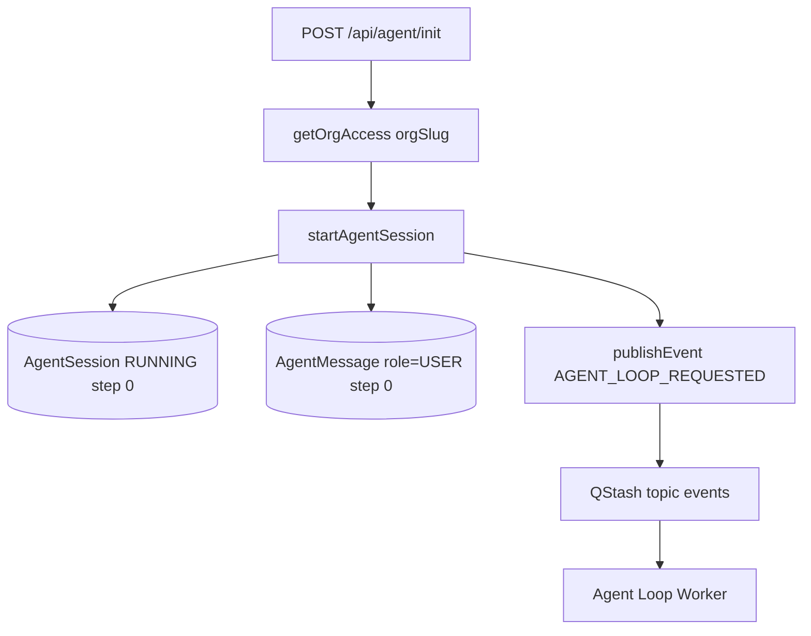
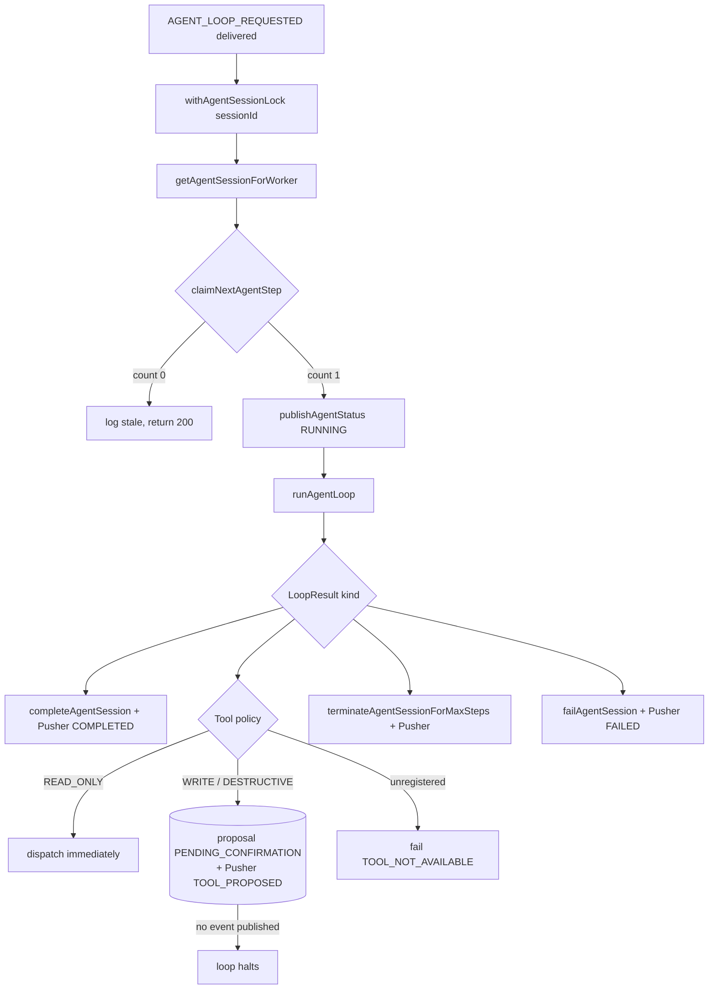
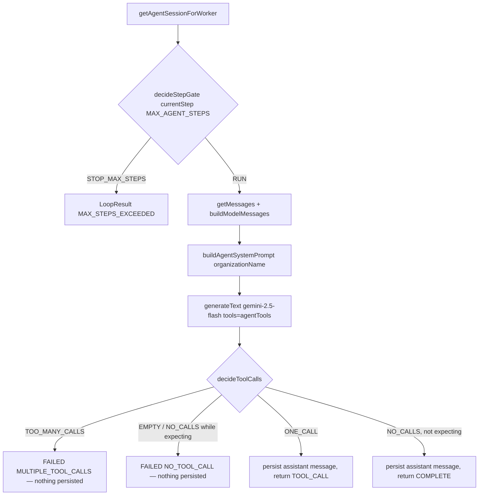
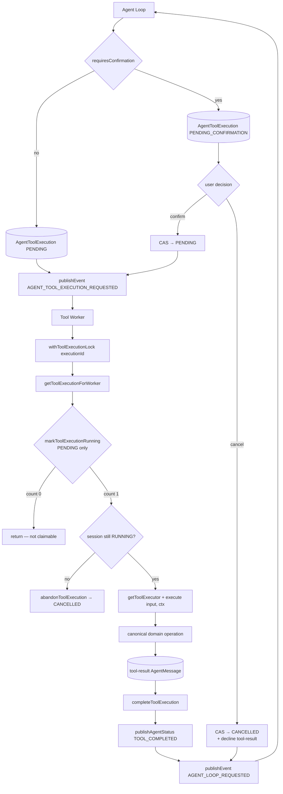
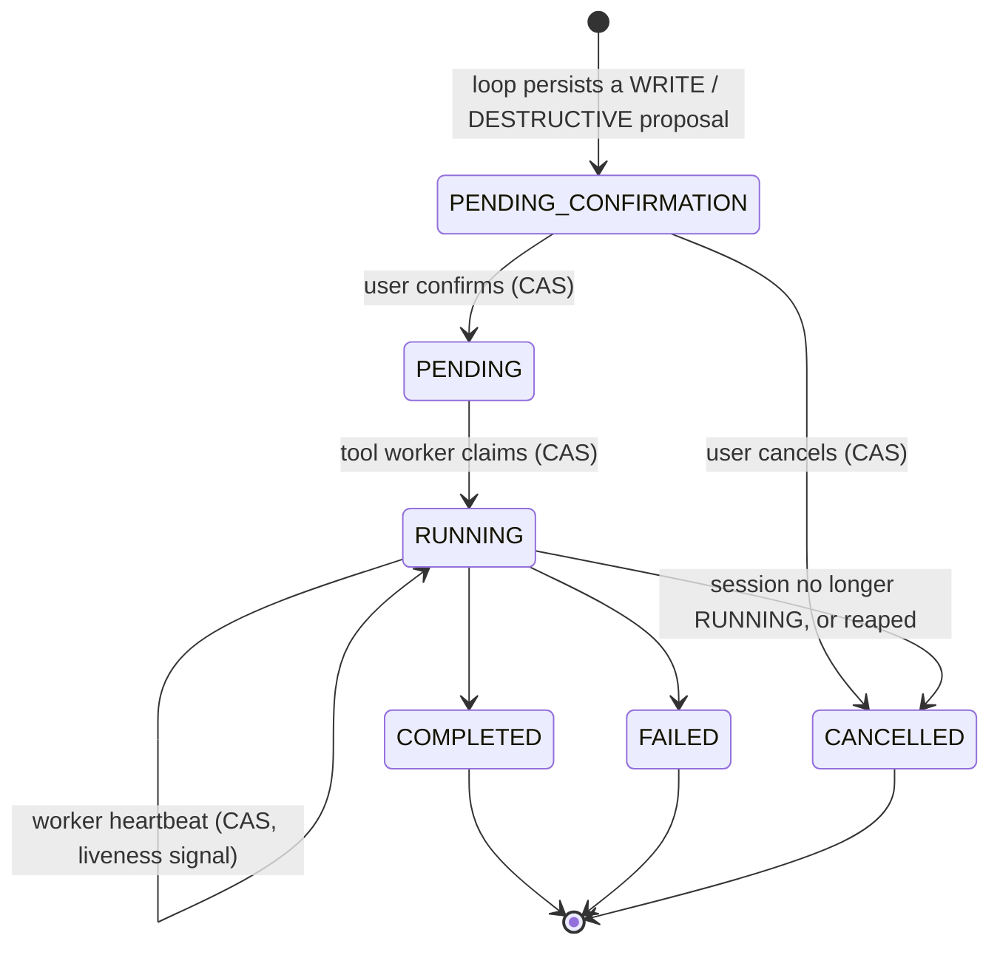
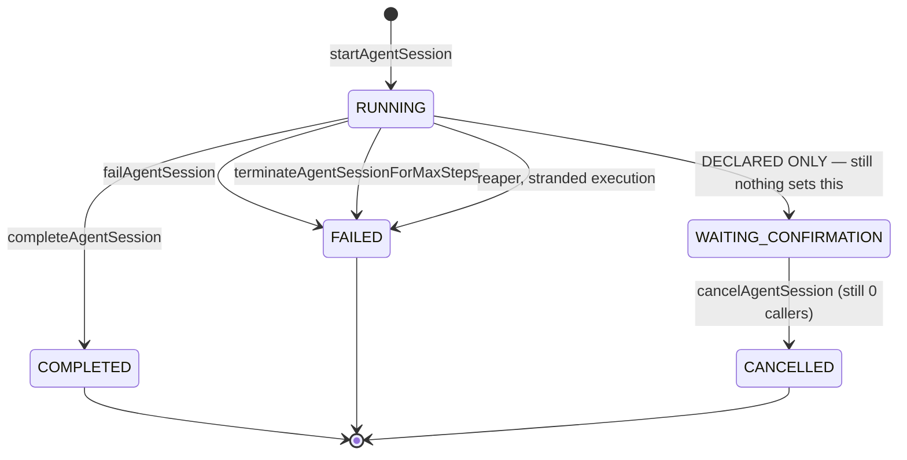
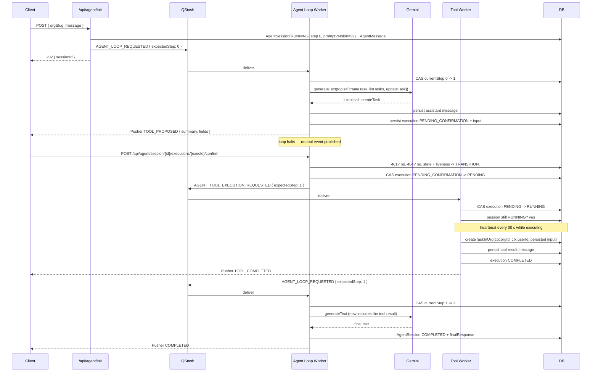

# Agent Runtime Architecture

> Verified against the repository on 2026-09-29. Status labels follow
> [`README.md`](./README.md#status-legend).

This document describes the runtime **as it is today**, stage by stage, with
the exact files and function names that implement each step.

## Stage 1 — Agent initialization



`forge/src/app/api/agent/init/route.ts` — `POST` only.

**Input** is a strict Zod object: `{ orgSlug: string (1+), message: string trimmed 1–5000 }`.
Invalid input is `400`.

**Authorization** is `getOrgAccess(orgSlug)`
(`forge/src/features/organizations/getOrgAccess.ts`), which requires a NextAuth
session, resolves the `Organization` by slug, and requires a `membership` row for
the current user. Unauthenticated or non-member is `403`.

> The `orgSlug` on the request body is an *input*, not an authorization. The
> trusted organization id is `orgAccess.organization.id`, returned by the
> membership check. This distinction is load-bearing — see
> [`security.md`](./security.md).

**Then** `startAgentSession({ orgId, userId, initialMessage })`
(`forge/src/lib/ai/agent/orchestrator.ts`) does exactly three things, in order:

1. `createAgentSession` → one `AgentSession` row, `status: RUNNING`,
   `currentStep: 0`.
2. `createMessage` → one `AgentMessage` row, `role: "user"`, `step: 0`.
3. `publishEvent("AGENT_LOOP_REQUESTED", { orgId, sessionId, expectedStep: 0 })`.

The route returns **`202`** with `{ sessionId, status }`. It does **not** block
on the model, and it publishes **no Pusher event** — the loop worker owns the
first `RUNNING` status.

## Stage 2 — The agent loop

`forge/src/app/api/worker/agent-loop/al.ts` — `handleAgentLoop`.



### Order of operations

1. **Acquire the session lock** — `withAgentSessionLock(sessionId, cb)`
   (`forge/src/lib/ai/agent/locks.ts`). Returns `null` on contention, which the
   worker logs as "already being processed" and returns `200`. Contention never
   blocks or throws.
2. **Load the session** — `getAgentSessionForWorker(sessionId)`. Missing →
   log, return.
3. **Claim the step** — `claimNextAgentStep(sessionId, expectedStep)`. This is
   the compare-and-swap described under [Concurrency](#concurrency). A lost race
   logs "stale loop event" and returns `200`.
4. **Publish `RUNNING`** — before the model call, so the UI shows activity.
5. **Run one model turn** — `runAgentLoop(session.id)`.
6. **Dispatch on the result** — exhaustive `switch` with an `assertNever`
   default, so adding a `LoopResult` variant becomes a compile error until every
   branch handles it.

### Terminal branches publish only after a successful DB transition

Every terminal branch is:

```ts
const { count } = await completeAgentSession(id, response);
if (count === 1) await publishAgentStatus(id, { type: "COMPLETED", content: response });
```

`completeAgentSession`, `failAgentSession` and
`terminateAgentSessionForMaxSteps` are all `updateMany` calls whose `where`
clause constrains the current status. A duplicate delivery therefore updates
**zero** rows, and the Pusher event is **not** re-emitted. This is what
prevents the database and the UI from disagreeing about the outcome.

The same guard exists in `tool-worker.ts` for its failure path.

### The `TOOL_CALL` branch

Three outcomes, decided entirely by trusted server-side policy.

```ts
const policy = getToolPolicy(result.toolName);
if (!policy) → failAgentSession(session.id, message, "TOOL_NOT_AVAILABLE");

const needsConfirmation = requiresToolConfirmation(result.toolName);

const execution = await createToolExecution({
  sessionId: session.id,
  toolCallId: result.toolCallId,
  toolName: result.toolName,
  input: result.input,          // persisted verbatim
  requiresConfirmation: needsConfirmation,
});

if (needsConfirmation) {
  const proposal = describeToolProposal(result.toolName, execution.input);
  await publishAgentStatus(session.id, { type: "TOOL_PROPOSED", ... });
  break;                        // ← no event published. The loop halts.
}

await publishEvent("AGENT_TOOL_EXECUTION_REQUESTED", {
  orgId: session.orgId,
  sessionId: session.id,
  executionId: execution.id,
  expectedStep: expectedStep + 1,
});
```

Four things are load-bearing here:

1. **Policy comes from the tool name, server-side.** `getToolPolicy` reads the
   registry. An unregistered name fails the session closed with
   `TOOL_NOT_AVAILABLE` rather than defaulting to "safe" or throwing deep in
   the worker.
2. **The proposal is persisted before anything else happens.** `input` on that
   row is the single copy of the arguments. The confirm path replays it; it
   never receives, reconstructs, or merges arguments of its own.
3. **A write halts the loop.** No tool event is published, so no worker runs,
   and the next model call only happens after a confirm or a cancel re-drives
   the loop.
4. **`expectedStep + 1` only applies to the immediate dispatch.** The confirm
   endpoint publishes with `session.currentStep`, which is already the
   post-claim value — the same number. Both paths converge.

The assistant message has already been persisted by the loop runner. The tool
result message is written later, by the tool worker (or the cancel endpoint),
before the loop is re-armed.

## Stage 3 — The model turn

`forge/src/lib/ai/agent/loop-runner.ts` — `runAgentLoop(sessionId)`.



Uses **`generateText`**, not `streamText`. (An earlier dev-log line said
`streamText`; that was wrong and has been annotated in
[`../../dev-log/2026-09-29.md`](../../dev-log/2026-09-29.md). `streamText` is
used by the unrelated RAG chat at `src/app/api/chat/route.ts`.)

**The validation order matters.** The turn is classified *before anything is
persisted*. If the model returns two tool calls, the run fails with
`MULTIPLE_TOOL_CALLS` and **no** assistant message is written. This is what
prevents a transcript containing an assistant turn with two tool calls and no
matching results, which the provider would reject on the next call.

### `LoopResult`
```ts
type LoopResult =
  | { kind: "COMPLETE"; response: string }
  | { kind: "TOOL_CALL"; toolName: string; toolCallId: string; input: JsonValue }
  | { kind: "MAX_STEPS_EXCEEDED"; maxSteps: number; currentStep: number }
  | { kind: "FAILED"; reason: AgentTerminalReason; message: string };
```

### Max steps
`MAX_AGENT_STEPS = 5` (`forge/src/lib/ai/agent/constants.ts`).

The gate is `currentStep > maxSteps`, evaluated **after** the CAS claim, so
`currentStep` is 1-based. With the limit at 5 the model is called **exactly
five times**; the sixth loop event terminates the session with
`FAILED` + `MAX_STEPS_EXCEEDED` + `finalResponse: null`, and makes **no** model
call.

> One asymmetry worth knowing: a tool requested on the fifth turn still
> executes, and its result is still persisted. Termination happens on the
> following loop event. The guarantee that matters — *no model call after the
> limit* — holds.

The gate and the tool-call classifier are pure functions in
`forge/src/lib/ai/agent/loop-policy.ts` with no I/O, so they are directly
testable without mocking Prisma, Gemini or Redis.

## Stage 4 — The tool path



`forge/src/lib/ai/agent/tool-worker.ts` — `handleToolExecution`.

The worker is **event-queue-driven and id-addressed**. It destructures only
`{ executionId, expectedStep }`; `sessionId` in the payload is not used. The
worker loads the execution and resolves everything else from the database, which
means a payload cannot lie about the org, the user, or the tool input.

Sequence:

1. `withToolExecutionLock(executionId, …)` — `SET NX PX`, 30 s, **with a TTL
   heartbeat**.
2. `getToolExecutionForWorker(executionId)` — includes the owning `session`, and
   through it `organization` and `user`.
3. `markToolExecutionRunning(executionId)` — CAS `PENDING → RUNNING`.
4. **Session liveness check** — if `execution.session.status !== "RUNNING"`, the
   execution is abandoned (`abandonToolExecution` → `CANCELLED`), a
   `SESSION_NOT_RUNNING` tool-result is written, and the worker returns. A
   terminal session must not gain new side effects, and the row must not be
   left in flight.
5. `getToolExecutor(execution.toolName)`.
6. `executor(execution.input, { orgId, userId, executionId })`.
7. `createMessage(..., { role: "tool", content: [{ type: "tool-result", … }] })`.
8. `completeToolExecution(executionId)` — **CAS from `RUNNING`**, so a losing
   duplicate delivery cannot stamp `COMPLETED` over a row another worker
   advanced.
9. `publishAgentStatus(TOOL_COMPLETED)`.
10. `publishEvent("AGENT_LOOP_REQUESTED", { sessionId, expectedStep, orgId })`.

On failure: `failToolExecution` (which stores the **stack**), then
`failAgentSession(..., "ERROR")`, and a `FAILED` Pusher event **only if** the
session update affected a row.

### Why step 3 is the whole security story

`markToolExecutionRunning` claims **`PENDING` only**:

```ts
updateMany({ where: { id, status: PENDING }, data: { status: RUNNING } })
```

A `PENDING_CONFIRMATION` row and a `CANCELLED` row are therefore *not claimable
at all* — not by a guard clause someone might forget to write, but by the shape
of the CAS itself. A late or duplicated QStash delivery for a proposal the user
declined exits at step 3 having performed no side effect. This is a structural
guarantee rather than a convention, and it is covered by tests that assert the
worker writes no message and dispatches no event.

### Why the tool worker is separate from the model loop

Four reasons, in order of importance:

1. **Different trust levels.** The loop talks to an external model provider and
   writes assistant messages. The worker writes to the database and performs
   side effects. Splitting them means the code path that performs writes is
   never the code path that parses untrusted model output.
2. **Different failure modes.** A model call that times out, is rate-limited or
   returns nonsense must not be able to leave a half-executed tool. Separating
   them means the tool either ran and committed, or did not run at all.
3. **Different concurrency controls.** The loop holds a *session* lock; the
   worker holds a *tool execution* lock. Two different resources, two different
   keys (`agent_session_lock:<id>` and `agent_tool_execution_lock:<id>`).
4. **Different latency profiles.** Tool execution may be slow. Blocking a model
   turn on it would waste the model call and hold the session lock far longer.

The loop and the worker communicate only through persisted rows and events.

## Stage 5 — User confirmation

A write proposal is a **durable row**, not a pending HTTP request. That is the
whole point: it survives a refresh, a reconnect, and a deploy.

### The state machine



Both `PENDING_CONFIRMATION` and `CANCELLED` are new in Phase 2, along with the
`confirmedAt` / `cancelledAt` audit columns. `CANCELLED` is **terminal**: no
transition leaves it, and nothing dispatches it.

The `RUNNING → CANCELLED` edge is the one worth reading twice. The worker takes
it only after claiming the row *itself* and finding the session terminal, and
the compare-and-set includes `RUNNING`. Leaving `RUNNING` out of that
`where` clause is not a missing nicety: this worker owns the claim, the queue
event is already acknowledged, and no reaper sweeps this state — the row would
sit `RUNNING` forever with a cancelled session behind it.

### The endpoints

Both live under `src/app/api/agent/session/[sessionId]/executions/[executionId]/`
and both are `POST` with **no request body**. A confirm needs no arguments and a
cancel needs none either; accepting any would only create a channel for
smuggling substitute arguments past review.

| | Confirm | Cancel |
| --- | --- | --- |
| Route | `.../confirm/route.ts` | `.../cancel/route.ts` |
| Transition | `PENDING_CONFIRMATION → PENDING` | `PENDING_CONFIRMATION → CANCELLED` |
| On success | publishes `TOOL_CONFIRMED`, then `AGENT_TOOL_EXECUTION_REQUESTED` | writes a `CANCELLED` tool-result, publishes `TOOL_CANCELLED`, then `AGENT_LOOP_REQUESTED` |
| Re-running it | `200` + `idempotent: true`, **no re-dispatch** | `200` + `idempotent: true`, no second message |

### The authorization ladder

`loadConfirmationTarget` in
`forge/src/lib/ai/agent/services/confirmation-service.ts` centralises it so both
routes enforce it identically:

1. **Authentication** (route): `auth()` → `401`.
2. **Ownership**: `getAgentSessionForUser({ sessionId, userId })` → `404`.
3. **Binding**: `getToolExecutionInSession({ executionId, sessionId })` → `404`.
4. **State**: `decideConfirmation` maps `(action, execution status)` to
   `TRANSITION` / `IDEMPOTENT` / `CONFLICT`.
5. **Liveness**: consulted only for a still-undecided proposal —
   `session.status !== RUNNING` → `409 SESSION_NOT_RUNNING`.
6. **Transition**: a compare-and-set, so concurrent requests resolve to one
   outcome.

Step 3 deserves emphasis. The session id is attacker-controlled, so ownership of
*that* session proves nothing about the *execution* id in the same path. The
execution lookup is constrained by `sessionId`, so a user who owns session A
cannot act on an execution belonging to session B. Unknown session and foreign
execution both return `404` with an identical body, so the endpoint cannot be
used to probe for valid ids across tenants.

**Steps 4 and 5 are ordered deliberately.** An execution that has already left
the gate cannot be changed by a dead session, so its real state is reported
rather than masked behind a `SESSION_NOT_RUNNING` the user can do nothing
about. Checking liveness first would mean a client that double-clicked confirm
after the session completed was told it had a problem it did not have.
`decideConfirmation` is a pure function precisely so this ordering is testable
without a database.

### Races resolve to one outcome

| Race | Winner | Loser sees |
| --- | --- | --- |
| confirm vs confirm | one `PENDING` | `409`, no second dispatch |
| confirm vs cancel | whichever CAS hit `PENDING_CONFIRMATION` first | `409 ALREADY_CANCELLED` / `409 ALREADY_DISPATCHED` |
| cancel vs a live worker | the worker (row is `RUNNING`) | `409 NOT_CANCELLABLE` |
| cancel after completion | nobody — `COMPLETED` is immutable | `409 NOT_CANCELLABLE` |

A cancel can never overwrite a committed write, and a confirm can never
resurrect a cancelled proposal.

### Why a cancel still re-drives the loop

A declined tool call has to be *answered* in the transcript. If the cancel
endpoint marked the row and stopped, the next model call would carry an
assistant turn with a tool call and no matching result, which providers reject.

So the cancel writes a real tool-result:

```ts
{ ok: false, code: "CANCELLED",
  error: "The user declined this action. Do not retry it and do not attempt
          to achieve the same result by another means." }
```

The loop treats it like any other result, and the system prompt tells the model
a decline is final.

### Approval has no timeout

There is no expiry on `PENDING_CONFIRMATION`, and `AgentSessionStatus` is never
set to `WAITING_CONFIRMATION` — the loop simply stops publishing. `cancelAgentSession`
still has zero callers. A proposal therefore persists until the user acts or
the session terminates by some other route. The `WAITING_CONFIRMATION` enum
value and the `cancelAgentSession` helper remain `DECLARED ONLY`.

## Concurrency

### Redis locking
`forge/src/lib/ai/agent/locks.ts`.

| Lock | Key | TTL | Contention |
| --- | --- | --- | --- |
| Session | `agent_session_lock:<sessionId>` | `AGENT_SESSION_LOCK_TTL_MS` = 30 000 | returns `null`, caller logs and exits |
| Tool execution | `agent_tool_execution_lock:<executionId>` | `AGENT_TOOL_EXECUTION_LOCK_TTL_MS` = 30 000 | returns `null` |

Acquire is a single atomic `SET key <token> NX PX <ttl>` where `token` is
`crypto.randomUUID()`. Release is a Lua compare-and-delete so a worker can
never delete a lock that has since been taken by someone else.

**Renewal (Phase 2).** A flat TTL is a bet that work finishes inside it. A
`generateText` call plus a Prisma round trip can exceed 30 s under load, at
which point the lock silently lapses, a second worker starts, and both write.
`withLock` now arms a heartbeat at `ttl / 3` that extends the lease with a
token-guarded Lua script:

```lua
if redis.call("GET", KEYS[1]) == ARGV[1] then
  return redis.call("PEXPIRE", KEYS[1], ARGV[2])
end
return 0
```

The token check is the point. A blind `PEXPIRE` would happily extend a lock that
had already expired and been re-acquired by *another* worker, locking that
worker out of its own lock. If renewal finds the token gone, the helper logs
`Lost ownership … while work was in flight` — loud, because the exclusivity
guarantee is genuinely gone and silently continuing would hide a race.

The timer is `unref`'d so a held lock can never keep the process alive.

`withLock` returns `null` on contention but `undefined` when the callback
returns early, which is how `al.ts` and `tool-worker.ts` distinguish "someone
else has the lock" from "we did nothing because the event was stale". Both now
log contention; the tool worker previously discarded the return value entirely.

### CAS step claiming
`claimNextAgentStep(sessionId, expectedStep)` in `session-service.ts`:

```ts
const result = await prisma.agentSession.updateMany({
  where: { id: sessionId, status: RUNNING, currentStep: expectedStep },
  data:  { currentStep: { increment: 1 } },
});
return result.count === 1;
```

Exact equality, not `>=` or `<=`. Consequences:

- Two concurrent deliveries of the same step: exactly one gets `count === 1`.
- A duplicate or out-of-order event with a stale `expectedStep`: `count === 0`,
  logged, `200` returned. It cannot advance the counter.
- A rewound `expectedStep` (e.g. `0` after the session is at step 4) is
  **permanently** rejected, because the counter only ever increments.

A second, independent CAS exists for tool executions:
`markToolExecutionRunning` does `updateMany({ where: { id, status: PENDING },
data: { status: RUNNING } })` and the worker exits if `count !== 1`. This is
what stops a duplicate QStash delivery from running a tool twice.

## Event routing

`forge/src/app/api/worker/route.ts` is the **single** dispatcher and the
**only** source-level consumer of both agent events.

| Event | Handler | File |
| --- | --- | --- |
| `AGENT_LOOP_REQUESTED` | `handleAgentLoop` | `src/app/api/worker/agent-loop/al.ts` |
| `AGENT_TOOL_EXECUTION_REQUESTED` | `handleToolExecution` | `src/lib/ai/agent/tool-worker.ts` |

The default branch refuses to acknowledge work it did not do:

| Condition | Status | Reasoning |
| --- | --- | --- |
| Missing `type` | `400` | Malformed payload. |
| Known `EventTypes` value, no handler | `500` | Misrouting. Must retry, must not be a silent drop. |
| Unknown `type` | `400` | Retrying can never help; would burn the retry budget forever. |

> **Removed.** `src/app/api/worker/agent-tool-execution/route.ts` was deleted in
> the Phase 1 hardening pass. Two source-level consumers for one event is not a
> routing strategy, and the dedicated path could only ever receive traffic from
> an external QStash consumer that cannot be verified from the repository.
> **Operational action required:** if a deployed QStash consumer points at
> `/api/worker/agent-tool-execution`, repoint it at `/api/worker`. The
> `agent-tool-execution-requested` entry in `topicMap` is now dead, because
> `USE_MULTI_TOPICS` is `false`.

### Queue — `forge/src/lib/events/queue.ts`

`USE_MULTI_TOPICS = false`, so `getTopic` returns `"events"` for every event and
the 19-entry `topicMap` is **entirely unused**. `publishEvent` validates the
payload against the Zod schema in `events/schema.ts`, wraps it in a CloudEvents
1.0 envelope, and publishes with `retries: 3`.

Agent payload schemas:

```ts
AGENT_LOOP_REQUESTED:              { orgId, sessionId, expectedStep: int >= 0 }
AGENT_TOOL_EXECUTION_REQUESTED:    { orgId, sessionId, executionId, expectedStep: int >= 0 }
```

**Signing:** outbound publishing relies on `QSTASH_TOKEN`; there is no payload
signing in `queue.ts`. Inbound verification is `verifySignatureAppRouter` in
`events/worker.ts`, using `QSTASH_CURRENT_SIGNING_KEY` /
`QSTASH_NEXT_SIGNING_KEY` — and it is **bypassed entirely when
`NODE_ENV === "development"`**.

> **The `deduplicationId` is not doing what its name suggests.** It is a SHA-256
> of the whole CloudEvent, which includes `time` and a `Date.now()`-derived
> `id`. It is therefore unique per publish and can never collapse a genuine
> re-publish. All real duplicate protection comes from the
> `EventLog(messageId)` guard, not from QStash.

### Idempotency — `forge/src/lib/events/worker.ts`

`createWorker(eventType, handler)` wraps a handler with:

1. `waitUntil(analyticsWorkerHandler(…))` — runs **before** validation, for
   every delivery including duplicates and invalid payloads.
2. `Upstash-Message-Id` header; in development only, a synthetic id if absent.
3. An `EventLog` create with a unique `messageId`. `P2002` is handled as
   already-processed / already-running / retry-from-`FAILED`.

> **Known gap:** if the `FAILED → PENDING` re-arm CAS loses (`updated.count ===
> 0`), execution is skipped and the function still returns `200`. That is a
> 200 that did no work — the same class of bug Phase 1 removed from the
> dispatcher.

## Session state machines

`AgentSessionStatus` — `forge/prisma/schema.prisma`



**`WAITING_CONFIRMATION` is still `DECLARED ONLY`.** Phase 2 implemented the
*approval gate*, not a session-level waiting status. The durable wait lives on
the execution row instead (`AgentToolExecutionStatus.PENDING_CONFIRMATION`),
which is strictly better: it identifies the specific action pending rather than
just the fact that something is. A session status would have to be re-derived
from "is there an open proposal?" on every read, and would go stale.

`cancelAgentSession` still has zero callers, because cancelling one proposal is
not the same as cancelling the conversation — a declined write leaves the agent
free to continue.

`AgentToolExecutionStatus`: see [Stage 5](#stage-5--user-confirmation) for the
full machine, including the two new Phase 2 states.

### Orphan recovery (Phase 2)

`forge/src/lib/ai/agent/reaper.ts` closes the gap that a worker dying after the
`PENDING → RUNNING` CAS left behind:

| Function | Selects | Acts |
| --- | --- | --- |
| `reapOrphanedToolExecutions` | `RUNNING`, no heartbeat for 10 min, session `RUNNING` | CAS the execution to `CANCELLED`; CAS the session to `FAILED` + `terminalReason: "ERROR"`; publish `FAILED` |
| `redeliverStalledConfirmedExecutions` | `PENDING`, stale, session `RUNNING` | re-publish `AGENT_TOOL_EXECUTION_REQUESTED` |

Both are idempotent: the second run matches nothing. Both are bounded (`take:
50`). Re-publishing is safe precisely because the worker claims with a CAS, so a
second delivery is a no-op if the first already started.

#### Liveness is a heartbeat, not a timestamp

While an execution runs, nothing else touches its row, so `updatedAt` is pinned
at the moment of the claim. The worker therefore refreshes it every
`AGENT_EXECUTION_HEARTBEAT_INTERVAL_MS` (30 s) via
`heartbeatToolExecution`, a CAS on `RUNNING` that also tells a worker when its
row has been taken away.

This matters more than it looks. Without the heartbeat, "stale" would mean "has
been running a while", and the sweep would cancel **live** work: a legitimately
slow execution is indistinguishable from a dead worker, the side effect would
still have happened, and the session would be failed underneath a successful
write. The Redis lock heartbeat cannot stand in — it keeps a second worker out
of the row, but it is process-local state the sweep cannot observe.

The staleness predicate is repeated in the compare-and-set, not only in the
read. The read-then-write gap is exactly the window a periodic sweep is most
likely to fire in; without it, a heartbeat landing between the two calls would
be overwritten and healthy work cancelled.

> **These functions are not scheduled.** Nothing in the repository invokes them
> on a timer or in a cron. They are implemented and tested but inert until a
> scheduler is wired up, which is Phase 4 work. Until then a stranded
> execution still hangs its session in practice.

## Terminal reasons
`AgentTerminalReason` (`forge/src/lib/ai/agent/types.ts`):

| Reason | Meaning |
| --- | --- |
| `MAX_STEPS_EXCEEDED` | The model-call budget was spent. |
| `MULTIPLE_TOOL_CALLS` | The model returned more than one tool call in a turn. |
| `NO_TOOL_CALL` | The model claimed a tool call but produced none. |
| `TOOL_NOT_AVAILABLE` | The model requested a tool that is not in the registry. Added in Phase 2. |
| `SESSION_NOT_FOUND` | The session row did not exist when the loop ran. |
| `ERROR` | Anything else, including tool execution failure. |

Persisted in `AgentSession.terminalReason` (`String?`, indexed) and published on
the wire. The reason exists so a consumer never has to parse `errorMessage`
prose to decide what happened.

> Three migrations exist and **none has been applied to any live database**:
> - `20260929120000_agent_session_terminal_reason` — the `terminalReason` column
>   and its index.
> - `20260929140000_agent_tool_execution_confirmation` — the two new enum
>   values plus `confirmedAt` / `cancelledAt`.
> - `20260929150000_agent_session_prompt_version` — `promptVersion`, `NOT NULL`,
>   defaulted to **`'v1'`** so rows predating the column backfill with the
>   contract they actually ran under. New sessions are unaffected:
>   `createAgentSession` writes `AGENT_PROMPT_VERSION` explicitly, so the default
>   is only ever reached by legacy rows.
>
> The Prisma client is regenerated. Applying them is an operational step.

## Session recovery API
`GET /api/agent/session/[sessionId]` — implemented at
`forge/src/app/api/agent/session/[sessionId]/route.ts`.

`401` anonymous → `400` empty id → `404` unknown **or** foreign (deliberately
indistinguishable, so the endpoint cannot be used to probe for valid session
ids) → `200`.

The `200` body returns `sessionId`, `orgId`, `status`, `currentStep`,
`finalResponse`, `error`, `terminalReason`, `promptVersion`, `createdAt`,
`updatedAt`, plus `messages[]` and `toolExecutions[]`.

Each `toolExecutions[]` entry carries `confirmedAt` / `cancelledAt`, and — **only
while the status is `PENDING_CONFIRMATION`** — a server-rendered `proposal`
object:

```json
{ "summary": "Create task \"Fix login\" in Website",
  "fields": [{ "label": "Title", "value": "Fix login" },
             { "label": "Project", "value": "Website" },
             { "label": "Priority", "value": "HIGH" }] }
```

That is what lets a client rebuild a confirmation card after a refresh instead
of rendering an approve button for an action it cannot display. It is derived
from the same `input` the executor will act on, so the card cannot drift from
the effect.

Clients should branch on `status` and `terminalReason`, never on the presence of
`finalResponse` — `finalResponse` is `null` for a legitimately empty answer as
well as for every failure.

> **This endpoint still has no caller.** See
> [`roadmap.md`](./roadmap.md#phase-3--agent-ui--session-experience).

## Pusher transport
`publishAgentStatus(sessionId, event)`
(`forge/src/lib/ai/agent/status.ts`) triggers `AGENT_STATUS_CHANGE` on
`private-agent-<sessionId>`.

> **Pusher is live transport only.** The `AgentSession` row in Postgres remains
> the source of truth. Nothing is durable because Pusher was told about it, and
> a missed trigger is repaired by re-reading the session — not by replaying a
> queue.

`AgentStatusEvent` variants: `RUNNING`, `TOOL_PROPOSED`, `TOOL_CONFIRMED`,
`TOOL_CANCELLED`, `TOOL_COMPLETED`, `COMPLETED`, `MAX_STEPS_EXCEEDED`, `FAILED`.

`WAITING_CONFIRMATION` was **removed** in Phase 2. Nothing ever published it,
and `TOOL_PROPOSED` supersedes it with two concrete improvements: it carries
the `toolName`, and it carries a server-rendered `summary` / `fields` derived
from the persisted arguments, so a client can show *what* is being approved
rather than only *that* something is.

Channel authorization is documented in
[`security.md`](./security.md#pusher-channel-authorization).

> **Known gap:** no `RUNNING` event is published when a *tool* starts, only on
> failure. The UI cannot currently show that a tool is executing.

## End-to-end sequence — a confirmed write



The **cancel** path diverges at the confirm call: the CAS goes to `CANCELLED`, a
`CANCELLED` tool-result is written, `TOOL_CANCELLED` is published, and
`AGENT_LOOP_REQUESTED` is published — the same re-arm, so the model still gets a
turn to acknowledge the decline.

## Known runtime gaps

| Gap | Status | Scheduled |
| --- | --- | --- |
| DB-write → publish-failure window | `PARTIAL` | Phase 4 |
| Reaper implemented but **not scheduled** | `PARTIAL` | Phase 4 |
| No proposal/approval timeout | `PLANNED` | Phase 4 |
| No model-call timeout bound | `PLANNED` | Phase 4 |
| `EventLog` re-arm CAS loss returns 200 without work | `PARTIAL` | Phase 5 |
| Message ordering depends on `createdAt` alone | `PARTIAL` | Phase 5 |
| Persisted messages are cast, not validated | `PARTIAL` | Phase 5 |
| No agent UI consumer | `PLANNED` | Phase 3 |
| No destructive tools (no safe domain semantics) | `DEFERRED` | — |

### Closed in Phase 2

| Previously | Now |
| --- | --- |
| Lock TTL flat and never renewed | Token-guarded heartbeat at `ttl / 3` |
| A `RUNNING` row looked identical whether the worker was alive or dead | `heartbeatToolExecution` refreshes it every 30 s, and the reaper re-checks staleness inside its CAS |
| Executions orphaned in `RUNNING` forever | `reapOrphanedToolExecutions` (needs a scheduler) |
| Confirmed executions never picked up | `redeliverStalledConfirmedExecutions` (needs a scheduler) |
| `completeToolExecution` could overwrite a newer state | CAS from `RUNNING` |
| Tool worker ignored session liveness | Abandons the claimed row and writes a `SESSION_NOT_RUNNING` result |
| A repeat confirm after the session ended reported a phantom `SESSION_NOT_RUNNING` | Execution state is decided before liveness; the real state is returned |
| Tool worker discarded its lock-contention result | Logs contention, like the loop worker |
| A thrown executor lost its stack | The raw error reaches `failToolExecution`; the session keeps the readable message |
| A hallucinated tool name reached the worker | `TOOL_NOT_AVAILABLE`, session fails closed |
| Two parallel tool maps that could drift | One registry; `agentTools` derived from it |
| No record of which prompt a session started under | `AgentSession.promptVersion`, defaulted to the legacy version so backfill is truthful |
| `WAITING_CONFIRMATION` status event, never published | `TOOL_PROPOSED` with rendered details |
