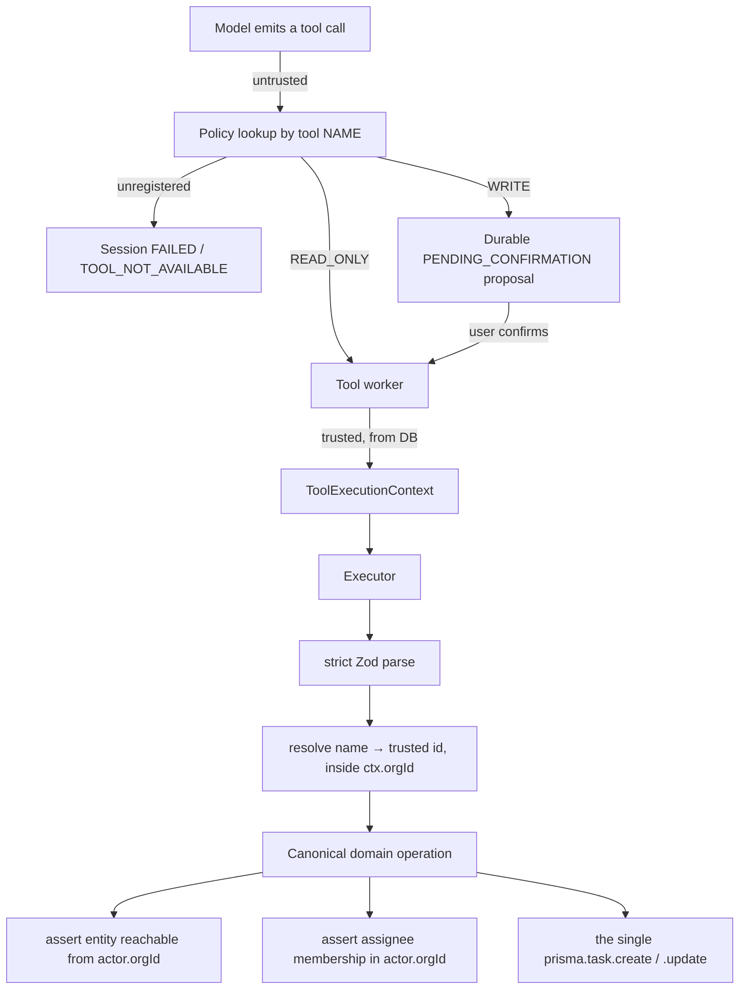
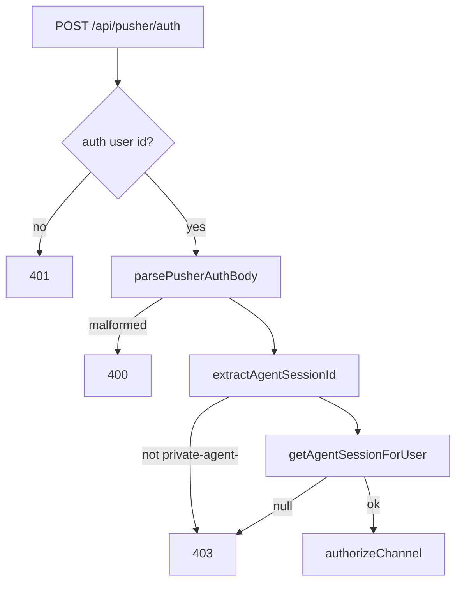

# Agent Security Boundaries

> Verified against the repository on 2026-09-29.

The agent processes untrusted, model-generated input and uses it to perform
database writes. This document is the map of who is allowed to decide what.

## The one rule

> **The model never chooses its own organization boundary.**

Not through a tool parameter. Not through a hint in the conversation. Not
through a project id it guessed. The org is resolved from persisted backend
state at execution time, inside the backend, and it is not expressible as model
input.

## The two classes of data

```mermaid
flowchart LR
    subgraph LLM["LLM-controlled (UNTRUSTED)"]
        T[title]
        PN[projectName]
        PR[priority]
        AI[assigneeId]
        FM[free text]
    end
    subgraph BE["Backend-controlled (TRUSTED)"]
        ORG[orgId]
        UID[authenticated user identity]
        EX[executionId]
        SID[session identity]
        AUTH[authorization]
        OWN[project ownership]
        MEM[membership]
    end
    LLM -->|validated by Zod| BE
    BE -->|scopes every read/write| DB[(domain operation)]
```



### LLM-controlled — `IMPLEMENTED` as constrained

Exactly the four fields in `createTaskSchema`
(`forge/src/lib/ai/agent/tools/create-task/schema.ts`):

| Field | Constraint |
| --- | --- |
| `title` | `string`, 3–100 characters |
| `projectName` | `string`, 1–100 characters |
| `priority` | `"HIGH" \| "MEDIUM" \| "LOW"`, optional |
| `assigneeId` | `cuid()`, optional |

The schema is `.strict()`, so an unrecognised key is a validation failure
rather than a silently ignored field.

### Backend-controlled — never model-supplied

| Value | Where it comes from |
| --- | --- |
| `orgId` | `execution.session.orgId`, loaded by `getToolExecutionForWorker` from the persisted `AgentSession` row. |
| `userId` | The same persisted row. |
| `executionId` | The row being executed. |
| Session identity | The `AgentSession` primary key. |
| Project ownership | `createTaskInOrg` asserts `project.findFirst({ where: { id, orgId: actor.orgId } })`. |
| Membership | `createTaskInOrg` asserts `membership.findFirst({ where: { userId: assigneeId, orgId: actor.orgId } })`. |
| `projectId` | Resolved from `projectName` **inside** `ctx.orgId` by `resolveProjectNameInOrg`. |

## `ToolExecutionContext`
`forge/src/lib/ai/agent/types.ts`

```ts
export type ToolExecutionContext = {
  orgId: string;
  userId: string;
  executionId: string;
};
```

Constructed in `tool-worker.ts` from
`execution.session.orgId` / `execution.session.userId` / `execution.id`, where
`execution` was loaded by `getToolExecutionForWorker(executionId)`.

**The QStash payload is treated as a durable database pointer and nothing
else.** The worker destructures only `{ executionId, expectedStep }`; the
`orgId` and `sessionId` in the payload are not read for identity purposes. A
forged or replayed message body therefore cannot redirect a write into another
organization.

A tool executor is typed as:

```ts
type ToolExecutor = (
  input: Prisma.JsonValue,   // UNTRUSTED — must be schema-validated
  ctx: ToolExecutionContext, // TRUSTED  — must scope every read and write
) => Promise<ToolResultPart["output"]>;
```

The separation is in the type signature. `input` is `JsonValue` because it
arrived from a model. `ctx` is a closed object the backend constructs.

## Why the tool schema has no `orgId`, `userId`, or `projectId`

**No `orgId` / `userId`** — because a write-capable tool that accepted them as
model input would be a tenant-isolation hole with a natural-language interface.
The model would not need to be attacked; it would only need to be wrong.

**No `projectId`** — because `Project` is unique on `@@unique([name, orgId])`
and a human can say a project name reliably, whereas a CUID cannot be invented
or recalled. Requiring a name and resolving it server-side is both safer and
more usable.

Resolution happens in `resolveProjectNameInOrg(ctx.orgId, projectName)`, which
searches **only** within the trusted org and returns one of:

| Outcome | Meaning | Model is told |
| --- | --- | --- |
| `FOUND` | Exact name match, or a single unambiguous substring match. | Proceed. |
| `NOT_FOUND` | No match in this org. | `PROJECT_NOT_FOUND` plus up to 10 real project names from `ctx.orgId`. |
| `AMBIGUOUS` | More than one substring match. | `PROJECT_AMBIGUOUS` plus the candidates, and is told to ask the user which one is meant. |

Returning real project names on failure is deliberate: it lets the model
self-correct and ask a good question instead of inventing an id. A cross-org
project is not merely unreachable — it is **not returned in `suggestions`**.

## The enforcement chain



Every check is repeated at the bottom. The tool layer is not the security
boundary; the canonical domain operation is. A read or update tool must reach
the same place, not introduce its own weaker logic.

## Organization isolation
`createTaskInOrg(input, actor)` performs, in order:

1. **Zod barrier** — `createTaskSchema.safeParse(input)` on `input: unknown`.
   It re-validates rather than trusting the caller's types. On failure returns
   `{ success: false, code: "INVALID_INPUT" }`. Zod issues are discarded, so
   callers do not leak schema internals to the model.
2. **Project ownership** —
   `project.findFirst({ where: { id: data.projectId, orgId: actor.orgId } })`.
   A cross-org `projectId` resolves to `null` and never reaches the write.
3. **Assignee membership** (only when `assigneeId` is present) —
   `membership.findFirst({ where: { userId: data.assigneeId, orgId: actor.orgId } })`.
   This prevents assigning a task to a user outside the organization.
4. **The single write** — `prisma.task.create` on the **extended** client, so
   the `TASK_CREATED` CDC fires identically on every path.

`prisma.task.create` appears **exactly once** in `src`:
`forge/src/lib/tasks/create-task.ts`. `prisma.task.update` appears **exactly
once**: `forge/src/lib/tasks/update-task.ts` (added in Phase 2). There is no
second implementation that could omit a check.

### The read path has no `orgId` column to filter on

`Task` has **no `orgId`**. Org membership is reached through
`project.orgId`. A query written as `where: { id: taskId }` would happily return
another tenant's task — the easiest possible cross-tenant leak in this schema.

Every read in `forge/src/lib/tasks/read-tasks.ts` therefore filters on the
project relation:

```ts
prisma.task.findFirst({ where: { id: taskId, project: { orgId } } })
prisma.task.findMany({ where: { project: { orgId }, ... } })
```

A task that does not exist and a task owned by another org are both `null` /
absent, so the read path cannot be used to probe for valid ids either. The
`take` is clamped server-side (1–100), so the model cannot turn a read tool into
an unbounded scan.

> Note the executor-level and domain-level split: `executeListTasks` calls
> `listTasksInOrg(ctx.orgId, …)`, and `listTasksInOrg` applies the org filter
> itself. The model never supplies the org, and it never supplies an
> organization *or* a project id that could bypass the filter.

### Trusted `orgId` per call path

| Path | Source of `orgId` | Source of `userId` |
| --- | --- | --- |
| Agent tool | `ctx.orgId` ← persisted `AgentSession` | `ctx.userId` ← persisted `AgentSession` |
| Agent confirm/cancel | `session.orgId` ← owner-scoped session lookup | `auth()` user id |
| UI server action | `organization.id` after `getOrgAccess(organization.slug)` | `session.user.id` |
| Workflow action | `workflow.orgId` from the persisted `Workflow` row, via `ctx.workflowId` | none — a `WorkflowRun` has no interactive user |
| Triage route | `project.orgId` from the authorized project | `auth()` user id |

None of these accepts an `orgId` from the request body, the queue payload, or
the model.

## Session ownership
Two accessors in `forge/src/lib/ai/agent/session-service.ts`:

| Function | Constrained by | Used by |
| --- | --- | --- |
| `getAgentSessionForUser({ sessionId, userId })` | `where: { id, userId }` | Pusher auth, `GET /api/agent/session/:id` |
| `getAgentSessionForOwner({ sessionId, orgId, userId })` | `where: { id, orgId, userId }` | **0 callers — superseded, dead code** |

`getAgentSessionForUser` exists because NextAuth exposes only `user.id` and no
organization context. It is safe *because* a session has exactly one owner: the
`userId` on the session row. It is authorization, not a second ownership
implementation, and it lives in the same service as every other session read.

`getAgentSessionForWorker(sessionId)` is **not** a security boundary. It is
loaded by id with no ownership filter, and is only ever called from a worker
behind QStash signature verification.

## Pusher channel authorization
`POST /api/pusher/auth` (`forge/src/app/api/pusher/auth/route.ts`).



- **401** anonymous. The endpoint previously accepted unauthenticated requests.
- **400** malformed body. The old parser split on `&` and `=` and took index
  `[1]`, silently truncating any value containing `=`. It now uses
  `URLSearchParams`.
- **403** for a channel that is not `private-agent-<id>`, including public
  lookalikes (`agent-<id>`) and prefix lookalikes
  (`private-agentevil-<id>`, `private-evil-agent-<id>`).
- **403** for another user's session **and** for an unknown session —
  deliberately indistinguishable, so the endpoint cannot be used to enumerate
  valid session ids.
- Only the owner reaches `authorizeChannel`.

`extractAgentSessionId` accepts only `private-agent-` followed by
`/^[A-Za-z0-9_-]{1,64}$/`. That rejects `/`, `?`, `..` and lookalike prefixes.
The regex validates *shape*, not a specific id strategy, so a future change of
primary key will not silently break authorization.

**Only the agent channel is authorizable.** The workflow channel
(`private-workflow-*`) and the org channel (`org-*`) are public and never sent
here. `AGENT_CHANNEL_PREFIX` in `agent-channel.ts` and the template literal in
`status.ts` must be kept in sync **by hand** — there is no test or constant
tying them together.

## Tool authorization — `IMPLEMENTED (three tools)`

The registry binds each tool to an executor **and** a policy, so "can this run
and does it need approval?" is answered from one server-side structure keyed by
tool name.

```ts
const policy = getToolPolicy(result.toolName);
if (!policy) → failAgentSession(session.id, message, "TOOL_NOT_AVAILABLE");

const needsConfirmation = requiresToolConfirmation(result.toolName);
```

An unregistered tool name fails the session closed. It does **not** default to
"safe" and it does not reach `getToolExecutor` to throw deep in the worker.

`getToolExecutor` still throws on an unknown name as a defence in depth; the
worker's error path then marks the execution and session `FAILED` with reason
`ERROR`.

> **Closed in Phase 2:** the two literal maps (`agentTools` and `toolExecutors`)
> are now one registry. An executor without a policy, or a tool without an
> executor, is a registration-time type error. See
> [`tools.md`](./tools.md#the-registry).

## Write confirmation — `IMPLEMENTED`

The Phase 1 gap is closed. Writes do not run when the model asks; they run when
the user approves.

| Control | Status | Note |
| --- | --- | --- |
| Write confirmation / approval | `IMPLEMENTED` | Durable `PENDING_CONFIRMATION` row, confirm/cancel endpoints, `TOOL_PROPOSED` event. |
| Destructive-op gating | `IMPLEMENTED (unused)` | `DESTRUCTIVE` policy exists and always requires confirmation. No destructive tool is registered, because the domain has no safe deletion semantics. |
| Approval timeout | `PLANNED` | A proposal persists until the user acts. No expiry, no session-level `WAITING_CONFIRMATION`. |
| Rate limiting on the agent path | `PLANNED` | The UI server action rate-limits; the agent tool path does not. |
| Prompt-leak resistance | `PROMPT-LEVEL` | The prompt's `<SECURITY>` section instructs the model never to reveal hidden instructions. Behavioural guardrail, not enforcement. |
| Cross-org session probing | `IMPLEMENTED` | Unknown and foreign sessions are indistinguishable on the session GET, the confirm/cancel endpoints, and Pusher auth. |

### The four properties of the approval gate

**1. The proposal is durable and immutable.** The arguments are written once, to
`AgentToolExecution.input`, and the confirm endpoint has **no request body** to
change them. There is no code path by which what executes can differ from what
was displayed.

**2. Approval is bound to an owner and a session.**
`loadConfirmationTarget` runs: `auth()` → owner-scoped session lookup →
execution lookup constrained by `sessionId`. The binding step is the one that
matters: the session id is attacker-controlled, so owning it proves nothing
about the execution id beside it. Without the `sessionId` predicate, a user who
owns session A could act on an execution belonging to session B.

Session liveness is checked **after** the execution's own state, not before.
Only a proposal still in `PENDING_CONFIRMATION` is undecided, and that is the
only case where a terminal session has to refuse. An execution that already
dispatched reports its real state even after the session ends, because its
outcome no longer depends on the session being alive.

**3. Unapproved work is structurally unexecutable.** The worker's claim is
`updateMany({ where: { id, status: PENDING }, … })`. A `PENDING_CONFIRMATION`
row and a `CANCELLED` row are not claimable — by construction, not by a guard
clause that could be forgotten. A late or duplicated delivery for a declined
proposal exits having performed no side effect.

**4. Cancellation is final.** `CANCELLED` has no outgoing transition and is
never dispatched. A cancel cannot overwrite a `RUNNING` or `COMPLETED` row
because the compare-and-set is written from `PENDING_CONFIRMATION`. Concurrent
confirm/cancel resolve to exactly one outcome, with the loser receiving a
`409` that names the reason.

### What the user approves is what runs

`describeProposal` renders the persisted `input` for display. It is
**presentation only**: the confirm path never reads it, and the executor always
reads `input`. Rendering performs no I/O, so an approval card cannot fail for a
database reason after the user has already been asked to approve something.

## Two honest caveats

**The prompt is a guardrail, not a control.** The system's behavioural rules —
one tool per turn, write only on explicit request, never claim success before a
tool returns `ok: true` — live in the system prompt and depend on the model
obeying. The one-tool-per-turn rule is *additionally* enforced in the loop
runner, because that one could corrupt persisted state. Nothing else is
mechanically enforced. See [`prompt.md`](./prompt.md).

**Development weakens the worker boundary.** `createWorker` returns
`internalHandler` unwrapped when `NODE_ENV === "development"`, bypassing QStash
signature verification entirely, and synthesises a `messageId` when the header
is absent. That is convenient locally and must never be true in production.
