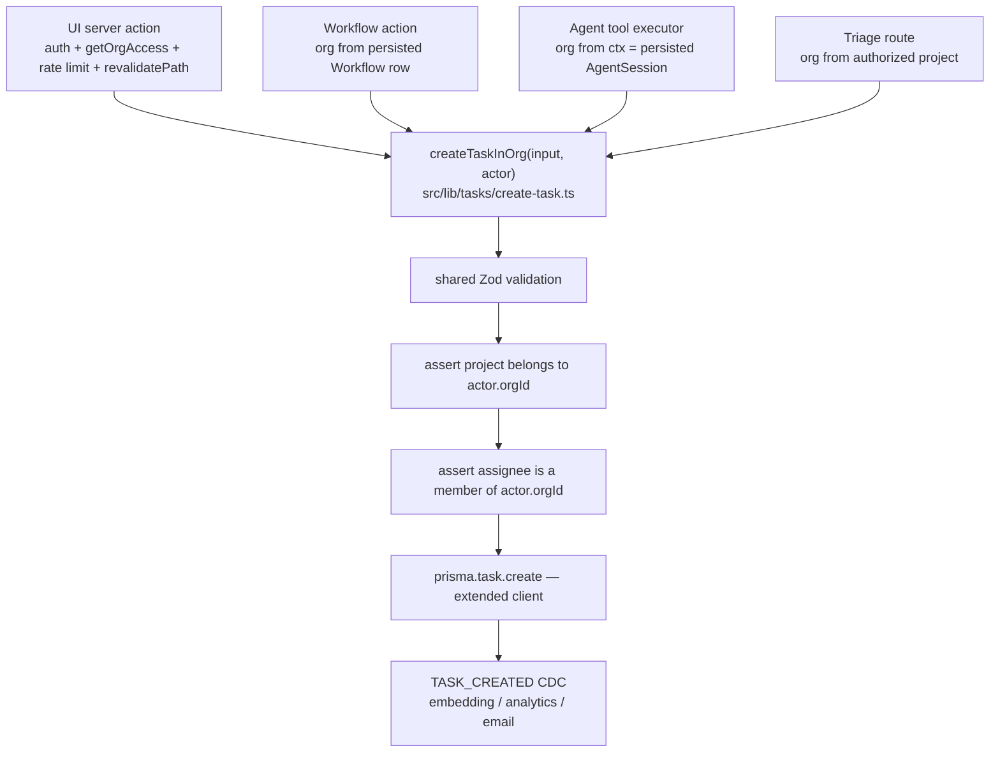

# Canonical Task Architecture

> Verified against the repository on 2026-09-29. This document records the
> transition from three divergent task-creation paths to one canonical domain
> operation, and the helpers built alongside it.

## The problem that started this

Task creation existed as **three independent implementations**, each with a
different — and mostly absent — authorization story.

| Path | File | Auth | Org check | Client | Consequence |
| --- | --- | --- | --- | --- | --- |
| UI server action | `src/app/actions/Tasks/createTask.ts` | `auth()` | `getOrgAccess()` | `prisma.task.create` | Mostly correct, but rate-limited twice. |
| Workflow node action | `src/lib/workflow/actions/core/create-task.ts` | **none** | **none** | raw `db.task.create` | Any `projectId` in node config was accepted → a task could be written into **another organization's** project. Also skipped the CDC. |
| Triage route | `src/app/api/triage/route.ts` | `auth()` | `getOrgAccess()` | `prisma.task.create` | Accepts `projectId` from the request body. |

Three copies of the same business rules. They drifted. The divergence was not
hypothetical: the workflow path had **no tenant check at all**, and it wrote
through the raw client so `TASK_CREATED` never fired.

On the agent side there was a fourth problem. `ToolExecutor` was
`(input: Prisma.JsonValue) => …`, so the tool layer had **no way to know which
organization it was acting for**. Any write-capable agent tool would therefore
have had to accept `orgId` as model input — putting the tenant boundary behind a
natural-language interface.

And the only registered tool was a placeholder: `searchKnowledge`, a renamed
stub that returned an empty result set. The registry advertised a tool that did
nothing.

## The current architecture



Four adapters, one operation. The adapters keep only what is genuinely specific
to their context; every business rule lives in the canonical function.

### What each adapter retains

- **UI** — `auth()`, project→org resolution, `getOrgAccess()` + `notFound()`,
  `revalidatePath`, the UI response shape, and a single `rateLimit.limit()`.
  *(This previously called `rateLimit.limit()` **twice**, taking `success` from
  the first call and `remaining`/`reset` from the second, so one user action
  consumed the budget twice. Fixed.)*
- **Workflow** — returns `{ success, data: { taskId, title } }` and maps
  `isRetriable: code === "CREATE_FAILED"`.
- **Agent** — Zod validation, project-name resolution, and translation of
  domain results into model-readable data. No Prisma import, no task logic.
- **Triage** — `auth()`, LLM extraction via `generateObject`, `getOrgAccess()`,
  title synthesis, and a `critical → HIGH` priority map.

### `createTaskInOrg`
`forge/src/lib/tasks/create-task.ts`

```ts
export type CreateTaskActor = { orgId: string; userId?: string };

export async function createTaskInOrg(
  input: unknown,
  actor: CreateTaskActor,
): Promise<CreateTaskResult>
```

Three contract properties, all deliberate:

1. **`input: unknown`.** It re-validates rather than trusting the caller's
   types. A caller cannot skip the barrier by having a well-typed argument.
2. **It returns, it does not throw.** Every failure is a discriminated
   `{ success: false, code, error }`. A workflow retry policy needs a machine
   code, not a stack trace.
3. **It is worker-safe.** No `auth()`, no `notFound()`, no `revalidatePath()`,
   no `next/*` import. This is what allows a queue worker and an LLM executor to
   share it with a React server action.

`orgId` is **required** — it is the authorization boundary. `userId` is
**optional** because a `WorkflowRun` has no interactive user and `Task` has no
creator column.

#### The four steps it owns

1. **Schema validation** — `createTaskSchema.safeParse(input)` using the shared
   schema from `forge/src/core/domain.ts`. Zod issues are discarded.
2. **Project/org validation** —
   `project.findFirst({ where: { id: data.projectId, orgId: actor.orgId } })`.
   A cross-org `projectId` resolves to `null` and never reaches the write.
3. **Assignee/org validation** — only when `assigneeId` is present:
   `membership.findFirst({ where: { userId: data.assigneeId, orgId: actor.orgId } })`.
   Previously an `assigneeId` was written with no check at all, which would have
   allowed attaching a task to a user outside the organization.
4. **The canonical write** — `prisma.task.create` on the **extended** client,
   so `TASK_CREEDED` fires identically on every path.

#### Failure codes

```ts
type CreateTaskFailureCode =
  | "INVALID_INPUT" | "PROJECT_NOT_FOUND" | "ASSIGNEE_NOT_FOUND" | "CREATE_FAILED";
```

`CREATE_FAILED` is the only one the workflow path treats as retriable.

### One write site

`prisma.task.create` appears **exactly once** in `src`:
`forge/src/lib/tasks/create-task.ts`. No duplicate implementations remain.

## Project resolution
`forge/src/lib/tasks/projects.ts`

| Function | Signature | Status |
| --- | --- | --- |
| `listProjectsInOrg` | `(orgId, { take = 50 })` | `IMPLEMENTED` |
| `searchProjectsInOrg` | `(orgId, query, { take = 10 })` | `IMPLEMENTED`, one internal caller |
| `resolveProjectNameInOrg` | `(orgId, projectName)` | `IMPLEMENTED` |

All three are worker-safe, org-scoped, and **none accepts an `orgId` from a
model**. `ProjectSummary` includes `taskCount` via `_count.select.tasks`, so
these helpers are already shaped for the read tools planned in Phase 2.

`searchProjectsInOrg` matches `name` **or** `description`, case-insensitively,
ordered by name. An empty or whitespace-only query delegates to
`listProjectsInOrg` rather than returning everything unfiltered.

### Resolution order

`resolveProjectNameInOrg` returns a discriminated union:

```ts
type ResolveProjectResult =
  | { kind: "FOUND"; project: ProjectSummary }
  | { kind: "NOT_FOUND" }
  | { kind: "AMBIGUOUS"; candidates: ProjectSummary[] };
```

1. Empty or whitespace-only name → `NOT_FOUND`.
2. **Exact, case-insensitive name match** within `orgId` → `FOUND`.
   Unambiguous by construction, because `Project` is unique on
   `@@unique([name, orgId])`.
3. Otherwise `searchProjectsInOrg(orgId, name, { take: 5 })`:
   - exactly one result → `FOUND`
   - none → `NOT_FOUND`
   - more than one → `AMBIGUOUS` with candidates

The model is instructed to use the returned `suggestions` and **ask the user
which project is meant** — it is never told to pick one.

> A project in another organization is never returned, not even as a
> suggestion. Cross-org existence is not leaked.

## Task reads and updates — Phase 2

`updateTaskSchema` already existed in `forge/src/core/domain.ts` with
`taskId`, `title`, `status`, `priority` and `assigneeId`, and had **zero
callers**. Phase 2 gives it one, and adds a read surface.

### Canonical operations

| Operation | File | Purpose |
| --- | --- | --- |
| `createTaskInOrg` | `src/lib/tasks/create-task.ts` | The single task **create**. |
| `updateTaskInOrg` | `src/lib/tasks/update-task.ts` | The single task **update**. |
| `listTasksInOrg` | `src/lib/tasks/read-tasks.ts` | Org-scoped list, bounded. |
| `getTaskInOrg` | `src/lib/tasks/read-tasks.ts` | Org-scoped fetch by id. |
| `resolveTaskInOrg` | `src/lib/tasks/read-tasks.ts` | Resolve an id **or a human title**. |

`prisma.task.update` appears **exactly once** in `src`:
`forge/src/lib/tasks/update-task.ts`. Same contract as `createTaskInOrg`:
`input: unknown`, discriminated results instead of throws, worker-safe (no
`auth()`, no `revalidatePath()`, no `next/*`).

```ts
type UpdateTaskFailureCode =
  | "INVALID_INPUT" | "TASK_NOT_FOUND" | "ASSIGNEE_NOT_FOUND"
  | "NO_CHANGES" | "UPDATE_FAILED";
```

#### Five steps it owns

1. **Zod barrier** — `updateTaskSchema.safeParse(input)`, shared with the UI.
2. **Ownership** — `task.findFirst({ where: { id: taskId, project: { orgId } } })`.
   Resolved **before** the write, and a foreign task is indistinguishable from a
   missing one.
3. **Assignee membership** — only when `assigneeId` is present. Assigning work
   to a non-member is a cross-tenant leak, not a cosmetic error.
4. **Partial update** — only the fields actually supplied are set. Omitted
   fields are left untouched rather than nulled. `assigneeId: null` is
   meaningful (unassign) and is applied as `{ disconnect: true }`; an absent key
   is not set at all, which is why the code uses `!== undefined` rather than a
   truthiness check.
5. **The single write** — `prisma.task.update` on the extended client.

#### Why `NO_CHANGES` is a failure

A payload that changes nothing returns `{ success: false, code: "NO_CHANGES" }`
rather than a silent success. An executor that reported "the task was updated"
when it updated nothing is indistinguishable, to the model and the user, from a
real update — and the whole point of requiring `ok: true` before claiming
success is defeated if `ok: true` can mean "nothing happened".

### The read path

`Task` has **no `orgId` column**; org membership is reached through
`project.orgId`. A query written as `where: { id: taskId }` would return another
tenant's row. Every read filters on the relation:

```ts
prisma.task.findFirst({ where: { id: taskId, project: { orgId } } })
prisma.task.findMany({ where: { project: { orgId }, status?, projectId?, assigneeId? } })
```

`take` is clamped server-side to 1–100, and `listTasks` additionally caps the
model-supplied `limit` at 50.

`resolveTaskInOrg` accepts either a real task id or an exact, case-insensitive
**title**, because a person says "the login bug task", not "clh7a1b…". A title
matching more than one task returns `AMBIGUOUS` with candidates and the caller
mutates nothing. Guessing would risk marking the wrong task `DONE`.

## Two task schemas — a known duplication

| Schema | Location | Shape |
| --- | --- | --- |
| `createTaskSchema` | `forge/src/core/domain.ts` | `projectId`, `description?`, `priority` (default `MEDIUM`) |
| `createTaskSchema` | `forge/src/lib/ai/agent/tools/create-task/schema.ts` | `projectName` (no `projectId`), `priority?`, `assigneeId?`, `.strict()` |

They are intentionally different — the tool faces a model that must supply a
name, the domain function faces a resolved id. But the tool schema omits
`description`, so **the agent still cannot set a task description**. The domain
schema supports it; the tool does not expose it.

Consolidating these is not planned. The divergence is narrow and each side is
readable on its own. Flagged here so it is a known state rather than a surprise.

> `updateTaskSchema` is now shared by the UI and by `updateTaskInOrg`. The agent
> tool has its own `.strict()` schema because the model identifies a task by
> **title** while the domain function requires a resolved **id** — the same
> name-vs-id split as `createTask`.

## No deletion

There is **no task deletion path anywhere in the codebase**: no domain
operation, no server action, no route, no `deletedAt` column, and zero
occurrences of `prisma.task.delete` in `src`. Deleting a task also cascades to
its `Comment` and `Attachment` rows.

Phase 2 therefore ships **no `deleteTask` tool**, despite `DESTRUCTIVE` policy
being implemented and ready for one. Building it would mean inventing soft-vs-
hard deletion, comment survivability, and UI reflection — product decisions
this repository has never made — and putting an irreversible operation behind a
single confirmation dialog. See
[`decisions.md`](./decisions.md#decision-13-no-destructive-tools-despite-a-working-policy).

## Verification

- `prisma.task.create` — exactly **1** occurrence in `src`.
- `prisma.task.update` — exactly **1** occurrence in `src`.
- `prisma.task.delete` — **0** occurrences in `src`.
- Neither the tool modules nor the domain operations contain a raw write outside
  the canonical function.
- `TaskBox` still compiles against the returned `Task` shape, so the UI path
  needed no component changes.
- No executor contains a Prisma import. Verified by search: the only `prisma`
  tokens under `src/lib/ai/agent/tools/` are in comments and import paths.

**Test coverage (Phase 2).** `src/tests/agent/task-operations.test.ts` covers
the org-scoping predicate, the clamped `take`, assignee membership rejection,
`assigneeId: null` versus omitted, the `NO_CHANGES` refusal, ambiguous-title
refusal, and rejection of a model-supplied `orgId`. The tests assert the
`where` clause the code **builds**, not just the rows returned — a read that
returns the right rows for the wrong reason is still a leak.

**Still not covered.** `createTaskInOrg` and `updateTaskInOrg` are still not
exercised against a real database; the tests use a prisma double. The migration
SQL is not applied anywhere.
