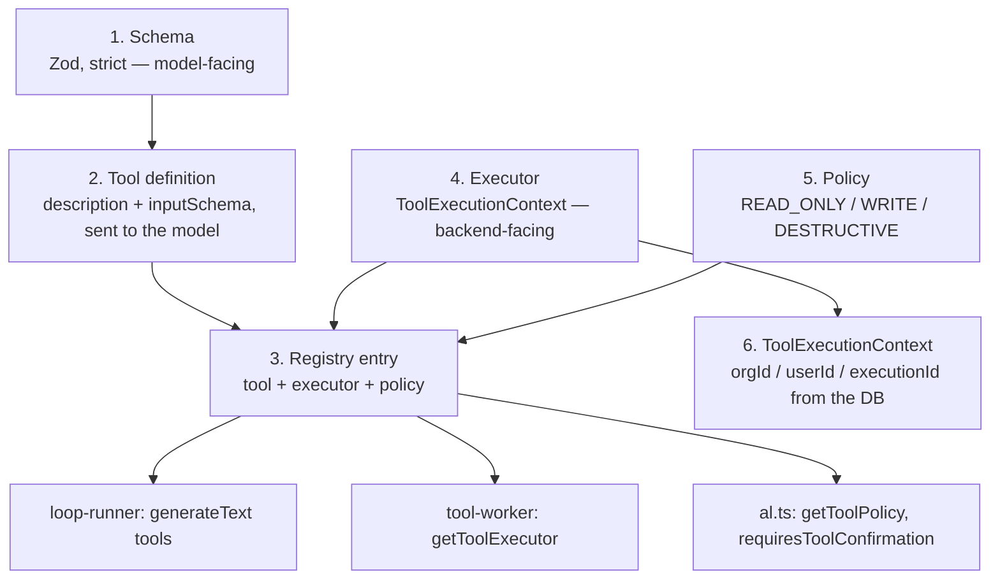
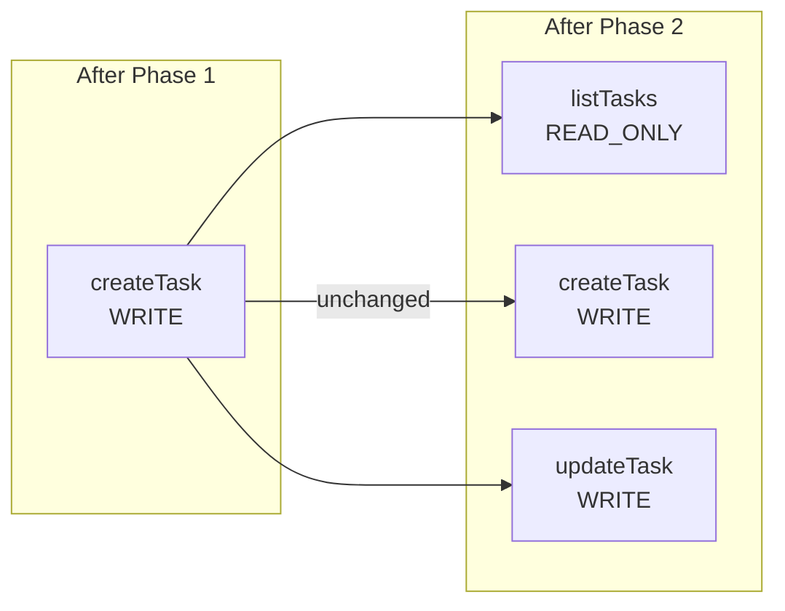

# Tool Architecture

> Verified against the repository on 2026-09-29 (Phase 2 pass). Status labels
> follow [`README.md`](./README.md#status-legend).

## Anatomy of a tool

A tool in this system is six separate things. Keeping them separate is what
makes the security boundary enforceable.



| Piece | File | Trust |
| --- | --- | --- |
| **Schema** | `tools/<name>/schema.ts` | Untrusted boundary — validates model output. |
| **Tool definition** | `tools/<name>/tool.ts` | Sent verbatim to the model. |
| **Executor** | `tools/<name>/execute.ts` | Trusted. Receives `ctx`. |
| **Policy** | `tools/policy.ts` | Trusted. Never leaves the server. |
| **Registry** | `tools/registry.ts` | One map binding all of the above. |
| **Execution context** | `types.ts` → built in `tool-worker.ts` | Trusted. Constructed by the backend. |

### The registry

`forge/src/lib/ai/agent/tools/registry.ts`

The Phase 1 version kept `agentTools` and `toolExecutors` as two parallel
literals with the tool name written twice and nothing verifying they stayed in
sync. Phase 2 collapses them into a single registry:

```ts
type AgentToolEntry = {
  tool: ToolSet[string];
  executor: ToolExecutor;
  policy: AgentToolPolicy;
  describeProposal?: (input: unknown) => ToolProposalSummary | null;
};

const registry = {
  createTask: { tool: createTaskTool, executor: executeCreateTask,
                policy: WRITE_POLICY, describeProposal: describeCreateTaskProposal },
  listTasks:  { tool: listTasksTool,  executor: executeListTasks,
                policy: READ_ONLY_POLICY },
  updateTask: { tool: updateTaskTool, executor: executeUpdateTask,
                policy: WRITE_POLICY, describeProposal: describeUpdateTaskProposal },
} satisfies Record<string, AgentToolEntry>;
```

Binding them together makes the dangerous states unrepresentable:

- An **executor with no policy** would run unconfirmed. Now impossible — a
  missing policy is a type error at registration.
- A **tool advertised to the model but absent from the executors** would fail
  deep in the worker. Now impossible for the same reason.
- A **tool with a policy but no model-facing schema** cannot be registered at
  all, because `tool` is required.

Consumers, each in exactly one place:

| Function | Caller | Purpose |
| --- | --- | --- |
| `agentTools` | `loop-runner.ts` | `generateText({ tools })` |
| `getToolExecutor` | `tool-worker.ts` | Run a persisted execution |
| `getToolPolicy` | `al.ts` | Fail closed on an unknown tool |
| `requiresToolConfirmation` | `al.ts` | Decide proposal vs. dispatch |
| `describeToolProposal` | `al.ts`, session GET | Render the approval card |

## Tool policy

`forge/src/lib/ai/agent/tools/policy.ts`

```ts
export type ToolAccess = "READ_ONLY" | "WRITE" | "DESTRUCTIVE";

export type AgentToolPolicy = { readonly access: ToolAccess };

export function requiresConfirmation(policy: AgentToolPolicy): boolean {
  return policy.access !== "READ_ONLY";
}
```

`requiresConfirmation` is **derived**, not stored.

The obvious shape is `{ access, requiresConfirmation }`, and it is wrong. Those
two fields can disagree, and a tool declared `DESTRUCTIVE` with
`requiresConfirmation: false` would silently execute a destructive action with
no user approval — with nothing failing loudly, because the type system was
satisfied. A security control whose failure mode is a silently mis-declared
boolean is not a control.

Deriving it makes that state unrepresentable, and it means policy has no second
source to be overridden from. The model cannot influence it because policy is
resolved from the **tool name** on the server; there is no input field to set.

| Access | Confirmation | Tools |
| --- | --- | --- |
| `READ_ONLY` | never | `listTasks` |
| `WRITE` | always | `createTask`, `updateTask` |
| `DESTRUCTIVE` | always | *(none — see below)* |

### Why there is no destructive tool

`DESTRUCTIVE` is implemented and tested but **unused**, because the domain has
no safe deletion semantics to call. A repository-wide search for
`prisma.task.delete` returns **zero** results: no domain operation, no server
action, no UI affordance, and no `deletedAt` column on `Task`. Deleting a task
also cascades to its `Comment` and `Attachment` rows.

The alternative — shipping a `deleteTask` that hard-deletes and cascades — would
mean inventing a product decision (soft vs. hard delete, whether comments
survive, whether the UI reflects it) that the codebase has never made, and
putting it behind a single "are you sure?" prompt. A wrong irreversible delete
is not recoverable by adding a confirmation dialog later. See
[`decisions.md`](./decisions.md#decision-13-no-destructive-tools-despite-a-working-policy).

## The current tool surface



### `createTask`

| Property | Value |
| --- | --- |
| **Name** | `createTask` |
| **Kind** | **WRITE** — a side effect on `Task`. Confirmation required. |
| **Input** | `{ title, projectName, priority?, assigneeId? }` |
| **Explicitly not accepted** | `orgId`, `userId`, `projectId` |
| **Executor** | `executeCreateTask(input, ctx)` |
| **Files** | `tools/create-task/{schema,tool,execute,types,describe,index}.ts` |

The tool definition carries a description that is itself part of the security
model: it is a write; only fire it on an explicit user request; never
proactively; identify the project **by name**; on a wrong or ambiguous name use
the returned suggestions; **"You never choose the organization"**; and do not
report the task as created until the tool returns `ok: true`.

### `listTasks` (Phase 2)

| Property | Value |
| --- | --- |
| **Name** | `listTasks` |
| **Kind** | **READ_ONLY** — dispatched immediately, no confirmation. |
| **Input** | `{ status?, projectName?, assigneeId?, limit? }` |
| **Executor** | `executeListTasks(input, ctx)` |
| **Files** | `tools/list-tasks/index.ts` |

Filters by a human-supplied **project name**, not an id, for the same reason
`createTask` does: a CUID is not something a model can usefully hold. `limit` is
clamped server-side to 1–50, so "list everything" gets a bounded page instead of
turning a read tool into a scan.

### `updateTask` (Phase 2)

| Property | Value |
| --- | --- |
| **Name** | `updateTask` |
| **Kind** | **WRITE** — confirmation required. |
| **Input** | `{ taskTitle, status?, priority?, assigneeId? }` (at least one change) |
| **Executor** | `executeUpdateTask(input, ctx)` |
| **Files** | `tools/update-task/index.ts` |

The task is identified by its **title**, resolved server-side inside the org. An
ambiguous title returns the candidates and refuses to mutate anything — guessing
could mark the wrong task `DONE`.

`assigneeId: null` means *unassign*; omitting the key leaves the assignee alone.
The executor forwards to `updateTaskInOrg`, which re-verifies ownership and
membership and rejects a payload that changes nothing.

### Why the schemas omit `orgId`, `userId` and `projectId`

This is the single most important property of the tool layer, and it is
covered in full in
[`security.md`](./security.md#why-the-tool-schema-has-no-orgid-userid-or-projectid).

In short: a write-capable tool that accepted an org id as model input would
make tenant isolation a natural-language problem; and requiring a `projectId`
CUID would ask the model to invent something it cannot know.

Every tool schema is also `.strict()`, so an unknown key is a hard validation
failure rather than something silently dropped. A model that tries to smuggle
`orgId` into `listTasks` gets `INVALID_INPUT` and the request never reaches the
database — covered by a test.

### What a rejection looks like to the model

All three tools build the rejection with the same helper,
`buildValidationFailure` in `forge/src/lib/ai/agent/tools/shared-output.ts`, so
one prompt rule covers all of them:

```json
{
  "ok": false,
  "code": "INVALID_INPUT",
  "error": "listTasks received invalid arguments: limit: Invalid input: expected number, received string.",
  "issues": [
    { "path": "limit", "code": "invalid_type", "message": "Invalid input: expected number, received string" }
  ]
}
```

`issues` is what makes the loop self-healing: the field that failed is named, so
the model fixes that argument instead of guessing. Every issue is reported, not
just the first, so three wrong fields are fixed in one turn rather than three. The
list is capped at 8 and the count of anything dropped is stated, so a truncated
list is never mistaken for a complete one.

No part of the submitted input is echoed back. Only the schema's own issue
`code`, `path`, and `message` are returned. Zod's `unrecognized_keys` message
names the offending *keys* — which the model itself just wrote — and never their
values.

> This is deliberately **not** what the canonical domain operations return.
> `createTaskInOrg` and `updateTaskInOrg` answer a rejected payload with a bare
> `{ success: false, code: "INVALID_INPUT", error: "Invalid task input." }`,
> because their caller is the HTTP API rather than a model, and schema internals
> are not something to hand to an arbitrary client. See
> [`security.md`](./security.md). The tool layer is not the security boundary;
> the domain operation is, and it re-validates regardless of what the tool did.

## Proposal rendering

`describeProposal` renders the **persisted** `input` into a
`ToolProposalSummary`:

```ts
type ToolProposalSummary = {
  summary: string;                             // "Create task \"Fix login\" in Website"
  fields: { label: string; value: string }[];  // Title / Project / Priority
};
```

Three properties matter:

1. **Same bytes as execution.** It runs on `AgentToolExecution.input`, the exact
   arguments the executor will later validate and act on. The card cannot drift
   from the effect.
2. **Presentation only.** Nothing in the confirm path reads these fields. The
   executor always reads `input`.
3. **No I/O.** `projectName` is shown as the human typed it; the trusted
   `projectId` is resolved later, at execution time, inside the org. Rendering
   an approval card must not require a database round trip that could fail
   after the user has already been asked.

Omitted fields render as their **effective value** (`Priority: MEDIUM`) or as
`unchanged` (update cards), so a partial change cannot be misread as a full
replacement.

## Failure handling — returned, not thrown

Executors return a discriminated `ToolOutput`:

```ts
type TaskOutput =
  | { ok: true; tasks: TaskSummary[] }
  | { ok: false; code: string; error: string; suggestions?: { id, name }[] };
```

Tool failures are **returned to the model as data**, so it can read them and
respond. The only throw paths are `input === null` and the executor-name lookup
— both genuinely exceptional.

Executors contain **no Prisma import and no task business logic**. They
validate, resolve names, delegate to a canonical operation, and translate the
result.

## `searchKnowledge`

`tools/search-knowledge/{execute,index,schema,tool,types}.ts` was deleted in
the first Phase 1 pass. It was a byte-identical copy of an earlier placeholder
that returned an empty result set while the registry advertised it to the
model as a real capability.

No source file contains the string `searchKnowledge` or `search-knowledge`.

## Tool definitions are supplied on every turn

`agentTools` is a static module-level object passed to every
`generateText({ tools: agentTools })` call. There is **no** dynamic selection:
every registered tool is offered on every turn, with no per-organization or
per-intent filtering.

This is intentional. The `ToolExecutionContext` boundary does not depend on when
tools are selected — `ctx` is constructed by the worker, not by the selector.

## Why the tool surface is still small

Three tools, after two passes. The expansion was driven by the same rule each
time: **add a capability only once the layer that makes it safe exists.**

1. Phase 1 added one write tool to prove the pipeline
   (session → loop → model → proposal → worker → trusted context → domain
   operation → CDC → continuation) end to end.
2. Phase 2 added the **policy and confirmation layers first**, then the tools.
   A second and third write tool were only safe once a proposal could be
   persisted, shown, approved, declined, and structurally prevented from
   executing unapproved.
3. **Read before write.** `listTasks` exists because `updateTask` cannot honestly
   be called "update the login bug task" without a way to find that task. The
   prompt tells the model to read first, and now it can.

Surface size is also a prompt-size cost: every description is sent on every
turn, competing with the behavioural rules for the model's attention.

> The first Phase 1 pass added a `description` field to the shared
> `createTaskSchema` so the workflow path kept a capability it had via its old
> inline write. The agent tools still cannot set `description` — see
> [`task-tools.md`](./task-tools.md#two-task-schemas--a-known-duplication).

## Deferred tool surface

| Tool | Status | Reason |
| --- | --- | --- |
| `searchTasks` | `DEFERRED` | Substring search over task titles. Useful, but `listTasks` plus in-conversation context covers the current need; free-text search over `Task` invites prompt-shaped queries with no index behind them. |
| `setTaskStatus` | `DEFERRED` | Would duplicate `updateTask`. Named only if domain transition rules (who may move a task out of `DONE`) are ever specified. |
| `deleteTask` | `DEFERRED` | No safe domain semantics exist. See above. |
| `moveTask` (change project) | `DEFERRED` | Not in the shared `updateTaskSchema`; would need a domain decision. |
| Dynamic tool loading / routing | `DEFERRED` | No demonstrated need; every turn is small enough today. |

All of them must go through a domain operation the way `createTask` goes
through `createTaskInOrg`. **The LLM layer must never mutate Prisma directly.**
